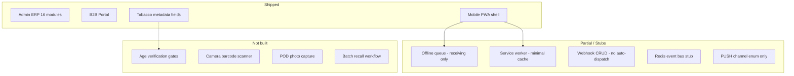

# Missing Features — Linear Task Backlog

## Current state summary

Pleros is a **feature-rich SMB wholesale ERP** (admin + B2B shop + 3 mobile PWAs) in [`apps/client`](apps/client) with Express/Prisma API in [`apps/web/lib/server`](apps/web/lib/server). Core workflows (order-to-cash, WMS, finance, EDI, MSA) are largely shipped per [`ERP_FEATURE_GAP.md`](ERP_FEATURE_GAP.md).

**What you asked about:**

| Area                 | Reality today                                                                                   | Evidence                                                                                                                                                                                    |
| -------------------- | ----------------------------------------------------------------------------------------------- | ------------------------------------------------------------------------------------------------------------------------------------------------------------------------------------------- |
| **Age verification** | Not implemented — only metadata (tobacco SKU flag, customer license field, onboarding checkbox) | [`inventory/schema.prisma`](apps/web/prisma/inventory/schema.prisma) `isTobacco`; [`crm/schema.prisma`](apps/web/prisma/crm/schema.prisma) `tobaccoLicenseNumber`; no gates in POS/checkout |
| **Label scanner**    | Text input only — no camera/OCR                                                                 | [`m/warehouse/receiving/page.tsx`](apps/client/src/pages/m/warehouse/receiving/page.tsx) L66–74                                                                                             |
| **PWA**              | Basic — manifest + SW registered, but incomplete offline/install story                          | [`manifest.webmanifest`](apps/client/public/manifest.webmanifest), [`sw.js`](apps/client/public/sw.js), [`main.tsx`](apps/client/src/main.tsx) L16–19                                       |

---

## Epic 1: Age Verification & Regulated Product Compliance

**Context:** Vertical enums (`TOBACCO_VAPE`, `ALCOHOL`) and tobacco metadata exist but **nothing enforces age or license at sale**. Onboarding [`COMPLIANCE_ACK`](apps/client/src/pages/admin/onboarding/page.tsx) is an admin acknowledgment, not a buyer/POS age gate.

### COS-101 — Define age verification policy model

- **Priority:** High | **Labels:** compliance, backend, schema
- **Description:** Add tenant-level config for regulated-product rules: minimum age (default 21), required customer license types, which surfaces require verification (POS, B2B checkout, delivery POD).
- **Acceptance criteria:**
  - New fields on tenant settings (e.g. `ageVerificationEnabled`, `minimumAge`, `requireTobaccoLicense`)
  - Prisma migration in [`tenant/schema.prisma`](apps/web/prisma/tenant/schema.prisma)
  - Settings UI in [`admin/settings/page.tsx`](apps/client/src/pages/admin/settings/page.tsx)
  - API: `GET/PATCH /tenants/me/compliance-settings`

### COS-102 — Enforce licensed-customer rules for tobacco SKUs (B2B)

- **Priority:** High | **Labels:** compliance, shop, backend
- **Description:** Block or warn when unlicensed buyers add `isTobacco` SKUs to cart/checkout.
- **Acceptance criteria:**
  - Server-side validation in order confirm / checkout ([`orders.ts`](apps/web/lib/server/orders.ts))
  - Catalog/cart UI shows regulated-product badge and license requirement
  - Error message when `customer.isLicensedTobacco` is false or `tobaccoLicenseNumber` missing/expired

### COS-103 — POS age verification gate

- **Priority:** High | **Labels:** compliance, pos, frontend
- **Description:** When cart contains regulated SKUs, require staff to confirm customer age/license before completing sale at [`admin/pos/page.tsx`](apps/client/src/pages/admin/pos/page.tsx).
- **Acceptance criteria:**
  - Modal/step: DOB entry or "ID verified" attestation with staff user logged
  - Audit log entry for each verification (`audit-log.ts`)
  - Sale blocked until verified when tenant policy enabled

### COS-104 — Age-restricted SKU flag generalization

- **Priority:** Medium | **Labels:** compliance, inventory
- **Description:** Extend beyond `isTobacco` to `ageRestricted` + `minimumAge` per SKU (covers alcohol, vape, pharma).
- **Acceptance criteria:**
  - Schema + inventory create/edit UI updates ([`admin/inventory/page.tsx`](apps/client/src/pages/admin/inventory/page.tsx))
  - Backward compatible: `isTobacco` maps to `ageRestricted` + age 21

### COS-105 — Delivery POD age check for regulated shipments

- **Priority:** Medium | **Labels:** compliance, mobile, dispatch
- **Description:** Driver must confirm recipient age/license before marking regulated stops delivered.
- **Acceptance criteria:**
  - Check order lines for age-restricted SKUs
  - POD form requires age confirmation checkbox or license photo capture
  - Stored on POD record in dispatch schema

### COS-106 — (Future) ID document scan integration

- **Priority:** Low | **Labels:** compliance, mobile, integration
- **Description:** Optional integration with ID scanning provider (e.g. Stripe Identity, Onfido, or manual camera capture of license).
- **Acceptance criteria:** Spike doc + provider selection; not required for MVP of COS-101–103

---

## Epic 2: Camera Barcode / Label Scanner

**Context:** Landing page claims "Barcode scans" ([`home/page.tsx`](apps/client/src/pages/home/page.tsx) L71) but mobile receiving uses a plain text field. Server already resolves scans via [`findSkuByScanValue`](apps/web/lib/server/inventory.ts). `Permissions-Policy: camera=(self)` is set in [`client/server/index.ts`](apps/client/server/index.ts) but unused.

### COS-201 — Reusable camera barcode scanner component

- **Priority:** High | **Labels:** mobile, frontend, wms
- **Description:** Build `BarcodeScanner` component using `BarcodeDetector` API with `@zxing/library` fallback for Safari.
- **Acceptance criteria:**
  - Start/stop camera, torch toggle (where supported), manual entry fallback
  - Debounced scan callback with duplicate suppression
  - Works on HTTPS and localhost; graceful degradation message when camera denied

### COS-202 — Wire scanner into warehouse receiving

- **Priority:** High | **Labels:** mobile, wms
- **Description:** Replace text-only input in [`m/warehouse/receiving/page.tsx`](apps/client/src/pages/m/warehouse/receiving/page.tsx) with scanner component.
- **Acceptance criteria:** Scan triggers same `POST .../scan` flow; offline queue still works (COS-301)

### COS-203 — Wire scanner into pick tasks and wave picking

- **Priority:** Medium | **Labels:** mobile, wms
- **Description:** Add scan-to-confirm on pick lines in [`m/warehouse/tasks`](apps/client/src/pages/m/warehouse/) pages.
- **Acceptance criteria:** Wrong barcode shows error; correct scan advances/confirms pick line

### COS-204 — Wire scanner into cycle count (admin + mobile)

- **Priority:** Medium | **Labels:** wms, admin
- **Description:** Scan SKU/bin during cycle count entry.
- **Acceptance criteria:** Scan populates SKU field on admin cycle count and mobile count flows

### COS-205 — POS barcode scan input

- **Priority:** Medium | **Labels:** pos, admin
- **Description:** Support USB wedge + optional camera scan on POS register page.
- **Acceptance criteria:** Scan adds SKU to POS cart via existing SKU lookup API

### COS-206 — Printable label format improvements

- **Priority:** Low | **Labels:** wms, backend
- **Description:** Enhance [`barcode-labels.ts`](apps/web/lib/server/barcode-labels.ts) — Code128/QR render, batch print, standard label sizes.
- **Acceptance criteria:** Labels scannable by COS-201 component at 4–6 inch distance

---

## Epic 3: PWA & Offline Mobile Hardening

**Context:** PWA shell exists but is **not production-grade**. Critical gaps:

- No `registration.sync.register('pleros-offline-queue')` — Background Sync documented in [`docs/celestial/06-faq.md`](docs/celestial/06-faq.md) L167 but unwired
- Offline queue only replays receiving actions ([`offline-sync.ts`](apps/client/src/lib/offline-sync.ts) L5–21)
- SW cache is minimal network-first fallback ([`sw.js`](apps/client/public/sw.js) L11–18)
- Manifest `start_url` is warehouse-only; no install prompt UX

### COS-301 — Register Background Sync for offline queue

- **Priority:** High | **Labels:** pwa, mobile
- **Description:** After enqueueing offline actions, call `SyncManager.register('pleros-offline-queue')` and handle permission/feature detection.
- **Acceptance criteria:**
  - [`offline-queue.ts`](apps/client/src/lib/offline-queue.ts) triggers sync registration
  - SW `sync` event replays queue via existing `PLEROS_SYNC_QUEUE` message path
  - Update FAQ/docs to match actual behavior

### COS-302 — Expand offline action types

- **Priority:** High | **Labels:** pwa, mobile
- **Description:** Queue pick confirmations, POD submissions, sales activity logs offline.
- **Acceptance criteria:**
  - New action types in `offline-sync.ts` replay handlers
  - Mobile pages enqueue when `!navigator.onLine`
  - Conflict handling: show failed count in [`OfflineBanner`](apps/client/src/components/mobile/offline-banner.tsx)

### COS-303 — App-shell caching strategy for mobile routes

- **Priority:** Medium | **Labels:** pwa
- **Description:** Precache `/m/*` static assets and shell; stale-while-revalidate for API GETs used on mobile home.
- **Acceptance criteria:** Mobile warehouse/delivery/sales load with no network after first visit
- **Note:** Consider adopting `vite-plugin-pwa` vs extending hand-rolled [`sw.js`](apps/client/public/sw.js)

### COS-304 — PWA install prompt and per-app manifests

- **Priority:** Medium | **Labels:** pwa, mobile
- **Description:** Separate manifest shortcuts or dynamic manifest for Warehouse / Delivery / Sales; "Add to Home Screen" prompt on mobile login.
- **Acceptance criteria:**
  - `beforeinstallprompt` handler on mobile layout
  - Icons/maskable assets verified (512px exists)
  - Each app deep-links to correct `start_url`

### COS-305 — Offline conflict resolution UX

- **Priority:** Medium | **Labels:** pwa, mobile
- **Description:** When replay fails (409/stale session), surface actionable errors instead of silent fail.
- **Acceptance criteria:** Banner shows failed action count + link to retry/discard

### COS-306 — PWA audit (Lighthouse + iOS/Android)

- **Priority:** Low | **Labels:** pwa, qa
- **Description:** Run Lighthouse PWA audit; fix installability, maskable icon, theme-color meta gaps.
- **Acceptance criteria:** PWA score ≥ 90 on mobile routes

---

## Epic 4: Mobile Field Gaps (marketing vs code)

**Context:** Landing page lists **"POD photos"** ([`home/page.tsx`](apps/client/src/pages/home/page.tsx) L80) but delivery sends `photoUrl: null` ([`m/delivery/route/[id]/page.tsx`](apps/client/src/pages/m/delivery/route/[id]/page.tsx) L42).

### COS-401 — POD photo capture and upload

- **Priority:** High | **Labels:** mobile, dispatch
- **Description:** Camera capture on delivery stop completion; upload to S3/local storage; attach URL to POD API.
- **Acceptance criteria:**
  - `<input type="file" capture="environment">` or camera component
  - Backend stores `photoUrl` on POD record
  - Admin dispatch view shows POD photo thumbnail

### COS-402 — POD signature capture

- **Priority:** Medium | **Labels:** mobile, dispatch
- **Description:** Canvas signature pad; send `signatureDataUrl` (currently always null).
- **Acceptance criteria:** Signature rendered on admin stop detail

### COS-403 — Route stop reorder / basic optimization

- **Priority:** Low | **Labels:** dispatch
- **Description:** Manual drag reorder exists partially; add map view or simple nearest-neighbor sort.
- **Acceptance criteria:** Documented in [`ERP_FEATURE_GAP.md`](ERP_FEATURE_GAP.md) L142 as partial

---

## Epic 5: Platform Integration Stubs

**Context:** Infrastructure exists but is not wired to real events.

### COS-501 — Wire webhook auto-dispatch on domain events

- **Priority:** High | **Labels:** integrations, backend
- **Description:** [`webhooks.ts`](apps/web/lib/server/webhooks.ts) only supports manual `testWebhook`. Emit subscribed events (order.shipped, compliance.batch_recalled, etc.) from order/compliance flows.
- **Acceptance criteria:**
  - Dispatcher called from order saga, invoice issue, MSA submit, batch recall
  - Events match list in [`webhook-manager.tsx`](apps/client/src/components/settings/webhook-manager.tsx)
  - HMAC signature + SSRF checks preserved

### COS-502 — Implement Redis event bus

- **Priority:** High | **Labels:** infra, backend
- **Description:** Replace console stub in [`event-bus.ts`](apps/web/lib/server/event-bus.ts) with ioredis pub/sub; call `publishOrderEvent` from order lifecycle.
- **Acceptance criteria:** Events published when `REDIS_URL` set; falls back to console in dev

### COS-503 — Redis-backed rate limiting for multi-replica

- **Priority:** Medium | **Labels:** infra, security
- **Description:** Move in-memory limiter in [`auth-security.ts`](apps/web/lib/server/auth-security.ts) to Redis when configured.
- **Acceptance criteria:** Documented in [`PRODUCTION_READINESS.md`](PRODUCTION_READINESS.md) L43

### COS-504 — Push notification channel (Expo / Web Push)

- **Priority:** Medium | **Labels:** notifications
- **Description:** `NotificationChannel.PUSH` exists in schema but unused; `EXPO_PUSH_ACCESS_TOKEN` in `.env.example` has no code path.
- **Acceptance criteria:**
  - Provider in [`notification-provider.ts`](apps/web/lib/server/notification-provider.ts)
  - Mobile opt-in + device token registration endpoint
  - At least order-shipped push trigger

### COS-505 — OpenTelemetry instrumentation

- **Priority:** Low | **Labels:** infra, observability
- **Description:** Env vars exist (`PLEROS_OTEL_ENABLED`); wire traces for API routes and order saga.
- **Acceptance criteria:** Spans visible in local OTEL collector ([`infra/docker/otel-config.yaml`](infra/docker/otel-config.yaml))

---

## Epic 6: ERP Roadmap (from gap analysis)

Per [`ERP_FEATURE_GAP.md`](ERP_FEATURE_GAP.md) L231 suggested order:

### COS-601 — Purchase requisition + approval workflow

- **Priority:** Medium | **Labels:** purchasing, erp
- **Description:** Requisition entity, approval chain, convert-to-PO. Today: direct PO only (L109).
- **Acceptance criteria:** Admin UI + API; approver notification

### COS-602 — Batch/lot recall workflow and compliance UI

- **Priority:** Medium | **Labels:** compliance, wms
- **Description:** `Batch.recalled` exists in [`compliance/schema.prisma`](apps/web/prisma/compliance/schema.prisma) L87 but no admin recall flow or webhook emit.
- **Acceptance criteria:**
  - Admin action: mark batch recalled → block allocation/ship
  - Emit `compliance.batch_recalled` webhook (ties to COS-501)
  - Customer/order impact report

### COS-603 — Deeper sales tax engine (nexus, exemptions)

- **Priority:** Medium | **Labels:** finance, compliance
- **Description:** Extend [`compliance-tax.ts`](apps/web/lib/server/compliance-tax.ts) beyond static state rates.
- **Acceptance criteria:** Customer tax exemption certs; nexus jurisdiction config

### COS-604 — Fine-grained RBAC per module

- **Priority:** Medium | **Labels:** security, admin
- **Description:** [`permissions.ts`](apps/web/lib/server/permissions.ts) permission map exists but routes use coarse role guards only.
- **Acceptance criteria:** `assertPermission` used on sensitive routes; admin role editor UI

### COS-605 — Report builder / export suite

- **Priority:** Medium | **Labels:** analytics, admin
- **Description:** KPI dashboard exists; no ad-hoc reports or CSV/Excel export suite.
- **Acceptance criteria:** Saved reports for orders, inventory, AR aging; CSV download

### COS-606 — Postgres unified local dev path

- **Priority:** Low | **Labels:** infra, dx
- **Description:** [`MISSING.md`](MISSING.md) L12 — local defaults to SQLite; document or default docker-compose Postgres dev flow.
- **Acceptance criteria:** `npm run dev` works with Postgres via `docker compose up db`

---

## Epic 7: Enterprise (Phase 2+ — defer unless customer-driven)

From [`ERP_FEATURE_GAP.md`](ERP_FEATURE_GAP.md) L219–228 — create Linear issues but mark **Backlog / Enterprise**:

| ID      | Title                                             |
| ------- | ------------------------------------------------- |
| COS-701 | Multi-currency and FX revaluation                 |
| COS-702 | Multi-subsidiary consolidation                    |
| COS-703 | Rebate and vendor allowance programs              |
| COS-704 | Fixed assets and depreciation                     |
| COS-705 | Manufacturing / BOM / kitting                     |
| COS-706 | HR and payroll module                             |
| COS-707 | Advanced BI / demand forecasting beyond EWMA      |
| COS-708 | Omnichannel connectors (Shopify, Amazon)          |
| COS-709 | Managed X12/AS2 EDI hub (beyond JSON interchange) |

---

## Recommended sprint order

**Sprint 1 — Close marketing gaps (highest user-visible risk):**
COS-201, COS-202, COS-401, COS-301, COS-302

**Sprint 2 — Regulated vertical readiness:**
COS-101, COS-102, COS-103, COS-104

**Sprint 3 — Platform reliability:**
COS-501, COS-502, COS-602, COS-503

**Sprint 4 — PWA polish + field mobile:**
COS-303, COS-304, COS-402, COS-203, COS-204

**Sprint 5 — ERP mid-market parity:**
COS-601, COS-603, COS-604, COS-605

---

## Linear setup notes

- **Team suggestion:** `Cosmos` or `Pleros` product team
- **Labels:** `compliance`, `pwa`, `mobile`, `wms`, `pos`, `integrations`, `erp`, `enterprise`
- **Priority mapping:** High → P1, Medium → P2, Low/Enterprise → P3/Backlog
- **No Linear integration exists in repo** — tasks above are ready to bulk-create manually or via Linear CSV import / API
- **Prefix:** Replace `COS-` with your Linear team prefix (e.g. `PLR-`)

## Key files to touch (cross-cutting)

| Feature          | Primary paths                                                                                                                                  |
| ---------------- | ---------------------------------------------------------------------------------------------------------------------------------------------- |
| Age verification | `apps/web/prisma/tenant/schema.prisma`, `apps/web/lib/server/orders.ts`, `apps/client/src/pages/admin/pos/`, `apps/client/src/pages/checkout/` |
| Label scanner    | New `apps/client/src/components/mobile/barcode-scanner.tsx`, `apps/client/src/pages/m/warehouse/`                                              |
| PWA              | `apps/client/public/sw.js`, `apps/client/src/lib/offline-sync.ts`, `apps/client/src/lib/offline-queue.ts`                                      |
| Webhooks         | `apps/web/lib/server/webhooks.ts`, order/compliance server modules                                                                             |
| Recall           | `apps/web/prisma/compliance/schema.prisma`, new admin compliance recall UI                                                                     |
