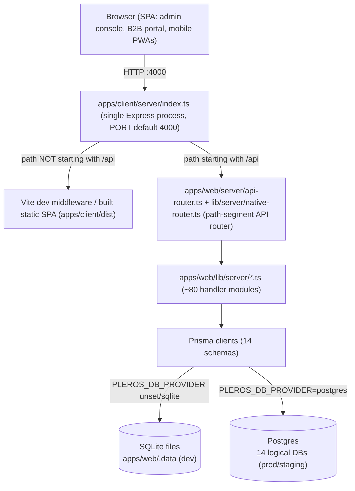
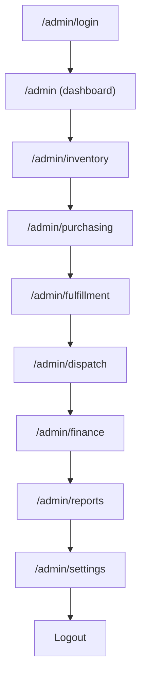
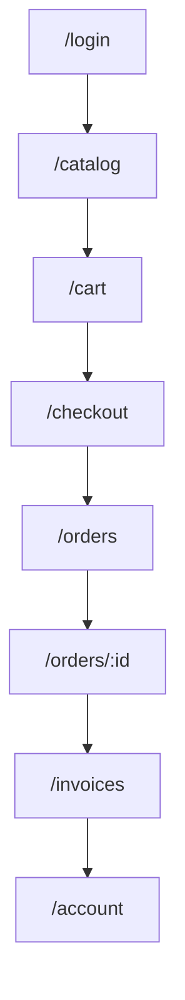
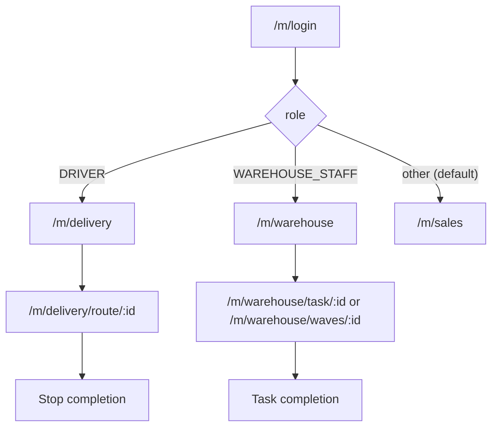

# Testing Flow Documentation

> Single source of truth for testing the Pleros / Cosmos ERP platform.

## 1. Overview

### 1.1 Purpose

This document is the master reference for testing the Pleros ERP / distribution platform (repo name `Cosmos`, package name `pleros`). It exists to give engineers and QA a single, verifiable procedure for standing up the application locally, understanding what "healthy" looks like, and exercising the platform's surfaces before a change ships. Every claim in this document is grounded in the actual scripts, environment files, and server code in this repository — see the fact-verification notes inline and in the linked source files.

### 1.2 Scope

This document covers the full monorepo as defined in the root `package.json` workspaces:

- `apps/web` (`@pleros/web`) — the API layer: Prisma schemas plus `lib/server/*.ts` business-logic modules, described in its own `package.json` as "Pleros API layer — Prisma + lib/server (served by @pleros/client Vite server)".
- `apps/client` (`@pleros/client`) — the single Express process (`apps/client/server/index.ts`) that serves the Vite/React SPA (admin console, B2B buyer portal, mobile field PWAs) and proxies `/api/*` requests into the `apps/web` API handler, all on one origin.
- `packages/*` — shared workspace packages: `@pleros/types`, `@pleros/ui`, `@pleros/web-gateway-client`, `@pleros/analytics-engine`.

Out of scope for this document: feature-by-feature acceptance criteria (see `PLATFORM_FEATURES.md`), the roadmap/gap analysis (`ERP_FEATURE_GAP.md`), production security hardening (`PRODUCTION_READINESS.md`), and the staging smoke-test script (`docs/QA_STAGING_CHECKLIST.md`) — this document is about the *mechanics* of testing (setup, startup, and, in later sections of this file, functional/API/DB test procedures), not a restatement of those other docs.

### 1.3 Application Architecture

Pleros runs as a **single-origin** application: one Express process serves both the browser SPA and the JSON API on the same host and port. There is no separate/standalone Express microservice for the API — `apps/web` contributes only a Prisma data layer and a tree of framework-agnostic handler modules under `lib/server/*.ts`; it has no server of its own (its own `dev` script literally says `"Use npm run dev from repo root (@pleros/client Vite server)"`).

Request flow, confirmed from source:

1. `apps/client/server/index.ts` starts one Express app on `PORT` (default `4000`).
2. Any request path starting with `/api` is buffered into a Fetch-API `Request` object and handed to `handleApiRequest()` in `apps/web/server/api-router.ts`.
3. `api-router.ts` answers a small number of routes directly (e.g. `GET /api/v1/health`, auth endpoints such as login/refresh/signup) and delegates everything else to `handleNativeApi()` in `apps/web/lib/server/native-router.ts` — a hand-written path-segment router (no Express/Next routing) that dispatches by `path[0]` (`tenants`, `users`, `skus`, `inventory`, `orders`, `invoices`, `wms`, `dispatch`, `bills`, `compliance`, `edi`, …) into the ~80 non-test modules in `apps/web/lib/server/`.
4. All non-`/api` requests fall through to the Vite dev middleware in development, or to the built static SPA (`apps/client/dist`) with an SPA fallback to `index.html` in production.
5. Handler modules read/write through Prisma clients against one of **14** independent Prisma schemas under `apps/web/prisma/*/schema.prisma` (`auth`, `tenant`, `inventory`, `order`, `crm`, `storefront`, `purchasing`, `payment`, `wms`, `dispatch`, `compliance`, `ledger`, `notification`, `analytics`) — each schema is a logical database, backed by embedded SQLite files in development or by separate Postgres databases (one per schema, same instance) in production/staging.



### 1.4 Testing Philosophy

The only automated test layer that exists in this repository today is **Node's built-in `--test` runner**, invoked via `tsx`. Confirmed per-workspace `test` scripts:

- `apps/web`: `node --import ./server/register-paths.mjs --import tsx --test lib/server/**/*.test.ts` — unit tests colocated next to the handler modules they cover (e.g. `barcode-labels.test.ts`, `compliance-recall.test.ts`, `fixed-assets.test.ts`, `dispatch-optimize.test.ts`).
- `apps/client`: `node --import tsx --test src/**/*.test.ts`
- `packages/analytics-engine` and `packages/web-gateway-client`: the same `node --import tsx --test src/**/*.test.ts` pattern.
- `packages/types` and `packages/ui`: no tests (`echo` stubs).

There is **no Jest, Vitest, or Playwright** anywhere in the repo (verified by grepping every `package.json` in the workspace tree) — meaning **there is no browser-driven end-to-end suite today**. Root `npm run test` (`node scripts/workspace-run.mjs test`) fans this out across workspaces, and `npm run prod:preflight` chains lint → test → build.

Because automated coverage stops at the unit-test layer, **manual and checklist-driven QA carries proportionally more weight** than it would in a codebase with an E2E suite. This document (and the later sections appended to it) is written with that gap in mind: it favors concrete, reproducible manual verification steps (exact URLs, exact curl/health checks, exact seeded accounts) over assuming a browser automation harness will catch regressions. If an E2E suite is introduced later, this section should be revisited — as of this writing, none exists.

---

## 2. Prerequisites

### 2.1 Required Software

| Requirement | Version / Notes | Source |
|---|---|---|
| Node.js | `>= 20` | `package.json` → `engines.node` |
| npm | `>= 10` | `package.json` → `engines.npm` (pinned `packageManager: npm@10.5.0`) |
| Git | any recent version, to clone the repo | — |
| Docker (optional) | only needed for `npm run infra:docker:up` (Postgres/Redis/MinIO/OTel-collector for scaled dev) or Postgres-mode testing | `docker-compose.yml` |

No global Postgres/Redis install is required for the default local workflow — local development uses embedded SQLite files under `apps/web/.data` with **no Postgres and no Docker** (per the comment at the top of `.env.example`).

### 2.2 Environment Setup

```bash
git clone <repo-url>
cd Cosmos
npm install
cp .env.example .env
# then set JWT_SECRET / JWT_REFRESH_SECRET to real random values (see 2.4)
```

`npm install` installs all workspaces (`apps/web`, `apps/client`, `packages/*`) in one pass because they are declared as npm workspaces in the root `package.json`.

### 2.3 Configuration Files

| File | Purpose |
|---|---|
| [`.env.example`](../.env.example) | Template for the root `.env` used by local development (SQLite by default). Copied to `.env` in step 2.2. |
| [`.env.production.example`](../.env.production.example) | Template for production/staging secrets (Postgres passwords, Redis password, live Stripe keys, `VITE_*` build-time values). Not used for local dev. |
| [`docker-compose.yml`](../docker-compose.yml) | Optional local infra: Postgres, Redis, MinIO, and an OpenTelemetry collector, for scaled-dev/Postgres-mode testing (`npm run infra:docker:up`). Plain local dev does not need this file. |
| [`docker-compose.production.yml`](../docker-compose.production.yml) | Production-style Compose stack: Postgres + Redis + the built `web` image, wired with per-schema `*_DATABASE_URL` variables. |
| [`render.yaml`](../render.yaml) | Render Blueprint for the `pleros-staging` and `pleros-production` web services plus a `pleros-staging-postgres` database; documents the exact env vars each hosted environment needs and the `/api/v1/health` health-check path. |
| [`package.json`](../package.json) | Root workspace scripts (`dev`, `build`, `test`, `db:*`, `seed`, `prod:preflight`, …). |
| [`tsconfig.base.json`](../tsconfig.base.json) | Shared strict TypeScript compiler options (`strict: true`, `target: ES2022`, `module: commonjs`) extended by workspace `tsconfig.json` files. |

### 2.4 Environment Variables Reference

The following table lists every variable present in `.env.example` (root). Purpose is inferred from the variable name and its inline comment — nothing here is invented.

| Variable | Purpose | Required? |
|---|---|---|
| `NODE_ENV` | Runtime mode (`development`/`production`); affects auth behavior (e.g. whether `verifyUrl` is returned to API responses). | Yes (defaults to `development` in the example) |
| `LOG_LEVEL` | Logging verbosity. | No (defaults to `info`) |
| `PLEROS_DATA_DIR` | Directory (relative to `apps/web`) holding embedded SQLite `.db` files when running without Postgres. | Yes for SQLite mode (defaults to `.data`) |
| `JWT_SECRET` | Signing secret for access tokens. | **Yes** — must be replaced with a real secret |
| `JWT_REFRESH_SECRET` | Signing secret for refresh tokens. | **Yes** — must be replaced with a real secret |
| `JWT_ACCESS_TTL` | Access-token lifetime (e.g. `15m`). | No (has a default) |
| `JWT_REFRESH_TTL` | Refresh-token lifetime (e.g. `7d`). | No (has a default) |
| `STRIPE_SECRET_KEY` | Stripe secret API key for server-side card checkout. | No locally (mock/dev-safe with placeholder); required for real Stripe flows |
| `STRIPE_PUBLISHABLE_KEY` | Stripe publishable key. | No locally |
| `STRIPE_WEBHOOK_SECRET` | Verifies incoming Stripe webhook signatures. | No locally |
| `STRIPE_RETURN_URL` | Redirect URL after Stripe Checkout. | No (defaults to `http://localhost:4000/checkout`) |
| `AWS_REGION` | Region for optional AWS S3 file storage (MSA/document archival). | No |
| `AWS_ACCESS_KEY_ID` | AWS credential. | No |
| `AWS_SECRET_ACCESS_KEY` | AWS credential. | No |
| `AWS_S3_BUCKET` | Target S3 bucket for document storage. | No |
| `NOTIFICATION_WEBHOOK_URL` | Optional outbound webhook for notification integration testing. | No |
| `PLEROS_OPS_EMAIL` | Ops/admin contact address used by notifications. | No |
| `SENDGRID_API_KEY` | Enables real email delivery for verification/invite/reset emails; without it, non-production signup/resend responses can return `verifyUrl` directly for QA convenience. | No locally; effectively required in production |
| `SENDGRID_FROM_EMAIL` | From-address for SendGrid-sent email. | No (defaults to `noreply@pleros.local`) |
| `APP_URL` | Public app origin used to build verification/reset/invite links. | Required in production; defaults to `http://localhost:4000` locally |
| `TWILIO_ACCOUNT_SID` | Twilio credential for SMS notifications. | No |
| `TWILIO_AUTH_TOKEN` | Twilio credential. | No |
| `TWILIO_FROM_NUMBER` | Twilio sending number. | No |
| `EXPO_PUSH_ACCESS_TOKEN` | Access token for Expo push notifications (mobile PWA). | No |
| `CELESTIAL_PROVIDER` | Selects the Celestial AI backend: `openrouter \| groq \| gemini \| ollama \| mock` (defaults to mock if no key is set). | No |
| `CELESTIAL_MODEL` | Model name for the selected Celestial provider. | No |
| `OPENROUTER_API_KEY` | Credential for the `openrouter` Celestial provider. | No |
| `GROQ_API_KEY` | Credential for the `groq` Celestial provider. | No |
| `GEMINI_API_KEY` | Credential for the `gemini` Celestial provider. | No |
| `CELESTIAL_OLLAMA_URL` | Local Ollama endpoint for the `ollama` Celestial provider. | No (defaults to `http://127.0.0.1:11434`) |
| `CELESTIAL_OLLAMA_MODEL` | Ollama model name. | No (defaults to `llama3.2`) |
| `PLEROS_OTEL_ENABLED` | Toggles OpenTelemetry export. | No (defaults to `false`) |
| `OPENTELEMETRY_ENDPOINT` | OTLP collector endpoint. | No (defaults to `http://localhost:4317`) |
| `PLEROS_DB_PROVIDER` | Set to `postgres` to switch the Prisma schemas from SQLite to Postgres (commented out by default — omitted means SQLite). | No (SQLite is the default) |
| `DATABASE_URL` | Base Postgres connection string, used only when `PLEROS_DB_PROVIDER=postgres`. | No locally; required when using Postgres |

> [!NOTE]
> `AWS_*` variables are present in `.env.example` but no `aws-sdk`/S3 client code was found under `apps/web/lib/server` at the time of writing — `apps/web/lib/server/msa-storage.ts` only performs a plain HTTPS `PUT` to an S3-compatible URL built from `MSA_S3_*` variables (a separate set, not the `AWS_*` ones above) when archiving MSA compliance reports. Treat `AWS_*` as reserved/optional rather than a hard prerequisite.

### 2.5 Database Setup

The provider switch is mechanical and controlled by `PLEROS_DB_PROVIDER`:

- **SQLite (default, no Postgres/Docker needed):**
  ```bash
  npm run db:setup          # scripts/setup-sqlite.mjs — creates apps/web/.data
  npm run db:generate-all   # scripts/generate-all-prisma.mjs — prisma generate for all 14 schemas
  npm run seed              # tsx scripts/seed-db.ts — demo tenant + accounts
  ```
- **Postgres:**
  ```bash
  PLEROS_DB_PROVIDER=postgres npm run db:setup:postgres   # scripts/setup-postgres.mjs
  npm run db:generate-all
  npm run db:migrate        # tsx scripts/migrate-all.ts — push all 14 Prisma schemas
  npm run seed
  ```
  Before generating/migrating against Postgres, `scripts/apply-prisma-provider.mjs` (invoked as `npm run db:provider`, and internally by the setup scripts) rewrites the `provider = "sqlite" | "postgresql"` line in every `apps/web/prisma/*/schema.prisma` file to match `PLEROS_DB_PROVIDER`.

`npm run db:migrate` and `npm run migrate:all` are the same script (`tsx scripts/migrate-all.ts`) under two names. `npm run infra:docker:up` (`docker compose -f docker-compose.yml up -d`) can supply a local Postgres/Redis/MinIO/OTel stack for Postgres-mode testing without installing them natively.

### 2.6 Authentication Requirements

Roles come from the `Role` enum in `apps/web/prisma/auth/schema.prisma`:

```
SUPER_ADMIN, TENANT_ADMIN, MANAGER, WAREHOUSE_STAFF, SALES_REP, DRIVER, ACCOUNTANT, VIEWER, STAFF
```

These are grouped into access-control sets in `apps/web/lib/server/session.ts`:

| Group | Roles | Used for |
|---|---|---|
| `ADMIN_ROLES` | `SUPER_ADMIN`, `TENANT_ADMIN`, `MANAGER`, `ACCOUNTANT` | Back-office/admin-gated routes (e.g. `GET /api/v1/health/db`) |
| `OPS_ROLES` | `ADMIN_ROLES` + `WAREHOUSE_STAFF` | Warehouse/fulfillment operations |
| `DRIVER_ROLES` | `ADMIN_ROLES` + `DRIVER` | Dispatch/delivery mobile PWA |
| `CRM_ROLES` (defined in `native-router.ts`) | `ADMIN_ROLES` + `SALES_REP` | CRM access |

`apps/web/lib/server/buyer-context.ts` additionally defines `PORTAL_BUYER_ROLES = ['STAFF', 'VIEWER']` — accounts with these roles are treated as B2B portal buyers (`isPortalBuyer()`) rather than back-office staff, and are resolved to a CRM customer record by matching email. There is no separate `BUYER` role value; buyer accounts use `STAFF` (the default role assigned by `apps/web/lib/server/auth.ts` on signup/invite when no role is given) or `VIEWER`.

For local testing, `npm run seed` creates the demo accounts documented in the root `README.md`:

| Role | Email | Password | Entry point |
|---|---|---|---|
| Admin | `admin@pleros.local` | `admin1234` | `/admin/login` |
| B2B buyer | `buyer@acme-retail.com` | `buyer1234` | `/login` |
| Warehouse | `warehouse@pleros.local` | `warehouse1234` | `/m/warehouse` |
| Driver | `driver@pleros.local` | `driver1234` | `/m/delivery` |
| Sales | `sales@pleros.local` | `sales1234` | `/m/sales` |

These seeded accounts exist only in the local database created by `npm run seed`; they are not present in production.

### 2.7 Third-Party Integrations

Confirmed by grepping `apps/web/lib/server` for each vendor's name/SDK:

| Integration | Confirmed usage | Hard prerequisite for local testing? |
|---|---|---|
| **Stripe** | `apps/web/lib/server/stripe.ts`, plus `billing.ts`, `invoices.ts`, `payments.ts`, `saved-payment-methods.ts`, `native-router.ts` | No — card checkout runs in a test/mock-safe mode with the placeholder `sk_test_replace_me` key from `.env.example`; real keys are only needed to exercise live Stripe flows. |
| **SendGrid** | `apps/web/lib/server/notification-provider.ts`, `notification-provider-status.ts`, `auth.ts` | No locally — without `SENDGRID_API_KEY`, emails log to the console and signup/resend can return `verifyUrl` directly for QA. Effectively required before go-live. |
| **Twilio** | `apps/web/lib/server/notification-provider.ts`, `notification-provider-status.ts` | No — SMS notifications are optional and only activate when Twilio credentials are set. |

No references to an AWS SDK, S3 client, or Expo push SDK were found under `apps/web/lib/server` at the time of writing, despite `AWS_*` and `EXPO_PUSH_ACCESS_TOKEN` appearing in `.env.example` — treat those as reserved/future rather than active integrations to test against.

---

## 3. Application Startup Flow

### 3.1 Starting the application

From the repo root, after completing Section 2:

```bash
npm run dev
```

This one command chains three steps (see the root `package.json` `dev` script):

1. `node scripts/prepare-dev-env.mjs` — reads the root `.env` (creating it from `.env.example` if missing) and writes `apps/web/.env.local` with the correct SQLite `file:` URLs (or Postgres URLs, if `PLEROS_DB_PROVIDER=postgres`) for each of the 14 schemas, plus a matching `apps/client/.env` for Vite build-time variables.
2. `node scripts/generate-all-prisma.mjs` — runs `prisma generate` for all 14 schemas so the Prisma clients match the current schema files.
3. `npm run dev -w @pleros/client` — runs `tsx server/index.ts`, which starts the single Express process described in Section 1.3: it mounts the `/api/*` proxy to the native API router, starts background jobs (`startBackgroundJobs()` from `apps/web/lib/server/background-jobs.ts`), and either wires in Vite's dev middleware (non-production) or serves the built static SPA (production, via `npm run start -w @pleros/client`).

The server listens on `PORT` (defaulting to `4000` — set in `apps/client/server/index.ts` as `Number(process.env.PORT ?? 4000)`), so the application is reachable at:

```
http://localhost:4000
```

### 3.2 What "healthy" looks like

Two real, code-confirmed health endpoints exist:

| Endpoint | Auth | Defined in | Behavior |
|---|---|---|---|
| `GET /api/v1/health` | None (public) | `apps/web/server/api-router.ts` | Returns `{ status: "ok", service: "pleros", api: "native", timestamp }` with HTTP 200. This is also the `healthCheckPath` Render uses for the hosted `pleros-staging` and `pleros-production` services in `render.yaml`. |
| `GET /api/v1/health/db` | Requires a session with an `ADMIN_ROLES` role | `apps/web/lib/server/native-router.ts` (dispatches to `checkDatabaseConnections()` in `apps/web/lib/server/db-health.ts`) | Returns `{ provider: "sqlite" \| "postgresql", checks: [...], allOk: boolean }` — one check per `*_DATABASE_URL` env key plus an `auth_connectivity` check that runs `SELECT 1` against the auth database. |

A quick unauthenticated check:

```bash
curl -s http://localhost:4000/api/v1/health
# {"status":"ok","service":"pleros","api":"native","timestamp":"..."}
```

Beyond the API, "healthy" also means the SPA shell loads — hit `http://localhost:4000/` (role-based landing page) or `http://localhost:4000/admin/login` and confirm the login form renders without a blank page or console errors.

### 3.3 Pre-test verification checklist

- [ ] `npm run dev` starts with no uncaught errors in the terminal, and logs `[pleros] Vite + API @ http://localhost:4000`.
- [ ] `curl -s http://localhost:4000/api/v1/health` returns HTTP 200 with `"status":"ok"`.
- [ ] `http://localhost:4000/admin/login` (or `/login` for the buyer portal) loads the login form in a browser with no blank page.
- [ ] The database exists and is reachable: for SQLite, `apps/web/.data/` contains the per-schema `.db` files after `npm run db:setup && npm run db:generate-all`; for Postgres, `GET /api/v1/health/db` (as an authenticated admin) reports `allOk: true`.
- [ ] `npm run seed` has been run at least once so the demo accounts in Section 2.6 exist, if functional/manual testing requires logging in.

> [!TIP]
> If `npm run dev` fails immediately, check that `.env` exists at the repo root (copy it from `.env.example` per Section 2.2) — `scripts/prepare-dev-env.mjs` will auto-create it from the example on first run, but will exit with an error if neither file is present.

---

## 4. End-to-End Testing Flow

Section 1.3 established that one Express process serves three distinct SPA surfaces from `apps/client/src/router.tsx`: the admin/back-office console under `/admin/*`, the B2B buyer portal under `/` (wrapped in `ShopLayout`), and the mobile field PWAs under `/m/*` (wrapped in `MobileLayout`). Each surface has its own realistic end-to-end path through the product, and the three paths write to (and read from) overlapping data — an order placed through the buyer portal shows up in the admin `/admin/orders` list and can generate a mobile warehouse task. The flows below are ordered the way they should be *tested*, not necessarily the way a real user would click through in one sitting.

### 4.1 Admin / Back-Office Flow



All eight route segments in the diagram are real children of the `/admin` route in `apps/client/src/router.tsx`. The router also defines several admin routes not shown on this main line — `crm`, `quotes`, `compliance`, `compliance/msa/:reportId`, `pos`, `celestial`, `warehouse`, `notifications`, `onboarding` — which branch off the dashboard and can be tested independently; they are omitted from the diagram only to keep the primary path readable.

The ordering is not arbitrary — it follows real code dependencies confirmed in Section 6:

- **Inventory before Purchasing/Fulfillment.** Receiving a PO (`po-receiving.ts`) and running WMS putaway/cycle-count (`wms-putaway.ts`, `wms-cycle-count.ts`) both import `inventory.ts` directly to mutate stock levels, and the order fulfillment pipeline (`order-orchestration.ts`) also imports `inventory.ts`. Testing Purchasing or Fulfillment against a SKU that was never created/stocked in Inventory will produce misleading failures that have nothing to do with the feature under test.
- **Fulfillment/Dispatch before Finance.** `order-orchestration.ts` imports `wms-fulfillment.ts` (pick/pack/ship) and drives the order into a shippable state; `dispatch.ts` imports `order-orchestration.ts` and `crm.ts` to resolve route stops back to orders. The invoice that Finance reconciles is generated from the order via `orders.ts` → `syncInvoiceFromOrder` → `invoices.ts` → `invoice-gl.ts`, so an order that never completed fulfillment/dispatch has no realistic invoice/ledger trail for Finance testing to exercise.
- **Reports last (before Settings).** `report-builder.ts` imports `orders.ts`, `invoices.ts`, `inventory.ts`, and `crm.ts` directly — it is the one module confirmed to read from every upstream feature area, so it is only meaningful to test once those areas already have data.
- **Settings tested last.** Role/permission constants such as `ADMIN_ROLES` (Section 2.6, defined in `apps/web/lib/server/session.ts:85`) and `CRM_ROLES` (defined in `apps/web/lib/server/native-router.ts:56`, built from `ADMIN_ROLES` plus `SALES_REP`) gate access to nearly every other admin route. Changing a role's permissions in Settings can change what the rest of this flow is even allowed to see, so re-running Settings changes earlier in the sequence would invalidate the tests that follow it.

### 4.2 Buyer Portal Flow



These routes are the `ShopLayout` children in `apps/client/src/router.tsx` (`/catalog`, `/cart`, `/checkout`, `/orders`, `/orders/:id`, `/invoices`, `/invoices/:id`, `/account`); the buyer signs in at `/login`, distinct from the admin's `/admin/login`. As Section 2.6 established, buyer-portal accounts have no dedicated `BUYER` role — they are `STAFF` or `VIEWER` accounts recognized as portal buyers by `isPortalBuyer()` in `apps/web/lib/server/buyer-context.ts`.

Checkout is where the flow's real dependencies surface: `checkout` submits through the same `orders.ts` module the admin console uses, which calls `assertOrderLinePrices` (`pricing.ts`), `computeSalesTax`/`getTenantSalesTaxRate` (`compliance-tax.ts`/`tenant-tax.ts`), and `assertCreditAvailable` (`credit-limit.ts`) before the order is accepted. A checkout tested against a SKU with no price row, a tenant with no configured tax rate, or a customer with no credit limit record will fail for reasons unrelated to the checkout UI itself. Once an order is created, `orders.ts` calls `syncInvoiceFromOrder` (`invoices.ts`), which is what populates `/invoices` for the buyer to view — so Invoices cannot be tested before at least one Checkout has completed. The router also exposes a parallel `/quotes` → `/quotes/new` → `/quotes/:id` path under the same `ShopLayout` for RFQ-style buying, which can be tested as a branch off Catalog rather than through Cart/Checkout.

### 4.3 Mobile PWA Flow



The role-to-home mapping is not a guess — it is the literal `defaultMobileHome()` function in `apps/client/src/pages/m/login/page.tsx`:

```ts
function defaultMobileHome(role: string | undefined): string {
  if (role === 'DRIVER') return '/m/delivery'
  if (role === 'WAREHOUSE_STAFF') return '/m/warehouse'
  return '/m/sales'
}
```

So `DRIVER` lands on `/m/delivery`, `WAREHOUSE_STAFF` lands on `/m/warehouse`, and every other role (including `SALES_REP`) falls through to `/m/sales`. `/m/warehouse` links into task/wave detail pages (`/m/warehouse/task/:id`, `/m/warehouse/waves/:id`, `/m/warehouse/receiving`), all real children of the `/m` route in `router.tsx`; `/m/delivery` links into `/m/delivery/route/:id`. `/m/sales` has no nested detail route in the router today, so its flow ends at the single page.

Because `order-orchestration.ts` imports `wms-fulfillment.ts` and `dispatch.ts` imports `order-orchestration.ts`, completing a task on `/m/warehouse/task/:id` or a stop on `/m/delivery/route/:id` writes back into the same order/inventory/dispatch records the admin console (`/admin/fulfillment`, `/admin/dispatch`) reads. The admin and mobile flows should be tested against the same seeded order for a completion action on mobile to be verifiable by checking the corresponding admin screen.

## 5. Module-by-Module Testing

> Route paths below are the literal children of the `/admin` route (`AdminLayout`) in `apps/client/src/router.tsx`. Backend routing for every module is dispatched from `apps/web/lib/server/native-router.ts`, a hand-written path-segment router: `handleNativeApi()` reads `path[0]` and calls a `route<X>()` function (e.g. `routeInventory`, `routePurchaseOrders`, `routeWms`) which then reads deeper segments/method to pick a handler in the matching `lib/server/*.ts` module. Role enforcement is via `requireRole(req, ROLES)` / `assertRole(session, ROLES)` from `session.ts`, against the real `Role` enum (`SUPER_ADMIN`, `TENANT_ADMIN`, `MANAGER`, `WAREHOUSE_STAFF`, `SALES_REP`, `DRIVER`, `ACCOUNTANT`, `VIEWER`, `STAFF` — `apps/web/prisma/auth/schema.prisma`) and two composed role lists defined in `session.ts`: `ADMIN_ROLES = [SUPER_ADMIN, TENANT_ADMIN, MANAGER, ACCOUNTANT]` and `OPS_ROLES = [...ADMIN_ROLES, WAREHOUSE_STAFF]`.

### 5.1 Inventory

**Purpose:** Maintain the SKU catalog and per-warehouse stock positions (on hand/reserved/available), and post every stock movement to an immutable ledger.
**Entry point:** `/admin/inventory` (list, `apps/client/src/pages/admin/inventory/page.tsx`) and `/admin/inventory/:skuId` (detail, `apps/client/src/pages/admin/inventory/[skuId]/page.tsx`)
**Backing API modules:** `apps/web/lib/server/inventory.ts` (SKUs, stock levels, ledger, adjust/receive/transfer/reserve/release, demand plan, low-stock alerts), `apps/web/lib/server/inventory-lots.ts` (lot tracking), `apps/web/lib/server/inventory-serials.ts` (serial tracking), routed via `routeSkus`/`routeInventory`/`routeWarehouses` in `apps/web/lib/server/native-router.ts`
**Prisma schemas touched:** `inventory` schema (`SKU`, `StockLevel`, `StockLedgerEntry`, `Warehouse`, `BinLocation`, `StockReservation`, `InventoryLot`, `SerialUnit` — `apps/web/prisma/inventory/schema.prisma`)
**Roles required:** `OPS_ROLES` (`SUPER_ADMIN`, `TENANT_ADMIN`, `MANAGER`, `ACCOUNTANT`, `WAREHOUSE_STAFF`) for all `/inventory/*` endpoints and any non-GET `/skus/*` call (`routeSkus` calls `assertRole(session, OPS_ROLES)` when `method !== 'GET'`); `/warehouses` writes are further restricted to `ADMIN_ROLES` only — `WAREHOUSE_STAFF` can view warehouses but not create one or set the default.

<details>
<summary>Test Checklist</summary>

- [ ] Functional: create a new SKU with code, name, category, cost, price, and a default warehouse/reorder point via the "New SKU" drawer, then receive stock against it from the SKU detail page ("Receive stock" → `POST /inventory/receive`)
- [ ] UI validation: on the New SKU drawer, "Create" stays disabled until both Code and Name are non-empty (`disabled={saving || !code.trim() || !name.trim()}`); toggling "Is tobacco" force-enables "Age restricted" and "Regulated product" and defaults minimum age to 21
- [ ] Form validation: "Adjust stock" requires a selected warehouse, a non-zero quantity delta, and a non-empty reason before "Apply" is enabled (`!adjWarehouse || adjDelta === 0 || !adjReason.trim()`)
- [ ] Navigation: click a SKU code in the inventory table to land on `/admin/inventory/:skuId`; use the "← Inventory" link on the detail page to return to the list
- [ ] Permissions: log in as a role outside `OPS_ROLES` (e.g. `SALES_REP` or `DRIVER`) and confirm any `/inventory/*` call (adjust, receive, transfer, levels) is rejected — `requireRole` throws before any handler in `routeInventory` runs
- [ ] Error handling: submit "Adjust stock" with a quantity delta large enough to drive `quantityOnHand` negative — `adjustStock` throws `ApiError(400, 'Adjustment would drive stock negative')` (`inventory.ts:582`)
- [ ] Edge cases: attempt "Transfer" with a quantity greater than `quantityAvailable` at the source warehouse — `transferStock` throws `ApiError(400, 'Insufficient available stock at source warehouse')` (`inventory.ts:278`)
- [ ] Empty state: with no SKUs matching the search/category/warehouse filters, the table renders the `EmptyState` "No SKUs match" panel with a "New SKU" action
- [ ] Loading state: while `skusQ` is loading, six skeleton rows (`div.skeleton`) render in place of the table
- [ ] Success scenario: "Adjust stock" applies the delta and appends a `StockLedgerEntry` with the given `eventType`/`quantityDelta`/`performedBy`, visible immediately in the "History" ledger modal
- [ ] Failure scenario: receiving stock into a nonexistent SKU/warehouse pair returns an error surfaced via `formatApiReachabilityError`, and no `StockLedgerEntry` row is created

</details>

**Expected results:** every stock-changing action (adjust/receive/transfer) writes exactly one `StockLedgerEntry` row whose `quantityAfter` matches the resulting `StockLevel.quantityOnHand`, and the demand-plan panel's "Suggest buy" quantities reflect `/inventory/demand-plan`. **Must never happen:** `StockLevel.quantityOnHand` or `quantityAvailable` must never go negative — every write path (`adjustStock`, `transferStock`, `reserveStock`) checks this before persisting.
**Screens:** `/admin/inventory` (list, filters, demand-plan panel, CSV import, New/Edit SKU drawer, ledger modal, adjust-stock modal) · `/admin/inventory/:skuId` (detail: tracking toggles, stock-by-warehouse table, batch tracking, ledger history, receive/transfer modals, label printing)

### 5.2 Purchasing

**Purpose:** Create and progress purchase orders against suppliers (draft → submit → receive → close/cancel), including landed-cost allocation onto received unit cost.
**Entry point:** `/admin/purchasing` (list + suppliers tab, `apps/client/src/pages/admin/purchasing/page.tsx`) and `/admin/purchasing/:poId` (detail, `apps/client/src/pages/admin/purchasing/[poId]/page.tsx`)
**Backing API modules:** `apps/web/lib/server/purchasing.ts` (PO/supplier CRUD, submit/cancel/receive/payments, landed-cost preview), `apps/web/lib/server/po-receiving.ts` (receipt validation, inventory posting, PO status refresh, bill/payment side effects via dynamic `await import('./ap-bills')`), `apps/web/lib/server/landed-cost.ts` (freight/duty/other allocation math, imported dynamically by both `purchasing.ts` and `po-receiving.ts`), routed via `routePurchaseOrders`/`routeSuppliers` in `native-router.ts`
**Prisma schemas touched:** `purchasing` schema (`Supplier`, `PurchaseOrder`, `PurchaseOrderLine`, `VendorBill`, `VendorBillLine` — `apps/web/prisma/purchasing/schema.prisma`); receiving also posts to the `inventory` schema (`StockLevel`, `StockLedgerEntry`) through `po-receiving.ts`'s static `import * as inv from './inventory'`
**Roles required:** reading POs/list (`GET /purchase-orders*`) requires `OPS_ROLES`, but every write — create, submit, cancel, receive, record payment, edit landed costs — requires `ADMIN_ROLES` only (`routePurchaseOrders`: `isRead ? requireRole(OPS_ROLES) : requireRole(ADMIN_ROLES)`), so `WAREHOUSE_STAFF` can view but not create/modify a PO. Suppliers: any non-buyer authenticated user can `GET`, but create/update requires `ADMIN_ROLES` (`routeSuppliers`).

<details>
<summary>Test Checklist</summary>

- [ ] Functional: create a purchase order for supplier X with one line (SKU code, description, qty ordered), submit it (`DRAFT` → `SUBMITTED`), then record a partial receipt of fewer units than ordered and confirm status becomes `PARTIALLY_RECEIVED`
- [ ] UI validation: the "New PO" drawer's "Create" button stays disabled until a supplier is selected (`disabled={props.loading || !supplierId}`); the "Record receipt" drawer clamps each line's input to `[0, open]` where `open = qtyOrdered - qtyReceived`
- [ ] Form validation: "New supplier" requires both Code and Name non-empty before "Create" enables
- [ ] Navigation: from `/admin/purchasing`, the "Purchase orders"/"Suppliers" tabs toggle in place (no route change); clicking a PO number's "View" link routes to `/admin/purchasing/:poId`; the inventory reorder-suggestion flow deep-links here via `?skuId=` query param, which prefills a PO line from `/skus/:id/reorder-suggestion`
- [ ] Permissions: log in as `WAREHOUSE_STAFF` and confirm PO list loads (`GET` allowed under `OPS_ROLES`) but "New PO", "Submit PO", "Cancel PO", and "Save landed costs" all fail with 403 since those require `ADMIN_ROLES`
- [ ] Error handling: submit a PO create with a line `qtyOrdered` of 0 or a missing supplier — the backend rejects it before a `PurchaseOrder` row is created
- [ ] Edge cases: attempt to receive more units on a line than are still open (`qtyOrdered - qtyReceived`) — the "Record receipt" input is capped at `open` client-side, and `po-receiving.ts`'s `validateAndApplyPoLineReceipts` rejects any receipt over the remaining quantity server-side
- [ ] Empty state: with zero purchase orders, the list renders `EmptyState` "No purchase orders" with a "New PO" action; zero suppliers renders "No suppliers" with a "New supplier" action
- [ ] Loading state: PO/supplier tables show "Loading…" text (not a skeleton) while `posQuery`/`suppliers` are in flight
- [ ] Success scenario: recording a receipt increments the matching `PurchaseOrderLine.qtyReceived`, posts a `StockLedgerEntry` via `postInventoryForPoReceipts` in `po-receiving.ts`, and (per `po-receiving.ts` line 233's dynamic import of `createBillFromPurchaseOrder` from `./ap-bills`) can create a `VendorBill` from the PO
- [ ] Failure scenario: if the inventory posting fails for a line during receipt, the UI surfaces the count of failed lines via `res.inventoryErrors` in a toast ("Receipt saved, but N inventory posting(s) failed") while the PO record itself is still updated

</details>

**Expected results:** a submitted PO's status transitions strictly `DRAFT` → `SUBMITTED` → (`PARTIALLY_RECEIVED` →) `CLOSED`, or to `CANCELLED` from `DRAFT`/`SUBMITTED`; landed costs (freight/duty/other) allocate across lines by value and feed `computeReceivedUnitCost`. **Must never happen:** a PO line's `qtyReceived` must never exceed its `qtyOrdered`, and a non-`ADMIN_ROLES` session must never be able to submit, cancel, or receive against a PO even if it can view the list.
**Screens:** `/admin/purchasing` (PO list with status filter chips, New PO drawer, Suppliers tab, New supplier drawer) · `/admin/purchasing/:poId` (status actions, landed-cost editor + preview, line items table, Record receipt drawer, "Start WMS session" shortcut into Warehouse receiving)

### 5.3 Fulfillment

**Purpose:** Track and progress warehouse pick tasks for released orders through pick → pack → dispatch, gating each transition on completion of the prior step and on product-recall status.
**Entry point:** `/admin/fulfillment` (task queue, `apps/client/src/pages/admin/fulfillment/page.tsx`) and `/admin/fulfillment/:taskId` (task detail, `apps/client/src/pages/admin/fulfillment/[taskId]/page.tsx`)
**Backing API modules:** `apps/web/lib/server/wms-fulfillment.ts` (task CRUD, pick-line confirmation, pack, dispatch status derivation; re-exports `derivePickLineStatus` from `pick-line-status.ts`), `apps/web/lib/server/pick-bin-resolver.ts` (enriches pick lines with resolved bin codes), routed via `routeFulfillment` (task create/cancel/pack/dispatch, under `/fulfillment/*`) and `routeWms` (task list/detail/assign/pick-lines/pick-all, under `/wms/tasks*`) in `native-router.ts`; dispatch itself is finished by `order-orchestration.ts`'s `dispatchFulfillmentTask`
**Prisma schemas touched:** `wms` schema (`FulfillmentTask`, `PickLine` — `apps/web/prisma/wms/schema.prisma`)
**Roles required:** `OPS_ROLES` (`SUPER_ADMIN`, `TENANT_ADMIN`, `MANAGER`, `ACCOUNTANT`, `WAREHOUSE_STAFF`) for every fulfillment/WMS-task endpoint — both `routeFulfillment` and `routeWms` call `requireRole(req, OPS_ROLES)` before dispatching on the sub-path.

<details>
<summary>Test Checklist</summary>

- [ ] Functional: open a `PENDING` task from the queue, use "Pick all" to mark every pick line `PICKED`, click "Pack" once all lines are `PICKED`/`SHORT`, then "Dispatch" once the task is `PACKED`
- [ ] UI validation: the "Pack" button is disabled while the task is already `PACKED`/`DISPATCHED`, and its tooltip reads "Every line must be PICKED or SHORT…" whenever `packingReady` is false; "Dispatch" is disabled unless `t.status !== 'PACKED'` is false (i.e. only enabled when status is exactly `PACKED`)
- [ ] Form validation: individual "Pick" buttons per line pass the full ordered `quantity` as `pickedQty`; a partial pick (less than ordered qty) without `markShort: true` is rejected by `confirmPickLine`'s "Partial pick requires markShort: true or pick full quantity" check
- [ ] Navigation: the task queue's status filter chips (`Active pickup`, `All open`, `Assigned`, `Pending`, `Picking`, `Ready to pack`, `Packed`, `Dispatched`) refetch `/wms/tasks` with `?status=`; clicking a task id routes to `/admin/fulfillment/:taskId`; the task detail links back to the originating order at `/admin/orders/:orderId`
- [ ] Permissions: as `SALES_REP` (outside `OPS_ROLES`), confirm `GET /wms/tasks` and every pack/dispatch/assign call is rejected before reaching `wms-fulfillment.ts`
- [ ] Error handling: try "Pick all" on a task whose status is `CANCELLED`, `PACKED`, or `DISPATCHED` — `assertTaskPickable` throws `ApiError(400, 'Cannot pick for task in status ...')`
- [ ] Edge cases: pick, pick-all, pack, and dispatch on a task that has a pick line whose `batchId` is under an active recall — each of the four call sites in `wms-fulfillment.ts` (`confirmPickLine`, `confirmAllPickLines`, `markFulfillmentPacked`, `markFulfillmentDispatched`) dynamically imports `checkBatchNotRecalled` from `compliance-recall.ts` and throws before the transition is applied
- [ ] Empty state: with no tasks matching the current filters, the queue renders `EmptyState` "No tasks in this view" ("adjust filters, or wait for orders to create WMS fulfillment tasks from the saga")
- [ ] Loading state: the task queue shows "Loading…" text while `tasks` query is in flight; it also polls every 45s (`refetchInterval: 45_000`)
- [ ] Success scenario: dispatching a `PACKED` task calls `orderOrchestration.dispatchFulfillmentTask`, which (per Section 6's dependency chain) commits inventory, fills backorder shorts, and updates the order/invoice — the task's status becomes `DISPATCHED` and the pick-progress bar shows 100%
- [ ] Failure scenario: packing a task with any pick line still `PENDING`/`PICKING` fails with "All lines must be PICKED or SHORT before packing" and the task status is unchanged

</details>

**Expected results:** a task's status only ever advances `PENDING`/`ASSIGNED` → `PICKING` → `PACKED` → `DISPATCHED` (or to `CANCELLED`), never skipping pack before dispatch. **Must never happen:** a task must never be packed while any `PickLine.status` is still `PENDING`, and a batch under an active recall must never be picked, packed, or dispatched.
**Screens:** `/admin/fulfillment` (task queue with status/warehouse/order filters) · `/admin/fulfillment/:taskId` (assignee picker, Pick all/Pack/Dispatch actions, per-line pick buttons)

### 5.4 Warehouse (WMS)

**Purpose:** Operate the physical warehouse floor — directed receiving against POs, putaway into bins, wave-batched picking, bin-location management, cycle counts with approval-gated inventory adjustment, and labor productivity metrics.
**Entry point:** `/admin/warehouse` (tabbed console — Pick tasks / Wave picking / Bin locations / Receiving / Putaway / Labor / Cycle counts — `apps/client/src/pages/admin/warehouse/page.tsx`)
**Backing API modules:** `apps/web/lib/server/wms-receiving.ts` (receiving sessions, barcode scan, complete → triggers putaway via dynamic `await import('./wms-putaway')`), `apps/web/lib/server/wms-putaway.ts` (bin suggestion, putaway task creation/confirmation, calls `recordLaborEvent` from `wms-labor.ts` statically), `apps/web/lib/server/wms-cycle-count.ts` (count CRUD, import, submit-for-approval, approve-and-post using `computeCycleCountDelta`/`cycleCountLineNeedsAdjustment` from `cycle-count-adjust.ts`), `apps/web/lib/server/wave-picking.ts` (wave create/start/complete, enriches lines with `pick-bin-resolver.ts`), `apps/web/lib/server/bin-locations.ts` (bin CRUD), `apps/web/lib/server/wms-labor.ts` (productivity metrics), routed via `routeWms` (`/wms/tasks`, `/wms/receiving/sessions`, `/wms/putaway/tasks`, `/wms/labor/metrics`, `/wms/cycle-counts`), `routePickWaves` (`/pick-waves`), and `routeBins` (`/bins`) in `native-router.ts`
**Prisma schemas touched:** `wms` schema (`ReceivingSession`, `ReceivingItem`, `PutawayTask`, `PutawayLine`, `CycleCount`, `CycleCountLine`, `PickWave`, `PickWaveTask`, `WmsLaborEvent` — `apps/web/prisma/wms/schema.prisma`); bin locations and cycle-count approval also write to the `inventory` schema's `BinLocation` and `StockLevel`/`StockLedgerEntry` tables
**Roles required:** `OPS_ROLES` for every `/wms/*`, `/pick-waves/*`, and `/bins/*` endpoint (`routeWms`, `routePickWaves`, `routeBins` all call `requireRole(req, OPS_ROLES)`), **except** cycle-count approval — `POST/PATCH /wms/cycle-counts/:id/approve` additionally calls `assertRole(session, ADMIN_ROLES)`, so `WAREHOUSE_STAFF` can create and submit a count but only `SUPER_ADMIN`/`TENANT_ADMIN`/`MANAGER`/`ACCOUNTANT` can approve it and post the resulting stock adjustments.

<details>
<summary>Test Checklist</summary>

- [ ] Functional: on the Receiving tab, start a session against a warehouse (optionally a PO id), import or scan received lines, then "Complete session" — confirm a `PutawayTask` with suggested bins appears on the Putaway tab; confirm the suggested bin, then check the Bin locations tab reflects the new stock
- [ ] UI validation: the "Add bin location" form requires a non-empty Code before "Add bin" enables; "Complete session" and the row-level "Complete" button on Receiving both block with a toast ("Scan at least one item before completing.") when `_count.items < 1`
- [ ] Form validation: the "New cycle count" drawer requires a warehouse selection before "Create" enables and defaults `type` to `FULL` (with `ABC`/`RANDOM` alternatives)
- [ ] Navigation: the seven tabs (Pick tasks, Wave picking, Bin locations, Receiving, Putaway, Labor, Cycle counts) switch state in place without a route change; the "Pick path" toggle on a wave row expands/collapses the bin-ordered pick path inline
- [ ] Permissions: as `WAREHOUSE_STAFF`, confirm cycle-count creation and "Submit for approval" succeed but the "Approve & post" button's underlying `POST /wms/cycle-counts/:id/approve` call is rejected with 403 (only `ADMIN_ROLES` may call it)
- [ ] Error handling: submit a cycle-count line's counted quantity, then attempt "Approve & post" while the count is still `IN_PROGRESS` (not yet `PENDING_APPROVAL`) — the approve action is only rendered/enabled when `status === 'PENDING_APPROVAL'`
- [ ] Edge cases: enter a cycle-count line's counted quantity equal to its system quantity (zero variance) — `cycleCountLineNeedsAdjustment` should report no adjustment needed, so approving posts zero stock adjustments even though the line was counted
- [ ] Empty state: a warehouse with no bin locations shows `EmptyState` "No bin locations"; a warehouse with no pick waves shows "No pick waves" with a "New pick wave" action gated on a warehouse being selected
- [ ] Loading state: every list on this page (pick tasks, waves, bins, receiving sessions, putaway tasks, labor metrics, cycle counts) renders skeleton rows (`div.skeleton`) while its query is loading
- [ ] Success scenario: approving a `PENDING_APPROVAL` cycle count calls `wmsCycleCount.approveCycleCount`, which posts one `StockLedgerEntry`/adjustment per line where `cycleCountLineNeedsAdjustment` is true, and the UI toasts "Cycle count posted — N stock adjustment(s) applied."
- [ ] Failure scenario: creating a pick wave with zero selected tasks is blocked client-side (`disabled={waveTaskSelection.size === 0}`); starting a wave that is not `OPEN`, or completing one that is not `IN_PROGRESS`, has no corresponding UI action exposed for that state

</details>

**Expected results:** the receiving → putaway → bin flow and the wave-picking flow both terminate in `StockLevel`/`StockLedgerEntry` rows consistent with what was physically scanned/counted; cycle-count adjustments are only ever posted after `ADMIN_ROLES` approval. **Must never happen:** a cycle count must never post inventory adjustments before an `ADMIN_ROLES` user has approved it (`WAREHOUSE_STAFF` submitting is not sufficient), and a pick wave must never be created with zero tasks selected.
**Screens:** `/admin/warehouse` tabs — Pick tasks (assign, detail modal), Wave picking (create wave drawer, pick-path view), Bin locations (add/remove per warehouse), Receiving (new session drawer, session detail with CSV import), Putaway (confirm-line actions), Labor (7-day productivity table), Cycle counts (new count drawer, count detail with line-level counted-qty editing and CSV import)

### 5.5 CRM

**Purpose:** Manage customer accounts (credit, contract/volume pricing, tobacco/regulated-product licensing) and sales leads through a drag-and-drop pipeline, logging activity history against both.
**Entry point:** `/admin/crm` (Customers/Leads tabs, `apps/client/src/pages/admin/crm/page.tsx`) and `/admin/crm/customers/:id` (detail, `apps/client/src/pages/admin/crm/customers/[id]/page.tsx`)
**Backing API modules:** `apps/web/lib/server/crm.ts` (customer/lead/activity CRUD and CSV import, lead-to-customer conversion), `apps/web/lib/server/pricing.ts` (customer contract prices, volume price breaks, and the price-resolution logic `resolvePricesForCustomer` used at checkout/POS), routed via `routeCustomers`, `routeLeads`, `routeActivities`, and `routeVolumePrices` in `apps/web/lib/server/native-router.ts`
**Prisma schemas touched:** `crm` schema (`Customer`, `CustomerPrice`, `VolumePriceBreak`, `Lead`, `Activity` — `apps/web/prisma/crm/schema.prisma`)
**Roles required:** mixed by sub-resource — `/customers/*` (list/create/patch) only requires an authenticated non-portal-buyer session (`routeCustomers` calls `requireSession` then throws 403 if `isPortalBuyer(session.role)`, native-router.ts:568-570 — no `CRM_ROLES`/`ADMIN_ROLES` gate), so any staff role including `WAREHOUSE_STAFF` or `DRIVER` can view/create/edit customers; contract-price writes (`POST`/`DELETE /customers/:id/prices`) require `ADMIN_ROLES` (native-router.ts:611-619); `/leads/*` and `/activities/*` require `CRM_ROLES` (`ADMIN_ROLES` + `SALES_REP`, native-router.ts:624,653); `/volume-prices/*` requires `ADMIN_ROLES` (native-router.ts:1910).

<details>
<summary>Test Checklist</summary>

- [ ] Functional: create a new Business customer via the "New customer" drawer, then add a contract price and a volume-price tier from the customer detail page
- [ ] UI validation: the New customer drawer's "Create" stays disabled until Company name (Business) or First/Last name (Individual) is non-empty (`valid = customerKind === 'BUSINESS' ? name.trim().length > 0 : firstName.trim().length > 0 || lastName.trim().length > 0`, crm/page.tsx:472-475); toggling "Individual" swaps in First/Last name inputs
- [ ] Form validation: "Save contract price" is disabled until both SKU id and Unit price are filled (crm/customers/[id]/page.tsx:370); `pricing.upsertCustomerPrice` rejects a negative/non-finite `unitPrice` with `ApiError(400, 'unitPrice must be >= 0')` (pricing.ts:38) and an unknown `skuId` with `ApiError(404, 'SKU not found')` (pricing.ts:40)
- [ ] Navigation: on `/admin/crm`, the Customers/Leads tab toggle switches state without a route change; clicking a customer row or a lead's linked "Customer" chip routes to `/admin/crm/customers/:id`; the detail page's "← CRM" link returns to `/admin/crm`
- [ ] Permissions: as `WAREHOUSE_STAFF` (outside `CRM_ROLES`), confirm the Leads kanban and Activities calls are rejected (`requireRole(req, CRM_ROLES)`, native-router.ts:624/653) while the Customers list/detail still load; as `SALES_REP`, confirm "Save contract price"/"Add tier" fail with 403 since those require `ADMIN_ROLES`
- [ ] Error handling: attempt "Convert to customer" on a lead that is already linked — the button is hidden client-side once `lead.customer` is set (`canConvert = !lead.customer && ...`, crm/page.tsx:825), and `convertLead` throws `ApiError(400, 'Lead already linked to a customer')` server-side if replayed (crm.ts:246)
- [ ] Edge cases: add a volume-price tier with `minQty < 1` — `upsertVolumePriceBreak` throws `ApiError(400, 'minQty must be >= 1')` (pricing.ts:195); save a second contract price for the same customer+SKU pair — the `upsert` on the `tenantId_customerId_skuId` unique key updates the existing row instead of creating a duplicate (pricing.ts:36-59)
- [ ] Empty state: zero customers renders `EmptyState` "No customers" with a "New customer" action (crm/page.tsx:309); a customer with no contract prices shows "No contract prices — catalog uses list price" and no volume tiers shows "No volume tiers for this customer"
- [ ] Loading state: the customers table shows a `skeleton h-40` block while loading; the leads kanban shows a `skeleton h-96` block; the customer detail header shows a `skeleton h-24` block while the `customer` query loads
- [ ] Success scenario: dragging a lead card to a new kanban column persists optimistically then via `PATCH /leads/:id`; "Convert to customer" creates a `Customer` row and sets `Lead.status` to `WON` with `Lead.customerId` linked, inside one `crm.convertLead` transaction (crm.ts:247-261)
- [ ] Failure scenario: a failed row inside `/customers/import` or `/leads/import` is reported per-row in the response's `errors` array without aborting the rest of the batch (crm.ts:92-110, 189-224)

</details>

**Expected results:** every `Customer.creditUsed`/`creditLimit` change is reflected immediately in the credit bar on both list and detail views; `resolvePricesForCustomer` (pricing.ts:71-123) always prefers a matching `VolumePriceBreak` over a `CustomerPrice` over SKU list price, in that order. **Must never happen:** a lead must never convert to a customer twice (`convertLead` checks `lead.customerId` first, crm.ts:246), and a session outside `ADMIN_ROLES` must never be able to write a contract or volume price even though it can view customers.

**Screens:** `/admin/crm` (Customers tab: search, CSV import/export, New customer drawer; Leads tab: drag-and-drop kanban, New lead drawer, CSV import, convert-to-customer modal) · `/admin/crm/customers/:id` (contact/credit cards, tobacco-license editor, contract pricing table, volume pricing table, recent orders, activity timeline, buyer-portal invite, log-activity modal)

### 5.6 Quotes

**Purpose:** Review and approve/reject buyer-submitted B2B quote requests, and negotiate pricing via counter-offers, before a quote converts into an order.
**Entry point:** `/admin/quotes` (`apps/client/src/pages/admin/quotes/page.tsx`) — quote creation and submission-for-approval happen on the buyer-portal side (`/quotes`, `/quotes/new`, `/quotes/:id` under `ShopLayout`, Section 4.2), not in the admin console
**Backing API modules:** `apps/web/lib/server/quotes.ts` (quote CRUD, approve/reject, counter-offer create/accept, submit-to-order via `orders.createOrder`), `apps/web/lib/server/pricing.ts` (not called directly by quotes, but the same price-resolution path applies once a quote's order is created), routed via `routeQuotes` in `native-router.ts`
**Prisma schemas touched:** `storefront` schema (`B2BQuote`, `QuoteLine`, `QuoteCounterOffer`, `QuoteCounterOfferLine` — `apps/web/prisma/storefront/schema.prisma`)
**Roles required:** `GET /quotes`, `GET /quotes/:id`, `GET`/`POST /quotes/:id/counter-offers`, and `POST /quotes/:id/counter-offers/accept` only require an authenticated session (any non-buyer staff role, or a portal buyer restricted to their own `customerRef` via `buyerOpts`, native-router.ts:744-749); `POST /quotes/:id/approve` and `/reject` require `ADMIN_ROLES` (native-router.ts:774,778) — the admin console's Approve/Reject buttons are the only UI calls to those two endpoints.

<details>
<summary>Test Checklist</summary>

- [ ] Functional: filter the quote list to `PENDING_APPROVAL`, open a quote's detail modal, review its lines, then click "Approve"
- [ ] UI validation: the filter chips (`PENDING_APPROVAL`, `APPROVED`, `REJECTED`, `OPEN`, `SUBMITTED`, `ALL`) drive the `?status=` query param directly, so switching filters re-fetches rather than client-side filtering
- [ ] Form validation: the "Reject quote" modal's Reject button stays disabled until a reason is entered (`disabled={!rejectReason.trim() || rejectMut.isPending}`, quotes/page.tsx:202); `quotes.rejectQuote` also rejects an empty reason server-side with `ApiError(400, 'reason is required')` (quotes.ts:101)
- [ ] Navigation: "View" opens the quote detail as a modal overlay with no route change; there is no dedicated `/admin/quotes/:id` route — detail is modal-only, closed via backdrop click or "Close"
- [ ] Permissions: as `SALES_REP`, confirm the quote list and detail load (no `CRM_ROLES`/`ADMIN_ROLES` gate on `GET`) but "Approve"/"Reject" fail with 403 since `routeQuotes` calls `requireRole(req, ADMIN_ROLES)` only on those two actions (native-router.ts:774,778)
- [ ] Error handling: replay "Approve" against a quote that is not `PENDING_APPROVAL` (e.g. already `APPROVED`) — `approveQuote` throws `ApiError(400, 'Only pending quotes can be approved')` (quotes.ts:82); the admin UI does not render Approve/Reject buttons for non-`PENDING_APPROVAL` rows (quotes/page.tsx:162), so this must be triggered by replaying the request directly
- [ ] Edge cases: send an admin counter-offer on a `SUBMITTED` quote (already converted to an order) — `createQuoteCounterOffer` throws `ApiError(400, 'Cannot counter-offer on this quote')` since `SUBMITTED` is not in its allowed-status list (quotes.ts:191); accept a buyer's `OPEN` counter-offer — `acceptQuoteCounterOffer` deletes all existing `QuoteLine` rows and recreates them from the counter-offer's lines, resetting `B2BQuote.status` back to `OPEN` (quotes.ts:222-236), so the quote must go through approval again before it can be submitted
- [ ] Empty state: zero quotes for the selected filter renders `EmptyState` "No quotes" ("Buyer-submitted quotes awaiting approval appear here")
- [ ] Loading state: the quotes table shows a `skeleton h-40` block while `quotesQ` is loading
- [ ] Success scenario: "Approve" sets `B2BQuote.status` to `APPROVED` with `approvedAt`/`approvedByUserId` populated (quotes.ts:84-93); the buyer can then submit it from the portal, which calls `submitQuote` → `orders.createOrder` and stamps `convertedOrderId` on the quote (quotes.ts:130-167)
- [ ] Failure scenario: "Reject" without a reason is blocked client-side; rejecting a `PENDING_APPROVAL` quote with a reason sets status to `REJECTED` and stores `rejectionReason` — the buyer can re-request approval later since `requestQuoteApproval` accepts starting status `OPEN` or `REJECTED` (quotes.ts:69)

</details>

**Expected results:** a quote's status only ever moves `OPEN` → `PENDING_APPROVAL` → (`APPROVED` → `SUBMITTED`) or → `REJECTED` (which can loop back to `PENDING_APPROVAL`), and accepting a counter-offer always resets it to `OPEN` first. **Must never happen:** a quote must never be approved or rejected by a session outside `ADMIN_ROLES`, and `submitQuote` must never create a second order for a quote that already has `convertedOrderId` set (quotes.ts:137 short-circuits by returning the existing quote instead).

**Screens:** `/admin/quotes` (status filter chips, quote list table, detail modal with line items + counter-offer history + send-counter form, reject-reason modal)

### 5.7 Dispatch

**Purpose:** Build and run delivery routes — plan stops (manually or from shipped orders), assign a driver, sequence/optimize stops, and record proof-of-delivery or failure per stop, gated on delivery age-verification for restricted orders.
**Entry point:** `/admin/dispatch` (day/route dashboard, `apps/client/src/pages/admin/dispatch/page.tsx`) and `/admin/dispatch/:routeId` (standalone single-route detail, `apps/client/src/pages/admin/dispatch/[routeId]/page.tsx`)
**Backing API modules:** `apps/web/lib/server/dispatch.ts` (route/stop CRUD, driver assignment, nearest-neighbor stop optimization via `optimizeRouteStopsNearestNeighbor`, POD/failed-stop handling), `apps/web/lib/server/dispatch-order.ts` (`orderIdFromStopAddress` — extracts the linked order id from a stop's address JSON so delivery ties back to the order), routed via `routeRoutes` (admin console, `/routes/*`) and `routeDispatchMobile` (driver PWA, `/dispatch/*`) in `native-router.ts`
**Prisma schemas touched:** `dispatch` schema (`DeliveryRoute`, `RouteStop` — `apps/web/prisma/dispatch/schema.prisma`); `markStopDelivered` also reads the `order` schema's `Order`/`OrderLineItem` (via `orderDb`) to resolve age-restricted SKUs on the linked order
**Roles required:** `DRIVER_ROLES` (`ADMIN_ROLES` + `DRIVER`) for every `GET /routes*` read; every non-`GET /routes/*` call (create, assign driver, reorder/optimize stops, mark delivered/failed) requires `ADMIN_ROLES` only (`routeRoutes`: `isRead ? requireRole(DRIVER_ROLES) : requireRole(ADMIN_ROLES)`, native-router.ts:1236) — so a `DRIVER` can see routes from the admin console but must record location/POD through the separate `/dispatch/*` mobile endpoints (`DRIVER_ROLES`, native-router.ts:1294), not the admin console's `/routes/.../delivered` action.

<details>
<summary>Test Checklist</summary>

- [ ] Functional: use "Create route" → "From shipped orders" to build a route from `SHIPPED`-status orders, assign a driver, drag-reorder two stops, then mark one stop "Delivered" via the POD modal
- [ ] UI validation: the driver select + "Set" button (`AssignDriverSelect`) are disabled while the route is `COMPLETED`/`CANCELLED` (dispatch/page.tsx:396-402); "⚡ Optimize Route" is disabled under the same condition and while a request is pending
- [ ] Form validation: "Create route" in "From shipped orders" mode requires at least one selected order (`if (selectedOrderIds.length === 0) { setError('Select at least one shipped order.') }`, dispatch/page.tsx:816-819); in "Manual stops" mode it requires at least one non-empty address line (dispatch/page.tsx:826-835)
- [ ] Navigation: selecting a route in the left sidebar updates the `?route=` query param via `setRouteInUrl` (dispatch/page.tsx:158-167) so a route is deep-linkable/bookmarkable; the Split/Map/List view toggle changes layout in place with no route change
- [ ] Permissions: as `SALES_REP` (outside `DRIVER_ROLES`), confirm `GET /routes` itself is rejected with 403 before the dashboard can load any route; as `DRIVER`, confirm routes load read-only but "Create route", "Set" driver, "⚡ Optimize Route", drag-reorder, and the POD/Failed buttons all fail with 403 since those are non-`GET` calls gated to `ADMIN_ROLES`
- [ ] Error handling: attempt to assign a driver to a route that is `COMPLETED` or `CANCELLED` — `assignRouteDriver` throws `ApiError(400, 'Route is not assignable')` (dispatch.ts:132); reorder stops with a `stopIds` array that omits or duplicates a stop — `reorderRouteStops` throws `ApiError(400, 'Must include every stop id for this route')` or `'Unknown stop id for this route'` (dispatch.ts:172-178)
- [ ] Edge cases: mark a stop "Delivered" without checking "Recipient age confirmed" when the linked order contains age-restricted SKUs and the tenant's age policy has `requireDeliveryConfirmation` enabled — `markStopDelivered` dynamically imports `assertDeliveryAgeCompliance` from `compliance-age.ts` (dispatch.ts:298) which throws `ApiError(403, 'This delivery includes age-restricted items (minimum age N). Confirm recipient age before marking delivered.')` (compliance-age.ts:334-337) before the stop is updated; the standalone `/admin/dispatch/:routeId` page's "Mark delivered" action posts an **empty** body (`api.post(...delivered, {})`, dispatch/[routeId]/page.tsx:75-76) with no `ageConfirmed` field, so it always fails this check for restricted orders even though the main dashboard's POD modal supplies it
- [ ] Empty state: no routes for the selected date renders `EmptyState` "No routes this day" with a "Create route" action (dispatch/page.tsx:298-311); a selected route with zero stops shows "No stops on this route." (dispatch/page.tsx:656)
- [ ] Loading state: the route list shows "Loading routes…" text; the main panel shows "Select a route…" until one is chosen, or "Loading…" while `routeDetail` fetches; the detail query polls every 15s while the route has a driver and is not `COMPLETED`/`CANCELLED` (dispatch/page.tsx:183-188)
- [ ] Success scenario: marking the last undelivered stop as `DELIVERED` sets `RouteStop.status` to `DELIVERED`, calls `orderOrchestration.onDeliveryStopDelivered` for the linked order, and — once every stop on the route is `DELIVERED` — flips `DeliveryRoute.status` to `COMPLETED` (dispatch.ts:302-321); "⚡ Optimize Route" re-sequences all stops by nearest-neighbor distance from the driver's last known GPS (or the first stop) and persists the new order via `reorderRouteStops` (dispatch.ts:239-283)
- [ ] Failure scenario: marking a stop "Failed" sets `RouteStop.status` to `FAILED` without altering the route's overall status or other stops (dispatch.ts:325-335), so a route can remain `IN_PROGRESS` indefinitely with one permanently failed stop

</details>

**Expected results:** `DeliveryRoute.status` only becomes `COMPLETED` once every one of its `RouteStop` rows is `DELIVERED`, and stop sequences reassigned by reorder/optimize are always contiguous `1..N` with no gaps or duplicates (a two-pass negative-then-positive sequence update avoids the `(routeId, sequence)` unique-constraint collision, dispatch.ts:179-197). **Must never happen:** a stop for an order carrying age-restricted SKUs must never be marked `DELIVERED` without `ageConfirmed: true` in its POD payload when the tenant's delivery-confirmation policy is enabled, and a session outside `ADMIN_ROLES` (including `DRIVER`, from the admin console) must never be able to mutate a route.

**Screens:** `/admin/dispatch` (date picker, route list sidebar, Split/Map/List view toggle, OpenStreetMap embed with driver GPS, drag-to-reorder stop list, Create route drawer, POD modal) · `/admin/dispatch/:routeId` (standalone read/assign/POD detail view, no drag-reorder or optimize)

### 5.8 POS

**Purpose:** Ring up walk-in counter sales against a register, resolving price/tax/age-verification the same way as any other order channel, and immediately ship/deliver the order since goods leave with the customer at time of sale.
**Entry point:** `/admin/pos` (`apps/client/src/pages/admin/pos/page.tsx`)
**Backing API modules:** `apps/web/lib/server/pos.ts` (register CRUD; `createPosOrder` wraps `orders.createOrder` then synchronously cancels the auto-created WMS pick task, commits inventory, and walks the order straight to `DELIVERED`), `apps/web/lib/server/pos-receipt.ts` (`buildPosReceiptHtml` — renders a printable HTML receipt for a completed POS order), routed via `routePos` in `native-router.ts`
**Prisma schemas touched:** `order` schema (`Order`, `OrderLineItem` via `orderDb`) and `tenant` schema (`PosRegister` via `tenantDb`); `createPosOrder` also touches the `inventory` schema (stock commit) and `wms` schema (pick-task cancellation) through its dynamic imports
**Roles required:** `ADMIN_ROLES` for every `/pos/*` endpoint with no exception (`routePos` calls `requireRole(req, ADMIN_ROLES)` unconditionally before dispatching on sub-path, native-router.ts:1881) — unlike Dispatch or Fulfillment, `WAREHOUSE_STAFF` cannot use POS at all.

<details>
<summary>Test Checklist</summary>

- [ ] Functional: select a register (or "Add register" if none exist), add two in-stock SKUs to the cart, choose a payment method, and "Complete sale"
- [ ] UI validation: "Complete sale" stays disabled until a register, warehouse, and customer are resolved and the cart is non-empty (`disabled={!registerId || !warehouseId || !effectiveCustomerId || cart.length === 0 || ...}`, pos/page.tsx:452-459); an age-restricted SKU shows its minimum-age badge (e.g. "21+") on its product tile (pos/page.tsx:312-319)
- [ ] Form validation: when the cart contains an age-restricted item and the tenant's policy has `requirePosAttestation` enabled, "Complete sale" additionally requires either a non-`DOB_ENTRY` method or a filled date-of-birth field (`cartNeedsAge && ageMethod === 'DOB_ENTRY' && !dob` blocks submit, pos/page.tsx:458); server-side, `assertAgeComplianceForOrder` throws `ApiError(400, 'dateOfBirth is required when using DOB_ENTRY verification')` if omitted (compliance-age.ts:239-241)
- [ ] Navigation: there is no POS detail/history route — after a sale, "View order →" links to `/admin/orders/:orderId` and "Print receipt" opens `GET /pos/orders/:id/receipt` in a new window
- [ ] Permissions: as `WAREHOUSE_STAFF` or `SALES_REP` (outside `ADMIN_ROLES`), confirm every `/pos/*` call — including just listing registers — is rejected with 403 before register/SKU/customer data can load
- [ ] Error handling: attempt a POS sale on a tenant whose plan feature flag has `pos: false` (the `STARTER`-plan default) — `createPosOrder` throws `ApiError(403, 'Feature "pos" is not enabled on your plan')` via `assertFeature(tenantId, 'pos')` (pos.ts:37, feature-flags.ts:14,47-53) before any order is created
- [ ] Edge cases: complete a sale where a line item ends up backordered (insufficient stock at checkout) — `createPosOrder` detects `quantityBackordered > 0` on the created order, dynamically imports `cancelOrderWithCompensation` from `order-orchestration.ts` (pos.ts:70) to unwind it, and throws `ApiError(400, 'Insufficient stock for POS sale')` instead of leaving a partially-shipped counter sale
- [ ] Empty state: an empty cart renders `EmptyState` "Cart is empty" ("Tap a product to add it to the sale"); zero in-stock SKUs matching the search shows "No in-stock SKUs match your search."
- [ ] Loading state: the product grid shows a `skeleton h-24` block while `skusQ` is loading; "Complete sale" reads "Processing…" while the checkout mutation is pending
- [ ] Success scenario: a completed sale cancels the auto-created WMS fulfillment task (`wms.cancelFulfillmentByOrder`, pos.ts:84-85), commits inventory (`inv.commitShipmentForOrder`, pos.ts:87-95), and walks the order through `transitionOrderStatus(... 'PACKED')` → `onFulfillmentDispatched` → `onDeliveryStopDelivered` (pos.ts:97-102) so it lands on `DELIVERED` synchronously within the same request — the receipt is immediately printable
- [ ] Failure scenario: if `createPosOrder` throws after the order row exists but before delivery completes, the error surfaces in the red error banner (`submitErr`, pos/page.tsx:447) and the cart is preserved (not cleared) so the cashier can retry or adjust

</details>

**Expected results:** every completed POS sale results in an `Order` at status `DELIVERED` with `amountPaid` equal to `totalAmount` for `CASH`/`CHECK` tenders (pos.ts:75-80), and its receipt always reflects the same `taxAmount`/`totalAmount` the order was created with (no re-computation in `pos-receipt.ts`). **Must never happen:** a POS sale must never leave stock reserved-but-uncommitted (an insufficient-stock line always triggers full order cancellation, never a partial ship), and `buildPosReceiptHtml` must never render for a non-POS-channel order (`ApiError(400, 'Receipt is only available for POS orders')`, pos-receipt.ts:21).

**Screens:** `/admin/pos` (register selector, customer selector, SKU search grid with age-restriction badges, cart panel with subtotal/tax/total, payment method selector, age-verification panel, post-sale confirmation with print/view-order actions)

### 5.9 Compliance

**Purpose:** Enforce and audit regulatory controls across three distinct concerns — batch/lot recalls that quarantine inventory and block downstream fulfillment, tobacco-manufacturer MSA (Master Settlement Agreement) weekly reporting, and age-verification/sales-tax checks applied at order time.
**Entry point:** `/admin/compliance` (tabbed console — Batch Recalls / MSA / Tax — `apps/client/src/pages/admin/compliance/page.tsx`) and `/admin/compliance/msa/:reportId` (MSA report detail, `apps/client/src/pages/admin/compliance/msa/[reportId]/page.tsx`)
**Backing API modules:** batch recalls — `apps/web/lib/server/compliance-recall.ts` (`initiateBatchRecall`, `resolveBatchRecall`, `listBatchRecalls`, `getBatchRecallImpactReport`, `listTenantBatches`, plus the enforcement primitives `checkBatchNotRecalled`/`isBatchRecalled` called elsewhere in the codebase); MSA reporting — `apps/web/lib/server/compliance-msa.ts` (transaction import, weekly MULTICAT report generation, EDI submission, automation cron) and `apps/web/lib/server/msa-storage.ts` (local-filesystem persistence under `.data/msa/`, with optional webhook or S3-compatible upload); age verification — `apps/web/lib/server/compliance-age.ts` (`assertAgeComplianceForOrder`, enforced inside `orders.createOrder` for every channel; `assertDeliveryAgeCompliance`, enforced inside `dispatch.markStopDelivered`, Section 5.7); tax — `apps/web/lib/server/compliance-tax.ts` (`computeOrderTax`/`computeSalesTax` state-jurisdiction or tenant-rate sales-tax math, and `taxSummary`, an MSA `netAmount` rollup, not a sales-tax ledger); all routed via `routeCompliance` (`/compliance/*`), `routeMsa` (`/msa/*`), and `routeTax` (`/tax/*`) in `native-router.ts`
**Prisma schemas touched:** `compliance` schema (`Batch`, `BatchRecall`, `MSATenant`, `MSAManufacturerDid`, `MSATransaction`, `MSAReport` — `apps/web/prisma/compliance/schema.prisma`); recall enforcement also reads the `inventory` schema (`InventoryLot`, `StockLevel`), the `wms` schema (`FulfillmentTask`/`PickLine`), and the `order`/`crm` schemas to build the impact report
**Roles required:** viewing recalls/batches/MSA reports/tax summary only requires an authenticated non-portal-buyer session (`assertNotBuyer(session)`, no `CRM_ROLES`/`ADMIN_ROLES` gate — native-router.ts:1440,1444,1314,1367); initiating/resolving a recall and PATCHing the age-verification policy require `ADMIN_ROLES` (native-router.ts:1401,1450,1464); every MSA write except "Generate weekly drafts" (`POST /msa/reports/generate`, callable by any non-buyer session) requires `ADMIN_ROLES` (`/msa/cron`, `/msa/reports/:id/upload`, `/msa/reports/:id/submit` — native-router.ts:1338,1344,1348); tax settings/record require `ADMIN_ROLES` (native-router.ts:1373,1385).

<details>
<summary>Test Checklist</summary>

- [ ] Functional: on the Batch Recalls tab, click "Initiate Batch Recall", pick a batch/lot from the available-batches dropdown, enter a reason, and submit — confirm the resulting Impact Report modal opens automatically and the batch is immediately blocked from further selection
- [ ] UI validation: "Execute Recall & Block Shipping" stays disabled until both a batch is selected and a reason is entered (`disabled={!selectedBatchKey || !recallReason.trim() || ...}`, compliance/page.tsx:775); an already-recalled batch is shown but disabled in the batch dropdown (`disabled={b.isRecalled}`, compliance/page.tsx:711)
- [ ] Form validation: `initiateBatchRecall` requires non-empty `skuId`, `batchNumber`, and `reason` server-side — `ApiError(400, 'skuId, batchNumber, and reason are required')` (compliance-recall.ts:183-185) — even though the UI already blocks submission without them
- [ ] Navigation: the Batch Recalls/MSA/Tax tabs switch state in place (no route change); "View" on an MSA report row routes to `/admin/compliance/msa/:reportId`, whose "← Compliance" link returns to `/admin/compliance`
- [ ] Permissions: as `SALES_REP` (a non-buyer, non-`ADMIN_ROLES` role), confirm the Batch Recalls, MSA, and Tax tabs all load read-only, "Generate weekly drafts" succeeds (no `ADMIN_ROLES` gate on `/msa/reports/generate`), but "Initiate Batch Recall", "Resolve", "Run full automation" (`/msa/cron`), "Upload", "Submit EDI", and the tax settings PATCH all fail with 403
- [ ] Error handling: attempt to initiate a second recall for a batch that already has an `ACTIVE` recall — `initiateBatchRecall` throws `ApiError(409, "An active recall already exists for batch '...' (Recall Code: ...)")` (compliance-recall.ts:191); attempt "Submit EDI" on an MSA report whose manufacturer has no `ediEndpoint` configured — `submitReportEdi` throws `ApiError(400, 'No EDI endpoint configured for this manufacturer')` (compliance-msa.ts:269)
- [ ] Edge cases: a recalled batch's blast radius spans enforcement points beyond the recall list itself — FEFO lot allocation dynamically imports `isBatchRecalled` (inventory-lots.ts:85,93), shipment creation dynamically imports `checkBatchNotRecalled` (order-shipments.ts:28,79), and WMS pick/pack/dispatch checks it at four call sites (`wms-fulfillment.ts`, Section 5.3) — verify a recall initiated mid-fulfillment blocks a pick already in progress on that batch; if the primary upload webhook/S3 target fails, `uploadMsaReport` still succeeds by falling back to local `.data/msa/` persistence via `persistMsaFile` inside `compliance-msa.ts`'s `.catch()` handler (compliance-msa.ts:205-208)
- [ ] Empty state: zero recalls for the selected filter renders `EmptyState` "No batch recalls found" (compliance/page.tsx:357-360); zero MSA reports renders "No reports yet" ("Generate a weekly draft or adjust filters")
- [ ] Loading state: recall/MSA tables show "Loading recalls…"/"Loading…" text (no skeleton) while their queries are in flight; the Impact Report modal shows "Generating impact analysis…" while `impactReportQ` loads
- [ ] Success scenario: "Resolve" on an `ACTIVE` recall sets `BatchRecall.status` to `RESOLVED` with `resolvedAt` populated and flips the linked `Batch.recalled` back to `false` (compliance-recall.ts:262-277), immediately unblocking the batch for picking/shipping; "Run full automation" (`runMsaAutomationCron`) generates draft reports, uploads each, and EDI-submits any whose manufacturer has `autoSubmit: true`, returning per-report success/failure in `errors` (compliance-msa.ts:308-340)
- [ ] Failure scenario: an EDI submission failure sets the report's status to `SUBMISSION_FAILED` with `submissionError` populated rather than leaving it stuck `GENERATED` (compliance-msa.ts:297-304), and the report remains re-submittable

</details>

**Expected results:** `BatchRecall.status = 'ACTIVE'` always blocks the same batch from FEFO allocation, WMS pick/pack/dispatch, and order-shipment creation simultaneously — there is no code path that checks recall status in only one of those places. **Must never happen:** `checkBatchNotRecalled`/`isBatchRecalled` must never be bypassed for any inventory movement of a recalled batch, and a session outside `ADMIN_ROLES` must never be able to initiate/resolve a recall or force an MSA EDI submission even though it can view all three tabs.

**Screens:** `/admin/compliance` tabs — Batch Recalls (filter chips, recall table, Initiate Recall modal, Impact Report modal with warehouse-exposure/blocked-orders/customer-traceability sections and CSV export), MSA (transaction CSV import, status filter chips, generate/run-automation buttons, report table with upload/submit actions), Tax (MSA netAmount rollup card, liabilities placeholder card) · `/admin/compliance/msa/:reportId` (period/totals/identifiers/submission detail cards)

### 5.10 Finance

**Purpose:** Unify accounts receivable (invoices), accounts payable (vendor bills), bank reconciliation, the general-ledger trial balance, cash-flow forecasting, and fixed-asset depreciation into one back-office console.
**Entry point:** `/admin/finance` — tabbed console (Invoices (AR) / Bills (AP) / Bank recon / Trial balance / Cash flow / Fixed Assets), `apps/client/src/pages/admin/finance/page.tsx`; `/admin/finance/journals/:id` — read-only journal-entry detail with a "Post entry" action, `apps/client/src/pages/admin/finance/journals/[id]/page.tsx`
**Backing API modules:** `apps/web/lib/server/invoices.ts` (`getArSummary` aging rollup, `listInvoices`, `recordInvoicePayment`, `payInvoiceWithStripe`, `applyCreditMemo`), `apps/web/lib/server/invoice-status.ts` (pure `invoiceBalance`/`deriveInvoiceStatus` helpers — no DB access), `apps/web/lib/server/invoice-gl.ts` (`postInvoiceJournal`/`postCreditMemoJournal`, posting AR code `1200` against Revenue code `4000`), `apps/web/lib/server/invoice-document.ts` (`buildInvoiceHtml`/`buildInvoicePdf`), `apps/web/lib/server/ap-bills.ts` (`listVendorBills` with `startDate`/`endDate` filtering on `issuedAt`, `createBillFromPurchaseOrder`, `recordBillPayment`, `computeThreeWayMatch`/`runThreeWayMatch`), `apps/web/lib/server/landed-cost.ts` (`totalLandedCharges`, dynamically imported by `ap-bills.ts` to prorate freight/duty/other landed charges onto the bill and into the three-way-match's expected received total), `apps/web/lib/server/bank-recon.ts` (`listBankAccounts`, `importStatementLines`, `listStatementLines` with `startDate`/`endDate`/`type` filters, `reconcileStatementLine`, `getReconciliationSummary` with a date range), `apps/web/lib/server/ledger.ts` (`createJournalDraft`/`postJournalEntry`, `listChartAccounts`, `trialBalance` supporting `MONTHLY`/`QUARTERLY`/`YEARLY` `periodType`), `apps/web/lib/server/fixed-assets.ts` (`createFixedAsset`, `calculateMonthlyDepreciation` — straight-line or 200%-declining-balance, `postMonthlyDepreciation`, `disposeFixedAsset`), `apps/web/lib/server/cashflow-history.ts` (`buildArApCashflowHistory` — weekly AR/AP buckets with a revenue-proxy fallback), `apps/web/lib/server/operations-gl.ts` (`postApPaymentJournal`/`postPoReceiptJournal`, called from `ap-bills.ts`), `apps/web/lib/server/credit-limit.ts` (`assertCreditAvailable`/`applyCreditUsed` — enforced at order-creation time for `NET_TERMS` orders, not from this page, but shares the same AR domain)
**Prisma schemas touched:** `ledger` schema (`ChartAccount`, `JournalEntry`, `JournalLine`, `BankAccount`, `BankStatementLine`, `FixedAsset` — `apps/web/prisma/ledger/schema.prisma`), `order` schema (`Invoice` via `orderDb`), `purchasing` schema (`VendorBill`, `VendorBillLine`)
**Roles required:** `ADMIN_ROLES` (`SUPER_ADMIN`, `TENANT_ADMIN`, `MANAGER`, `ACCOUNTANT`) for every `/bills*`, `/bank-accounts*`, `/fixed-assets*`, `/journal-entries*`, `/chart-accounts*`, and `/reports/trial-balance` call, read or write (`routeBills` calls `assertRole(session, ADMIN_ROLES)` on every branch, native-router.ts:900,909; `routeBankAccounts`/`routeFixedAssets` call `requireRole(req, ADMIN_ROLES)` unconditionally, native-router.ts:1695,1741; `routeJournalEntries`/`routeReports` call `requireRole(req, ADMIN_ROLES)` up front, native-router.ts:1509,1548); `GET /invoices` and `GET /invoices/ar-summary` only require an authenticated non-portal-buyer session (`assertNotBuyer`, native-router.ts:696) — any admin-console staff role can view AR — while recording a staff-side payment specifically requires `ADMIN_ROLES` (native-router.ts:726) — the Finance page is only reachable by admin-console staff sessions in practice.

<details>
<summary>Test Checklist</summary>

- [ ] Functional: on the Fixed Assets tab, "+ Register Asset" a new asset, click "⚡ Post Monthly Depreciation", then "Dispose" the same asset with a proceeds amount and confirm the gain/loss preview
- [ ] UI validation: the shared "Date Range Filter" bar renders for every tab except Trial balance (`{tab !== 'trial' && (...)}`, finance/page.tsx:488); "Complete disposal"/"Register Asset" buttons stay disabled while their mutation is pending, and the Register Asset submit is blocked client-side until Code, Name, and a positive Cost are filled (finance/page.tsx:1264-1267)
- [ ] Form validation: `createFixedAsset` requires non-empty `assetCode`/`name`, a positive `cost`, `usefulLifeMonths >= 1`, and `salvageValue < cost` server-side — `ApiError(400, 'Salvage value cannot equal or exceed cost')` (fixed-assets.ts:74-77) even though the modal doesn't cross-validate salvage vs. cost client-side
- [ ] Navigation: there is no in-app link anywhere to `/admin/finance/journals/:id` (confirmed by `grep -rl "finance/journals" apps/client/src` matching only `router.tsx`) — the only way to reach a journal entry's detail page is a direct URL with an id obtained elsewhere (e.g. one of the ids `postMonthlyDepreciation` returns in `journalEntries`, fixed-assets.ts:226,233)
- [ ] Permissions: as `SALES_REP` or `WAREHOUSE_STAFF` (outside `ADMIN_ROLES`), confirm every Bills, Bank recon, Fixed Assets, Trial balance, and journal-entry call is rejected with 403 before any row loads; the Invoices (AR) tab's list *and* its AR-summary cards still load (`GET /invoices`/`GET /invoices/ar-summary` only require a non-portal-buyer session, native-router.ts:696) but "Record payment" fails with 403 since only that action calls `assertRole(session, ADMIN_ROLES)` (native-router.ts:726)
- [ ] Error handling: attempt "Post entry" twice on the same journal — the second call throws `ApiError(400, 'Already posted')` (ledger.ts:93); create a chart of accounts with a duplicate `code` — `ApiError(409, 'Account code already exists')` (ledger.ts:134-136); dispose an asset that is already `DISPOSED` — `ApiError(400, 'Asset is already disposed')` (fixed-assets.ts:243-245)
- [ ] Edge cases: the Date Range Filter bar visually appears on the Invoices, Fixed Assets, and Cash flow tabs too, but has **no effect** there — `invoicesQ`'s query key (`['finance','invoices-ar', invoicePage, invFilter]`, finance/page.tsx:244) and `fixedAssetsQ`'s key (finance/page.tsx:207) never include `startDate`/`endDate`, and `cashHistQ` always requests a fixed `weeks=16` (finance/page.tsx:304) — only the Bills (`billsQ`, finance/page.tsx:251) and Bank recon (`bankSummaryQ`/`bankLinesQ`, finance/page.tsx:263,274) queries actually consume the date range; `postMonthlyDepreciation` skips an asset entirely (no journal, no error) once its `netBookValue <= salvageValue` (fixed-assets.ts:146,197)
- [ ] Empty state: `EmptyState` "No invoices" / "No bills" / "No fixed assets" render for each tab with zero rows (finance/page.tsx:585,668,1065); Trial balance with zero posted journals for the period renders "No posted journals" (finance/page.tsx:885); Bank recon renders "No transactions" when the selected sub-tab/date range matches nothing (finance/page.tsx:790)
- [ ] Loading state: each tab's table shows a `skeleton h-40`/`h-48` block while its query is loading (finance/page.tsx:582,665,789,882,1062); the Cash flow tab shows "Need at least three weeks of AR/AP activity (or KPI revenue) to forecast cashflow." when `cashInput` is null instead of a spinner (finance/page.tsx:930-932)
- [ ] Success scenario: "Post Monthly Depreciation" computes each active asset's depreciable amount via `calculateMonthlyDepreciation` (straight-line: `(cost - salvage) / usefulLifeMonths`; 200%-declining-balance: `netBookValue × (2 / (usefulLifeMonths/12)) / 12`, fixed-assets.ts:151-159), updates `accumulatedDepreciation`/`netBookValue`, flips `status` to `FULLY_DEPRECIATED` once `netBookValue <= salvageValue` (fixed-assets.ts:201,209), and posts one balanced journal entry (Depreciation Expense debit / Accumulated Depreciation credit) per asset via `createJournalDraft` + `postJournalEntry` (fixed-assets.ts:217-227)
- [ ] Failure scenario: `postMonthlyDepreciation` throws `ApiError(400, 'Chart of accounts must contain accounts for depreciation GL posting')` if no expense/accumulated-depreciation fallback account can be resolved from the tenant's chart of accounts (fixed-assets.ts:179-181), leaving no assets updated for that run

</details>

**Expected results:** `trialBalance`'s date window is always computed the same way regardless of caller (`MONTHLY` = `[1st, last day]` of the selected month; `QUARTERLY` = the 3-month span starting at `(quarter-1)×3`; `YEARLY` = Jan 1–Dec 31, ledger.ts:172-188) so the UI's month/quarter/year selectors and the API agree on period boundaries; a `FixedAsset`'s `netBookValue` never drops below its `salvageValue` from depreciation alone (`calculateMonthlyDepreciation` caps at `remainingToDepreciate`, fixed-assets.ts:161-162). **Must never happen:** a journal entry must never post unbalanced (`assertJournalBalanced` throws before any write whenever total debits ≠ total credits, ledger.ts:9-20,62,94), and a session outside `ADMIN_ROLES` must never create, pay, reconcile, or post anything in Finance even though it can browse the AR invoice list.

**Screens:** `/admin/finance` (tab bar, shared date-range filter, Invoices (AR) sub-view with aging buckets + pagination + CSV export + Record Payment modal, Bills (AP) sub-view with 3-way-match modal, Bank recon sub-view with summary cards + reconcile action, Trial balance sub-view with period selector + CSV export, Cash flow sub-view with EWMA area chart, Fixed Assets sub-view with Register/Dispose modals) · `/admin/finance/journals/:id` (journal lines table, metadata card, Post entry action)

### 5.11 Reports

**Purpose:** Let staff build ad-hoc Orders / Inventory / AR-aging reports from filter presets, preview them, export CSV, and save/re-run named report definitions.
**Entry point:** `/admin/reports` (`apps/client/src/pages/admin/reports/page.tsx`)
**Backing API modules:** `apps/web/lib/server/report-builder.ts` (`reportCatalog`, `runReport`/`runOrdersReport`/`runInventoryReport`/`runArAgingReport`, `rowsToCsv`/`toCsvResponse`, `createSavedReport`/`updateSavedReport`/`deleteSavedReport`/`runSavedReport`), which itself calls `apps/web/lib/server/orders.ts` (`listOrders`), `apps/web/lib/server/invoices.ts` (`listInvoices`), `apps/web/lib/server/inventory.ts` (`listSkus`), and `apps/web/lib/server/crm.ts` (`listCustomers`, used only to backfill `customerName` on report rows), routed via `routeReportBuilder` (`/report-builder/*`) in `native-router.ts`
**Prisma schemas touched:** `analytics` schema (`SavedReport` — `apps/web/prisma/analytics/schema.prisma`); running a report additionally reads the `order` schema (`Order`, `Invoice`) and `inventory` schema (`Sku`, stock levels) through the modules above — Reports itself owns only the `SavedReport` table
**Roles required:** `ADMIN_ROLES` for every `/report-builder/*` call with no exception, including previewing a report (`routeReportBuilder` calls `requireRole(req, ADMIN_ROLES)` unconditionally before dispatching on sub-path, native-router.ts:1572)

<details>
<summary>Test Checklist</summary>

- [ ] Functional: select "AR aging", set a `customerId`, click "Preview" to see the row/summary table, then "Export CSV" to download the same rows
- [ ] UI validation: switching report type resets `filters` to `{}` (or `{ openOnly: true }` for AR aging, reports/page.tsx:205) and clears any existing `preview`; the Inventory type's Warehouse `<select>` only loads once (`enabled: type === 'INVENTORY'`, reports/page.tsx:88)
- [ ] Form validation: `createSavedReport` requires a non-empty `name` — `ApiError(400, 'name is required')` (report-builder.ts:380) — even when the UI auto-fills a default name (`${activeCatalog?.label ?? type} — ${date}`, reports/page.tsx:118) when the Save-as field is left blank; `runReport`/`isReportType` reject an unknown `type` with `ApiError(400, 'Invalid report type')` (native-router.ts:1581)
- [ ] Navigation: there is no report-detail route — "Run"/"CSV"/"Delete" on a saved report act in place inside the same `/admin/reports` page via `loadSaved`, which repopulates `type`/`filters`/`saveName` from the clicked row (reports/page.tsx:162-168)
- [ ] Permissions: as `ACCOUNTANT` (inside `ADMIN_ROLES`) confirm full access; as `SALES_REP` or `MANAGER`-adjacent non-admin roles, confirm `GET /report-builder/types`, `POST /report-builder/run`, and every `/report-builder/saved*` call is rejected with 403 before the catalog buttons can even populate real labels (the client falls back to a hardcoded `ORDERS`/`INVENTORY`/`AR_AGING` button list, reports/page.tsx:193-196, so the UI still renders even when the catalog fetch 403s)
- [ ] Error handling: run the AR-aging report on a tenant with a broken/unavailable CRM connection — `customerNameMap` swallows the failure and leaves `customerName` blank rather than failing the whole report (report-builder.ts:159-166); save a report with an empty `name` after trimming — 400 surfaces in the red error banner (reports/page.tsx:179-183)
- [ ] Edge cases: any report type caps at `MAX_EXPORT_ROWS = 5000` and paginates internally in `PAGE_SIZE = 100` chunks, setting `truncated: true` once the cap is hit (report-builder.ts:36-37,195-198) — the preview table itself additionally caps its own rendering at the first 100 rows regardless of how many rows the API returned (`preview.rows.slice(0, 100)`, reports/page.tsx:431); the AR-aging report explicitly excludes invoices on `CANCELLED` orders from both rows and the aging `summary` (report-builder.ts:274)
- [ ] Empty state: a report run with zero matching rows renders `EmptyState` "No rows" ("Adjust filters and run again.", reports/page.tsx:419); the Saved reports sidebar shows "No saved reports yet. Configure filters and click Save report." when empty (reports/page.tsx:458-460)
- [ ] Loading state: the Saved reports sidebar shows a `skeleton h-24` block while `savedQ` is loading (reports/page.tsx:456); "Preview"/"Export CSV"/"Run"/"CSV" buttons disable themselves while their respective mutation is pending
- [ ] Success scenario: "Export CSV" triggers the same `POST /report-builder/run` as "Preview" but with `format: 'csv'` in the body, which makes the server respond with a `text/csv` `Response` carrying `X-Report-Truncated`/`X-Report-Row-Count` headers instead of JSON (report-builder.ts:326-336) and the browser downloads it via `downloadCsvText` (reports/page.tsx:104-111)
- [ ] Failure scenario: deleting a saved report that doesn't belong to the tenant (or never existed) throws `ApiError(404, 'Saved report not found')` (report-builder.ts:370) before any delete happens, surfaced in the page's red error banner

</details>

**Expected results:** every report run — preview, CSV export, or saved-report re-run — executes the exact same `runReport`/`runOrdersReport`/`runInventoryReport`/`runArAgingReport` code path, so a saved report's CSV export always matches what its Preview showed at the time of the run (barring intervening data changes). **Must never happen:** a session outside `ADMIN_ROLES` must never reach `/report-builder/*` at all, and a truncated report (`truncated: true`) must never be presented to the user without the "(truncated)" label on the preview heading (reports/page.tsx:401) or the `X-Report-Truncated: 1` header on the CSV response.

**Screens:** `/admin/reports` (report-type buttons, per-type filter form, Save-as / Preview / Export CSV action row, preview table with summary tiles, Saved reports sidebar with Run/CSV/Delete per row)

### 5.12 Notifications

**Purpose:** Show the tenant-wide outbound-notification delivery log (email/SMS/webhook) and let staff resend a failed notification; the actual send/delivery logic is invoked from other modules (orders, invoices, inventory, auth) rather than from this page itself.
**Entry point:** `/admin/notifications` (`apps/client/src/pages/admin/notifications/page.tsx`)
**Backing API modules:** `apps/web/lib/server/notifications.ts` (`send`/`enqueue`/`deliverRecord` — idempotency-keyed enqueue plus delivery, `list`, `retry`), `apps/web/lib/server/notification-provider.ts` (`deliverNotification` — renders one of eight `TEMPLATE_COPY` templates keyed by `templateKey` and dispatches via SendGrid (`EMAIL` + `SENDGRID_API_KEY`), Twilio (`SMS` + Twilio env vars), a generic webhook (`NOTIFICATION_WEBHOOK_URL`), or a `console.log` stub, in that fallback order), `apps/web/lib/server/notification-provider-status.ts` (`getNotificationProviderStatus` — reports which provider is active per channel without sending anything, surfaced on Settings → Integrations), `apps/web/lib/server/notification-triggers.ts` (`notifyOrderCreated`/`notifyOrderShipped`/`notifyInvoiceIssued`/`notifyPaymentReceived`/`notifyLowStock` — the actual call sites elsewhere in the codebase that populate this log), `apps/web/lib/server/customer-notification-prefs.ts` (`shouldSendCustomerNotification` — consulted by every `notification-triggers.ts` function before enqueueing, so a customer's opt-outs suppress the row before it's ever created), routed via `routeNotifications` (`/notifications/*`) in `native-router.ts`
**Prisma schemas touched:** `notification` schema (`NotificationRequest` — `apps/web/prisma/notification/schema.prisma`); notification preferences are stored as JSON inside the `tenant` schema's `TenantOrganization.settings.customerNotificationPrefs` map (not a dedicated table)
**Roles required:** any authenticated non-portal-buyer session for `GET /notifications` (list), `POST /notifications/send`, and `POST /notifications/retry` for one's own notifications (`routeNotifications` calls `assertNotBuyer(session)` only, native-router.ts:1473; `retry` additionally checks `isAdminStaff(session.role)` — a non-admin staff role can only retry a notification addressed to their own `session.email`, native-router.ts:1492-1497); `GET /notifications/providers/status` requires `ADMIN_ROLES` (native-router.ts:1486)

<details>
<summary>Test Checklist</summary>

- [ ] Functional: trigger an order creation elsewhere in the app (which calls `notifyOrderCreated`) and confirm a new `EMAIL` row with `templateKey: 'order.created'` appears on this page within the 60s auto-refetch
- [ ] UI validation: the table renders `channel` and `status` through the shared `StatusBadge` component (notifications/page.tsx:68,75); the `errorMessage` cell truncates with a `title` tooltip for the full text (notifications/page.tsx:77-79)
- [ ] Form validation: N/A — this page has no create/send form of its own; `send`/`retry` are invoked programmatically by other modules or by direct API call, not from a UI form here
- [ ] Navigation: this is a single flat table with no drill-down route or detail modal — there is no `/admin/notifications/:id`
- [ ] Permissions: as a `WAREHOUSE_STAFF`/`SALES_REP`/`DRIVER` session, confirm the activity log itself loads (no `ADMIN_ROLES` gate on `GET /notifications`), but confirm that same session's attempt to retry a notification addressed to someone else's email fails with `ApiError(403, 'You can only retry notifications sent to your email')` (native-router.ts:1495) while an `ADMIN_ROLES` session can retry any row
- [ ] Error handling: retry a notification id that doesn't exist for the tenant — `ApiError(404, 'Notification not found')` (notifications.ts:90); send with `channel: 'EMAIL'` when `SENDGRID_API_KEY` is unset and no `NOTIFICATION_WEBHOOK_URL` is configured — delivery still "succeeds" via the console-log fallback (`provider: 'console'`, notification-provider.ts:155-159), so a `FAILED` row only appears when a configured provider's HTTP call itself errors (e.g. SendGrid returns non-2xx, notification-provider.ts:78-81)
- [ ] Edge cases: `enqueue` is idempotency-keyed per `(tenantId, idempotencyKey)` — resending the same domain event (e.g. `` `order-created:${orderId}` ``, notification-triggers.ts:35) returns the existing row without creating a duplicate or re-delivering (notifications.ts:12-18); a customer whose `customerNotificationPrefs.orderUpdates` is `false` never gets an `order.created`/`order.shipped` row created at all — `shouldSendCustomerNotification` is checked *before* `notifications.send` is called (notification-triggers.ts:23-25,43-45), so there is nothing to see in this log or to retry for that customer
- [ ] Empty state: zero notifications ever sent renders `EmptyState` "No notifications yet" ("Events that enqueue notifications will appear here after the platform sends or stubs delivery.", notifications/page.tsx:42-46)
- [ ] Loading state: the table area shows plain "Loading…" text (no skeleton block) while the query is in flight (notifications/page.tsx:37)
- [ ] Success scenario: `deliverRecord` updates the `NotificationRequest` row to `SENT` with `errorMessage: null` and stamps a `_delivery: { provider, subject }` marker into `payload` (notifications.ts:45-55)
- [ ] Failure scenario: a delivery exception updates the row to `FAILED` with `errorMessage` set to the caught error's message (notifications.ts:56-61), and the row remains retryable indefinitely via `POST /notifications/retry`

</details>

**Expected results:** every domain event that should notify a customer (order created/shipped, invoice issued, payment received) produces at most one `NotificationRequest` row per idempotency key regardless of how many times the triggering action is retried, and this page's log always reflects the true `status` of the most recent delivery attempt. **Must never happen:** a customer with a channel disabled in their notification preferences (`emailEnabled`/`smsEnabled` false) must never receive that channel's notification — `deliverNotification` is never invoked in that case since `notification-triggers.ts` short-circuits before calling `notifications.send`; a non-admin, non-owning session must never retry another user's notification.

**Screens:** `/admin/notifications` (single activity-log table: time, channel, template, recipient, status, error)

### 5.13 Celestial AI

**Purpose:** An in-app conversational assistant, available on both the buyer portal and the admin console, that answers platform how-to questions from bundled docs and answers live-data questions ("any orders pending?", "what's low on stock?") by calling read-only Pleros tools, all gated behind a per-tenant `celestial` feature flag.
**Entry point:** `/admin/celestial` (`apps/client/src/pages/admin/celestial/page.tsx`, renders `<CelestialChat surface="admin" variant="page" />`); the identical `CelestialChat` component also renders as a floating widget on every other admin page via `AdminLayout`'s shell (`<CelestialChat surface="admin" variant="floating" />`, guarded by `!pathname.startsWith('/admin/celestial')`, `apps/client/src/components/layout/dashboard-shell.tsx:93`) and embedded on the buyer portal (`<CelestialChat surface="shop" />`, `apps/client/src/layouts/ShopLayout.tsx:10`) — all three call sites share the identical backend pipeline described below
**Backing API modules — real pipeline order, confirmed from `apps/web/lib/server/celestial/orchestrator.ts`'s `prepareChat`:** (1) `apps/web/lib/server/feature-flags.ts` — `assertFeature(tenantId, 'celestial')` gates every call before anything else runs (orchestrator.ts:89); (2) `apps/web/lib/server/celestial/conversations.ts` — `getOrCreateConversation` resolves/creates the `CelestialConversation` row (orchestrator.ts:99-105); (3) `apps/web/lib/server/celestial/intent.ts` — `detectIntent`/`isPlainLanguagePreferred` classify the message into zero or more `CelestialToolName`s and detect an order/quote id from the raw text (orchestrator.ts:107-112); (4) `apps/web/lib/server/celestial/retrieval.ts` — `retrievePlatformDocs` pulls up to 6 ranked doc chunks from bundled platform docs regardless of whether any tools matched (orchestrator.ts:113); (5) `apps/web/lib/server/celestial/tools.ts` — `runTools` executes the detected tools (`get_my_orders`, `get_order_detail`, `list_my_invoices`, `search_catalog`, `list_my_quotes`, `global_search`, `list_low_stock`, `list_warehouses`) against `orders.ts`/`invoices.ts`/`inventory.ts`/`quotes.ts`/`search.ts` (orchestrator.ts:114-122); (6) `apps/web/lib/server/celestial/prompts.ts` — `buildSystemPrompt`/`buildContextPrompt` **unconditionally** assemble the full LLM message array (system prompt + up to 10 prior turns + tool/doc context block + user message) regardless of whether any tool returned data (orchestrator.ts:129-136); (7) only afterward, `apps/web/lib/server/celestial/compose.ts`'s `composeFromToolResults`/`toolResultHasData` decide whether any tool actually returned data — `shouldUseDirectCompose` then picks between that structured Markdown reply (discarding the already-built messages and **skipping the LLM call entirely**) or proceeding to call the LLM with the messages built in step (6) (orchestrator.ts:21-23,138,178-190); (8) `apps/web/lib/server/celestial/llm.ts` — `completeChat`/`streamChat` call the configured provider (OpenRouter/Groq/Gemini/Ollama/mock, auto-selected in `resolveProvider` from which API key env var is set, llm.ts:11-26), falling back to `compose.ts`'s `buildDocFallbackReply` on any LLM error (orchestrator.ts:200-204); (9) `conversations.ts` again — `appendMessage`/`touchConversation` persist both the user and assistant turns and bump `updatedAt` (orchestrator.ts:160-167), followed by a fire-and-forget `auditLog` call (`apps/web/lib/server/audit-log.ts`, action `celestial.chat`, orchestrator.ts:169-175)
**Prisma schemas touched:** `analytics` schema (`CelestialConversation`, `CelestialMessage` — `apps/web/prisma/analytics/schema.prisma`), plus whatever schemas the invoked tools touch (`order`, `inventory`, `storefront`/quotes) via `orders.ts`/`invoices.ts`/`inventory.ts`/`quotes.ts`/`search.ts`
**Roles required:** any authenticated non-portal-buyer session for `POST /celestial/chat`, `POST /celestial/chat/stream`, and `GET /celestial/conversations*` (`routeCelestial` calls only `assertNotBuyer(session)`, native-router.ts:1930-1931 — so `WAREHOUSE_STAFF`, `SALES_REP`, `DRIVER`, and `ACCOUNTANT` can all chat from the admin console, not just `ADMIN_ROLES`); every call additionally requires the tenant's `celestial` feature flag to be enabled (`assertFeature`, `ApiError(403, 'Feature "celestial" is not enabled on your plan')`) — `celestial` defaults to `false` on the `STARTER` plan and `true` on `GROWTH`/`ENTERPRISE` (feature-flags.ts:14-16)

<details>
<summary>Test Checklist</summary>

- [ ] Functional: from `/admin/celestial`, ask "any orders pending?" and confirm a Markdown table of orders renders without any visible LLM "thinking" delay (direct-compose path); then ask "how does POS work?" and confirm a docs-derived prose answer streams in token-by-token
- [ ] UI validation: `isHowToQuestion`/`isPlainLanguagePreferred` route "how does X work" phrasing to plain-language doc answers and explicitly skip tool calls (`return { tools: [], ... }`, intent.ts:62-63) even if the message also contains a data keyword like "orders"
- [ ] Form validation: `chat`/`chatStream` throw `ApiError(400, 'message required')` server-side for a blank/whitespace-only message (orchestrator.ts:92) — confirm the client can't already block this (no visible client-side guard exists in the shared `CelestialChat` component's send action referenced from this page)
- [ ] Navigation: links Celestial returns in its `links` array (from tool results, capped at 8, orchestrator.ts:145) point at real admin routes (e.g. `/admin/orders/:id`, `/admin/inventory`) — clicking one navigates within the SPA; conversation history is not a separate route, it's fetched via `GET /celestial/conversations` into the same page's sidebar
- [ ] Permissions: as a portal-buyer session (role `STAFF`/`VIEWER` linked to a CRM customer), confirm `/admin/celestial` itself is unreachable in practice (buyer sessions don't get admin-console access), and confirm any direct API call to `/celestial/*` with such a session fails with `ApiError(403, 'Forbidden')` from `assertNotBuyer` (native-router.ts:60-61) regardless of the `celestial` feature flag; disable the `celestial` feature override in Settings → Features (Section 5.14) and confirm every `/celestial/*` call then 403s with the feature-flag message even for `ADMIN_ROLES`
- [ ] Error handling: force the configured LLM provider to fail (e.g. invalid `OPENROUTER_API_KEY`) — `chat` catches the `completeChat` rejection and falls back to `buildDocFallbackReply` with `provider: 'pleros'`/`model: 'fallback'` rather than surfacing a raw error to the user (orchestrator.ts:200-204); the same fallback applies inside `chatStream`'s stream loop (orchestrator.ts:283-289)
- [ ] Edge cases: a message that matches both an order-status keyword and a "how does X work" pattern (e.g. "how do pending orders work?") is still routed to the how-to/no-tools branch because `isHowToQuestion` is checked before any tool detection (intent.ts:62-63); a buyer's message containing a raw order id (`ORDER_ID` regex, intent.ts:19) auto-adds `get_order_detail` to the tool set even without an explicit "order" keyword
- [ ] Empty state: `retrievePlatformDocs` returning zero doc chunks (e.g. an unrecognized topic) falls back to a canned "I'm **Celestial**, your Pleros assistant." self-introduction rather than an empty reply (compose.ts:104-118)
- [ ] Loading state: `chatStream`'s SSE response emits `delta` events for each token/whitespace chunk as they arrive (or, for a direct-compose reply, a simulated 8ms-per-chunk typing effect, orchestrator.ts:228-233) before a final `done` event carries `conversationId`/`links`/`toolsUsed`/`provider`/`model`
- [ ] Success scenario: a tool-backed question whose tools return data never calls the LLM at all — `shouldUseDirectCompose` returns true and the reply is `composeFromToolResults`'s structured Markdown, tagged `provider: 'pleros'`/`model: 'structured'` (orchestrator.ts:138,178-190)
- [ ] Failure scenario: `assertFeature` throws before `getOrCreateConversation` even runs when `celestial` is disabled, so a disabled-feature tenant never accumulates conversation history or audit-log noise from blocked attempts (orchestrator.ts:89 runs first in `prepareChat`)

</details>

**Expected results:** the pipeline order is always feature-check → conversation resolve → intent detection → doc retrieval → tool execution → (direct compose *or* LLM) → persist + audit-log, exactly as coded in `prepareChat`/`chat`/`chatStream` (orchestrator.ts:88-216) — a tool-backed answer is never routed through the LLM, and an LLM failure never surfaces as a hard error to the end user. **Must never happen:** a portal-buyer session must never reach any `/celestial/*` route from the admin console, and a tenant with `celestial` disabled must never receive a reply (fallback or otherwise) — `assertFeature` throws before any conversation, retrieval, or tool work begins.

**Screens:** `/admin/celestial` (full-page chat thread, message composer, conversation history sidebar, inline links from tool results) · floating `CelestialChat` widget on every other `/admin/*` page and on the buyer-portal `ShopLayout` pages (same composer/thread UI in a collapsed/expandable panel)

### 5.14 Settings

**Purpose:** The tenant-admin control panel for company profile, team/role management and invites, warehouses, third-party integrations (EDI, MSA, Stripe, notification providers), billing/plan, feature-flag overrides, and the audit log.
**Entry point:** `/admin/settings?tab=<company|users|warehouses|integrations|billing|features|audit>` (`apps/client/src/pages/admin/settings/page.tsx`) — tab state is driven by the `?tab=` query param via `useQueryParams`/`tabFromSearchParams` (settings/page.tsx:111-123)
**Backing API modules:** `apps/web/lib/server/tenant.ts` (`findTenantById`, `patchTenant`, `updateTenantPlan`, `seedOnboardingSteps`, `patchOnboardingStep`, `listPendingInvites`/`createInvite`/`revokeInvite`), `apps/web/lib/server/users.ts` (`listUsers`, `updateUser`, `deactivateUser` — not in the assigned file list but the direct backing of the Users tab), `apps/web/lib/server/feature-flags.ts` (`getTenantFeaturesDetail` — plan defaults merged with tenant-level overrides), `apps/web/lib/server/audit-log.ts` (`listAuditEvents`, filterable by `entityType`), `apps/web/lib/server/notification-provider-status.ts` (`getNotificationProviderStatus`, surfaced on the Integrations tab), plus (outside the assigned list but wired into this same page) `apps/web/lib/server/billing.ts` (plan/Stripe Checkout/portal), `apps/web/lib/server/edi.ts` (trading partners/documents), `apps/web/lib/server/compliance-msa.ts` (MSA config), and `apps/web/lib/server/compliance-tax.ts`/`compliance-age.ts` (Tax and Age-verification cards on the Company tab)
**Prisma schemas touched:** `tenant` schema (`TenantOrganization`, `TenantInvite`, `TenantOnboardingStep`, `AuditEvent`, `EdiTradingPartner`, `EdiDocument` — `apps/web/prisma/tenant/schema.prisma`); feature-flag overrides live inside `TenantOrganization.settings.features` (JSON), not a separate table
**Roles required:** `GET /tenants/me`, `GET /tenants/me/invites`, and `GET /features` only require an authenticated non-portal-buyer session; every non-`GET /tenants/*` call (profile PATCH, invites, plan/upgrade, onboarding-step PATCH) requires `ADMIN_ROLES` (`if (method !== 'GET' || seg[2] === 'invites') assertRole(session, ADMIN_ROLES)`, native-router.ts:126-128 — note invites are gated even on `GET`); `routeUsers` (Users tab) requires `ADMIN_ROLES` for every call including listing users (native-router.ts:187); `routeWarehouses` requires `ADMIN_ROLES` for every non-`GET` call (native-router.ts:313)

<details>
<summary>Test Checklist</summary>

- [ ] Functional: on the Users tab, invite a new user with role `WAREHOUSE_STAFF`, copy the one-time invite link, then change an existing active user's role via the inline `<select>`
- [ ] UI validation: the invite-role dropdown offers `INVITE_ROLES` = `STAFF, VIEWER, MANAGER, WAREHOUSE_STAFF, SALES_REP, DRIVER, ACCOUNTANT, TENANT_ADMIN` (settings/page.tsx:88-97) — note `SUPER_ADMIN` is deliberately absent from the invitable list; "Save changes" on Company profile stays disabled until `displayName` is non-empty (settings/page.tsx:278)
- [ ] Form validation: "Update password" requires the new password to be at least 10 characters (`minLength={10}`, settings/page.tsx:796,806) and requires new/confirm to match client-side before calling `POST /auth/change-password` (settings/page.tsx:772-775); the Sales tax rate input is clamped `0–50` before `saveMut` fires (settings/page.tsx:601-602,617); Age verification's minimum age is clamped `18–99` before submit (settings/page.tsx:674,689)
- [ ] Navigation: switching tabs updates `?tab=` without a full route change, so the tab is bookmarkable/deep-linkable and survives a page refresh; "Manage subscription" and "Subscribe to Growth/Enterprise" redirect out to Stripe (`window.location.href = url`, settings/page.tsx:1359,1373) and back to `/admin/settings?tab=billing&checkout=success|cancel`
- [ ] Permissions: as `SALES_REP` (outside `ADMIN_ROLES`), confirm the Company tab's read (`GET /tenants/me`) and the Features tab's read (`GET /features`) both load, but Save changes, invite/role-change/deactivate on Users, warehouse create, MSA/EDI/tax/age-verification writes, and feature-override saves all fail with 403 — while `GET /tenants/me/invites` itself is blocked even for reads per the `seg[2] === 'invites'` carve-out (native-router.ts:128)
- [ ] Error handling: deactivate the currently-signed-in user's own account — `ApiError(400, 'You cannot deactivate your own account')` (native-router.ts:200); this is enforced entirely server-side even though the Deactivate button has no client-side self-check
- [ ] Edge cases: `buildFeatureOverrides` only writes a key into the `settings.features` override map when the toggled value actually differs from that key's plan default (settings/page.tsx:1489-1495) — toggling a feature to its plan default and saving effectively *removes* the override rather than storing a redundant explicit value; upgrading from `GROWTH`/`ENTERPRISE` back down to `STARTER` does not retroactively clear pre-existing per-feature overrides stored in `settings.features` (`buildFeatureOverrides` only compares against the *new* plan's defaults on the next Features-tab save)
- [ ] Empty state: zero warehouses renders `EmptyState` "No warehouses yet" with an "Add your first warehouse" action (settings/page.tsx:892-902); zero pending invites shows "No pending invites" (settings/page.tsx:483); zero audit events renders `EmptyState` "No audit events" (settings/page.tsx:1627)
- [ ] Loading state: each tab's primary table/form shows a `skeleton` block sized to its content (`h-24`, `h-32`, `h-16`, `h-20`) while its query is loading
- [ ] Success scenario: completing the last unfinished `TenantOnboardingStep` via the Company tab's checklist flips `TenantOrganization.onboardingPhase` to `READY` (tenant.ts:115-122), which — per Section 5.15 — lifts the `RequireOnboardingComplete` redirect gate on every other `/admin/*` route
- [ ] Failure scenario: adding an MSA manufacturer DID with a blank `reporterDid`/`manufacturerDid`/`manufacturerName` is blocked client-side (submit disabled, settings/page.tsx:1295-1297) before the request is even sent

</details>

**Expected results:** a feature-flag override, once saved, is reflected everywhere `getTenantFeatures`/`assertFeature` are consulted (POS, Quotes, Contract pricing, Wave picking, Split shipments, Advanced tax, Celestial) without requiring any other service restart, since `getTenantFeatures` always reads live from `TenantOrganization.settings` (feature-flags.ts:42-45). **Must never happen:** a non-`ADMIN_ROLES` session must never invite a user, change a role, deactivate an account, or write any tenant/warehouse/feature/integration setting even though several of those tabs' reads are open to any non-buyer session; a user must never be able to deactivate their own account through this UI or the API.

**Screens:** `/admin/settings` — Company (profile form, Sales tax card, Age verification card, onboarding checklist), Users (team table, invite modal + one-time link banner, change-password card, pending invites table, deactivate modal), Warehouses (table, new-warehouse drawer), Integrations (webhook manager, EDI trading partners + recent documents, MSA config, notification-provider status, Stripe status + secret-rotation instructions), Billing (current plan, plan comparison cards, Stripe Checkout/portal redirects), Features (per-feature toggle list with plan-default/override indicator), Audit log (entity-type filter, event table)

### 5.15 Onboarding

**Purpose:** A mandatory, linear first-run wizard that a brand-new tenant's admin completes once — organization profile, billing contact, first warehouse, and a compliance acknowledgement — before any other `/admin/*` route in the console becomes usable.
**Entry point:** `/admin/onboarding` (`apps/client/src/pages/admin/onboarding/page.tsx`)
**Backing API modules:** `apps/web/lib/server/tenant.ts` (`seedOnboardingSteps` — called once at signup to create the four `TenantOnboardingStep` rows, `signup.ts:40-41`; `patchOnboardingStep` — marks a step complete and flips `onboardingPhase` to `READY` once all four are done, tenant.ts:94-124; `patchTenant` — used by the Org profile and Billing contact steps to save `displayName`/`timeZone`/`industry`/`billingEmail`), `apps/web/lib/server/inventory.ts` (`createWarehouse`, invoked by the First-warehouse step via `POST /warehouses`) — none of these are Onboarding-specific modules; Onboarding is purely a client-side wizard sequencing existing Settings/Warehouse writes
**Prisma schemas touched:** `tenant` schema (`TenantOrganization.onboardingPhase`, `TenantOnboardingStep` — `apps/web/prisma/tenant/schema.prisma`); the warehouse step also writes the `inventory` schema (`Warehouse`)
**Roles required:** `GET /tenants/me` only requires an authenticated non-portal-buyer session, but every step's completion call — `PATCH /tenants/me` (profile/billing), `POST /warehouses` (warehouse), and `PATCH /tenants/me/onboarding-steps/:stepKey` (marking any step complete) — requires `ADMIN_ROLES` (native-router.ts:128,313); in practice this is a non-issue for the intended flow since `signup.ts:49` always creates the first user of a new tenant with role `TENANT_ADMIN`, but it does mean a `WAREHOUSE_STAFF`/`SALES_REP` invited before onboarding finishes cannot complete any step on the tenant's behalf

<details>
<summary>Test Checklist</summary>

- [ ] Functional: as a freshly-signed-up `TENANT_ADMIN`, walk all four steps in order (Org profile → Billing contact → First warehouse → Compliance ack) and confirm the final "Go to dashboard" button routes to `/admin`
- [ ] UI validation: the 4-segment progress bar colors each segment green (completed), accent (`i === activeIndex`), or border-gray (not yet reached) (onboarding/page.tsx:90-102); `activeIndex` is always `STEPS.findIndex(s => !completed.has(s.key))`, so re-visiting `/admin/onboarding` after completing steps 1–2 resumes exactly at step 3 rather than restarting (onboarding/page.tsx:46-49)
- [ ] Form validation: Org profile blocks "Continue" client-side with "Display name is required." if blank (onboarding/page.tsx:188-191); Billing contact requires an `@`-containing string ("Enter a valid billing email.", onboarding/page.tsx:243-244); First warehouse requires name/code/address line 1/city/state/postal code all non-empty ("Fill in warehouse name, code, and full address.", onboarding/page.tsx:292-294); Compliance requires the acknowledgement checkbox to be checked before "Complete setup" is enabled (`disabled={!ack || props.busy}`, onboarding/page.tsx:368)
- [ ] Navigation: a `useEffect` immediately redirects to `/admin` (`replace: true`) if `tenantQ.data.onboardingPhase === 'READY'` (onboarding/page.tsx:53-57) — visiting `/admin/onboarding` directly after onboarding is already complete bounces straight back out; conversely, `RequireOnboardingComplete` (`apps/client/src/components/auth/require-onboarding.tsx:25-27`) redirects *every other* `/admin/*` path back to `/admin/onboarding` whenever `onboardingPhase !== 'READY'`
- [ ] Permissions: as an invited `WAREHOUSE_STAFF` on a tenant that hasn't finished onboarding, confirm `/admin/onboarding` itself loads (read-only `GET /tenants/me` has no `ADMIN_ROLES` gate) but every step's "Continue"/"Create warehouse & continue"/"Complete setup" action fails with 403, permanently stalling that user's console access until a `TENANT_ADMIN` finishes onboarding
- [ ] Error handling: submit the First-warehouse step with a `code` that collides with an existing warehouse code for the tenant — the underlying `createWarehouse` unique-constraint error surfaces via `errMsg`/`props.error` in the step's inline red text rather than crashing the wizard (onboarding/page.tsx:340,192-194 pattern)
- [ ] Edge cases: completing steps out of the displayed order is possible via direct API calls (`patchOnboardingStep` accepts any of the four `stepKey`s independently, tenant.ts:100-103) even though the UI only ever exposes the next incomplete step — `allDone`/`onboardingPhase` only care that all four are `completed`, not the order they were completed in
- [ ] Empty state: N/A — this page always renders exactly one of the four step forms or the "Go to dashboard" state; there is no list/table with a zero-row case
- [ ] Loading state: the whole page shows "Loading setup…" centered full-screen while `tenantQ` is loading (onboarding/page.tsx:65-71), and `RequireOnboardingComplete` shows its own "Loading workspace…" full-screen state while the gate's own tenant fetch is in flight
- [ ] Success scenario: completing the fourth step (`COMPLIANCE_ACK`) makes `patchOnboardingStep`'s `allDone` check true, which sets `TenantOrganization.onboardingPhase = READY` in the same request (tenant.ts:116-122) — the very next `tenantQ` refetch (triggered by the mutation's `onSuccess` invalidation, onboarding/page.tsx:62) flips the wizard to its "Go to dashboard" state
- [ ] Failure scenario: if a step's underlying write succeeds but the subsequent `patchStep.mutateAsync` call fails (e.g. network blip), the step's local form retains its entered values and shows the caught error, so re-submitting "Continue" is safe and won't double-create a warehouse for the First-warehouse step's own write... but *will* re-issue the `POST /warehouses` call, since `onDone` re-runs the warehouse creation before retrying the step-completion PATCH (onboarding/page.tsx:138-141) — retry after a partial failure can create a duplicate warehouse if the address/code aren't uniquely constrained

</details>

**Expected results:** `onboardingPhase` transitions from its initial non-`READY` value to `READY` exactly once, the moment all four `TenantOnboardingStep` rows are `completed`, regardless of the order they were completed in — and every other `/admin/*` route is unreachable until that happens. **Must never happen:** a tenant must never be able to reach `/admin` (or any other admin route) while `onboardingPhase !== 'READY'` — `RequireOnboardingComplete` wraps the admin router and redirects unconditionally — and a role outside `ADMIN_ROLES` must never be able to complete an onboarding step on behalf of the tenant.

**Screens:** `/admin/onboarding` (segmented progress bar, one active step form at a time: Org profile / Billing contact / First warehouse / Compliance acknowledgement, final "Go to dashboard" button)

### 5.16 Customers

**Purpose:** Maintain a tenant's own customer profile, notification preferences, saved payment methods, and reorder templates — the customer-facing counterpart to the admin console's CRM (Section 5.5), which manages *other* companies' customer records rather than one's own.
**Entry point:** the admin-console route `/admin/customers` (and `/admin/customers/:id`) is a pure client-side redirect — `AdminCustomersRedirect`/`AdminCustomerDetailRedirect` immediately `<Navigate>` to `/admin/crm` / `/admin/crm/customers/:id` (`apps/client/src/router.tsx:8-15,78-79`) — so the standalone components at `apps/client/src/pages/admin/customers/page.tsx` and `apps/client/src/pages/admin/customers/[id]/page.tsx` are **unreachable dead code**: no router entry ever renders them, and staff-side customer management happens entirely through CRM (Section 5.5) instead. The live customer-facing entry point backed by the same `crm`/`customer-notification-prefs`/`pricing` server modules is the buyer-portal page `/account` (`apps/client/src/pages/account/page.tsx`, under `ShopLayout`)
**Backing API modules:** `apps/web/lib/server/crm.ts` (`getCustomer`, `patchCustomerProfile` — not in the assigned module list but the direct backing of `/customers/me`), `apps/web/lib/server/customer-notification-prefs.ts` (`getCustomerNotificationPrefs`/`patchCustomerNotificationPrefs`, backing `/customers/me/notification-prefs`), `apps/web/lib/server/pricing.ts` (`listCustomerPrices`, backing `/customers/me/prices`, not directly rendered on `/account` today), routed via `routeCustomers` (`/customers/*`) in `native-router.ts`
**Prisma schemas touched:** `crm` schema (`Customer` — `apps/web/prisma/crm/schema.prisma`); notification preferences are stored as JSON inside the `tenant` schema's `TenantOrganization.settings.customerNotificationPrefs` map, keyed by customer id (no dedicated table)
**Roles required:** `GET/PATCH /customers/me`, `GET/PATCH /customers/me/notification-prefs`, and `GET /customers/me/prices` require the caller to be a portal buyer (`STAFF`/`VIEWER` role resolved to a CRM customer) — `routeCustomers` explicitly checks `if (!isPortalBuyer(session.role)) throw new ApiError(403, 'Forbidden')` on the notification-prefs and profile-PATCH branches (native-router.ts:540,546,561) and resolves the acting customer via `requirePortalCustomerId`/`getAuthProfile`, never from a client-supplied id; every other `/customers/*` branch (list, create, lookup, per-id CRUD used by CRM) explicitly rejects a portal-buyer session instead (`if (isPortalBuyer(session.role)) throw new ApiError(403, 'Forbidden')`, native-router.ts:568-570)

<details>
<summary>Test Checklist</summary>

- [ ] Functional: as a portal-buyer session, navigate to `/account`, edit phone/address, "Save profile", then toggle notification preferences and "Save notification preferences"
- [ ] UI validation: navigating to `/admin/customers` or `/admin/customers/:id` in a browser (e.g. an old bookmark) instantly redirects to `/admin/crm`/`/admin/crm/customers/:id` with no visible flash of the old customer-list UI, since the redirect components render nothing but a `<Navigate>` (router.tsx:8-15)
- [ ] Form validation: the Account page's SMS-notifications checkbox has no client-side dependency check even though its label says "requires phone" (account/page.tsx:308) — enabling `smsEnabled` with no `phone` set is not blocked client- or server-side; "Add card"'s "Add card" button stays disabled until `cardLast4.length === 4` (account/page.tsx:436) — this is a demo/placeholder flow (`stripePaymentMethodId: pm_demo_${cardLast4}` is fabricated client-side, account/page.tsx:202), not a real Stripe tokenization
- [ ] Navigation: an unauthenticated or non-buyer visitor to `/account` sees a "Sign in to view your account." message with a link to `/login` instead of the profile form (account/page.tsx:228-236), gated on `getB2bCustomerId()` from local session state rather than a server round-trip
- [ ] Permissions: as an admin-console session (`ADMIN_ROLES`/`WAREHOUSE_STAFF`/etc., not a portal buyer), confirm `GET /customers/me` fails with 404 (`ApiError(404, 'No customer linked to this account')`, only thrown when `profile.customerId` is null — an admin staff account with no matching CRM customer email hits this) and `PATCH /customers/me/notification-prefs` fails with 403 Forbidden since that branch explicitly requires `isPortalBuyer` (native-router.ts:546); conversely, as a portal buyer, confirm `GET /customers` (the CRM list) and `GET /customers/:id` for another customer both fail with 403 (native-router.ts:568-570)
- [ ] Error handling: `patchCustomerNotificationPrefs` on a tenant whose `TenantOrganization` row is missing throws `ApiError(404, 'Tenant organization not found')` (customer-notification-prefs.ts:40) — practically unreachable in normal operation since a session always resolves to an existing tenant, but confirms the function doesn't silently no-op
- [ ] Edge cases: `shouldSendCustomerNotification` reads through `getCustomerNotificationPrefs`, which falls back to `DEFAULT_CUSTOMER_NOTIFICATION_PREFS` (`emailEnabled: true, smsEnabled: false, orderUpdates: true, invoiceAlerts: true`) for any customer with no stored override (customer-notification-prefs.ts:12-17,24-32) — a brand-new customer who has never opened `/account` is still fully opted in to email order/invoice notifications by default
- [ ] Empty state: zero saved order templates renders "No templates yet." (account/page.tsx:358); zero saved cards renders "No saved cards." (account/page.tsx:399)
- [ ] Loading state: the whole page shows "Loading…" text below the header while the initial `/customers/me` + `/customers/me/notification-prefs` + templates/cards fetch is in flight (account/page.tsx:245)
- [ ] Success scenario: "Save profile" PATCHes only `phone`/`primaryAddressLine1`/`primaryCity`/`primaryState`/`primaryZip` (never `name`/`email`/credit fields) and shows "Profile saved." on success (account/page.tsx:126-144); "Save notification preferences" PATCHes the four boolean prefs and shows "Preferences saved." (account/page.tsx:111-124)
- [ ] Failure scenario: any of the profile/prefs/template/card mutations catches its error into the shared `err` state and renders it in a single error paragraph at the top of the page (account/page.tsx:246) — there is no per-field error display

</details>

**Expected results:** `/customers/me` and `/customers/me/notification-prefs` always resolve the acting customer from the session's own email via `getAuthProfile`/`requirePortalCustomerId`, never from a request parameter, so one buyer can never read or modify another customer's profile or preferences by manipulating the request. **Must never happen:** the dead `apps/client/src/pages/admin/customers/*` components must never be wired back into the router without also removing or reconciling the `AdminCustomersRedirect`/`AdminCustomerDetailRedirect` entries (doing both would leave two competing implementations); a portal-buyer session must never reach the CRM-side `/customers` list/CRUD branches, and a non-buyer admin session must never reach the buyer-only `/customers/me*` branches.

**Screens:** `/account` (profile + credit summary card, contact & address form, notification preferences form, order templates list with "Order again", saved payment methods list) — `/admin/customers` and `/admin/customers/:id` are redirect-only and have no screens of their own

### 5.17 Buyer Portal

**Purpose:** Let a B2B buyer browse the catalog, build a cart, check out, track and reorder their own orders, pay invoices, negotiate quotes, and manage their own account — the customer-facing storefront that sits on top of the same `orders`/`invoices`/`quotes` server modules the admin console uses.
**Entry point:** `/catalog`, `/cart`, `/checkout`, `/orders`, `/orders/:id`, `/orders/:id/confirmation`, `/invoices`, `/invoices/:id`, `/quotes`, `/quotes/new`, `/quotes/:id`, `/account` (`apps/client/src/pages/{catalog,cart,checkout,orders,invoices,quotes,account}/**`, all under the storefront `ShopLayout`)
**Backing API modules:** `apps/web/lib/server/orders.ts` (`createOrder`, `listOrders`, `findOrderById`, `confirmOrder`/`cancelOrder`, `getReorderLines`), `apps/web/lib/server/order-status.ts` (`ORDER_FLOW`-equivalent forward-transition table consumed indirectly through `orders.ts`), `apps/web/lib/server/order-orchestration.ts` (`runOrderFulfillmentPipeline`, `cancelOrderWithCompensation`, invoked from `orders.ts`), `apps/web/lib/server/order-saga.ts` (thin wrapper around the orchestration pipeline), `apps/web/lib/server/order-shipments.ts` (`getOrderTracking`, backing the order-detail "Shipping & delivery" panel), `apps/web/lib/server/pricing.ts` (`resolvePricesForCustomer`, `assertOrderLinePrices`, backing per-customer contract pricing on catalog and checkout), plus `invoices.ts`, `quotes.ts`, `order-templates.ts`, `saved-payment-methods.ts`, `credit-limit.ts`, `compliance-age.ts` and `buyer-context.ts` (buyer scoping), all routed through `routeOrders`/`routeInvoices`/`routeQuotes`/`routeOrderTemplates`/`routeSavedPaymentMethods` in `native-router.ts`
**Prisma schemas touched:** `order` schema (`Order`, `OrderLineItem`, `Invoice`, `CreditMemo`, `OrderShipment` — `apps/web/prisma/order/schema.prisma`), `storefront` schema (`B2BQuote`, `QuoteLine`, `QuoteCounterOffer`, `QuoteCounterOfferLine`, `OrderTemplate`, `OrderTemplateLine` — `apps/web/prisma/storefront/schema.prisma`), `crm` schema (`Customer`, `CustomerPrice`, `VolumePriceBreak` — `apps/web/prisma/crm/schema.prisma`), `payment` schema (`SavedPaymentMethod` — `apps/web/prisma/payment/schema.prisma`)
**Roles required:** every buyer-portal endpoint requires only an authenticated session; a session is treated as a **portal buyer** when its role is `STAFF` or `VIEWER` (`PORTAL_BUYER_ROLES`, `apps/web/lib/server/buyer-context.ts:5`) *and* that role's email resolves to a CRM `Customer` via `requirePortalCustomerId` — every buyer-scoped route then force-substitutes that resolved `customerId` for whatever the client sent, so a buyer can never place, view, or pay for another customer's orders/invoices/quotes (`orders.ts:46-49`, `quotes.ts:38-40`). Order **`confirm`**, **`fulfill`**, **`cancel`**, and **`returns`** are the exception: `routeOrders` classifies those four as `adminAction` and gates them on `ADMIN_ROLES` (`SUPER_ADMIN`/`TENANT_ADMIN`/`MANAGER`/`ACCOUNTANT`) regardless of who is asking (native-router.ts:409-416) — see the Permissions checklist item below.

<details>
<summary>Test Checklist</summary>

- [ ] Functional: as a portal-buyer session, browse `/catalog`, add a SKU to cart, go to `/cart` → "Proceed to Checkout", complete all 3 checkout steps with `NET_TERMS`, land on `/orders/:id/confirmation`, then open `/orders/:id` and confirm the order appears with status `PENDING`
- [ ] UI validation: a SKU with an active `CustomerPrice`/`VolumePriceBreak` for the signed-in buyer's customer renders the catalog card with the contract price plus a struck-through list price and a green "Contract price" label (catalog/page.tsx:286-296), driven server-side by `enrichSkusWithCustomerPrices`/`resolvePricesForCustomer` auto-scoping to the buyer's own customer id (native-router.ts:240-241, pricing.ts:156-178); a SKU with `quantityAvailable === 0` renders an "Out of stock" overlay and a disabled "Add to Cart" button (catalog/page.tsx:251-267,304)
- [ ] Form validation: checkout step 1's "Continue" button stays disabled until `line1.trim()` is non-empty (checkout/page.tsx:268); a draft quote's "Create draft quote" call succeeds even with a blank `skuCode` on a line, but that same quote's later submit-to-order step throws `ApiError(400, 'Quote line N: skuCode is required')` for any line missing a code (quotes.ts:118) — the buyer-portal UI itself warns about this ("Submit-to-order requires a SKU code on every line", quotes/new/page.tsx:104-106) but does not block quote creation client-side
- [ ] Navigation: `/cart` (empty) → `/catalog` via "Browse Catalog" (cart/page.tsx:10-12); `/cart` (non-empty) → `/checkout` → step 1 → step 2 → step 3 → `/orders/:id/confirmation` → "Track order" → `/orders/:id`; `/quotes/new?from=cart` pre-fills quote lines from the cart's localStorage snapshot and clears it on successful submit (quotes/new/page.tsx:50-63,81)
- [ ] Permissions: as a portal buyer, open `/orders/:id` for a `PENDING` order and click "Confirm order" — this calls `POST /orders/:id/confirm`, which `routeOrders` routes through its `adminAction` branch and rejects with 403 for any non-`ADMIN_ROLES` session (native-router.ts:409-416), even though the button is rendered unconditionally for the order owner (orders/[id]/page.tsx:349-353); the same is true of "Request cancel" → `POST /orders/:id/cancel` (orders/[id]/page.tsx:354-358) — both admin-only actions render as buyer-facing buttons that will 403 in practice for `STAFF`/`VIEWER` sessions
- [ ] Error handling: place a `NET_TERMS` order whose total exceeds `creditLimit - creditUsed` on the buyer's customer record — `assertCreditAvailable` throws `ApiError(400, 'Credit limit exceeded. Available $X, order total $Y')` before the order is created (credit-limit.ts:19-23); submit a checkout line whose client-sent `unitPrice` differs from the server-resolved price by more than $0.02 — `assertOrderLinePrices` throws `ApiError(400, 'Price mismatch for SKU …')` (pricing.ts:147-148)
- [ ] Edge cases: submit a quote to order a second time after it already has `convertedOrderId` set — `submitQuote` short-circuits and returns the existing quote instead of creating a duplicate order (quotes.ts:137); accepting an admin counter-offer on a quote resets its status back to `OPEN` and deletes/recreates its `QuoteLine` rows from the offer (quotes.ts:222-236), so a buyer must re-request approval even though the price was already negotiated; if the tenant's age-verification policy is enabled and the cart includes a restricted SKU, checkout still submits successfully for a licensed customer but `assertAgeComplianceForOrder` blocks it for an unlicensed one — the checkout review step surfaces this in advance via the "not marked as licensed" notice (checkout/page.tsx:311-326) but does not hard-block the "Place order" button
- [ ] Empty state: `/cart` with no items renders a centered 🛒 "Your cart is empty" panel with a "Browse Catalog" link (cart/page.tsx:4-15); `/orders` with zero results renders "No orders yet." (orders/page.tsx:116-123); `/invoices` with zero rows renders "No invoices yet." (invoices/page.tsx:88); `/quotes` with zero rows renders "No quotes yet — try New quote." (quotes/page.tsx:42)
- [ ] Loading state: `/catalog` shows a full-width `skeleton` block while the first page of SKUs is loading and no items are cached yet (catalog/page.tsx:239); `/orders`, `/invoices`, and `/quotes` each show a plain "Loading…" text row instead of the table while their initial fetch is in flight
- [ ] Success scenario: placing an order returns HTTP 201 with the new `Order` row, then asynchronously runs `runOrderFulfillmentPipeline` (orders.ts:95-101) and fires `notifyOrderCreated` (orders.ts:102) without blocking the checkout response; paying an invoice via Stripe or a recorded manual payment reloads the invoice and re-renders its balance from the server response (invoices/[id]/page.tsx:249)
- [ ] Failure scenario: a Stripe card-checkout attempt with `VITE_STRIPE_PUBLISHABLE_KEY` unset shows "Set VITE_STRIPE_PUBLISHABLE_KEY for card checkout." and blocks order placement client-side (checkout/page.tsx:128-131); a credit-limit or price-mismatch rejection from the server surfaces as a single red paragraph above the current checkout step (checkout/page.tsx:242) with the cart left intact for retry

</details>

**Expected results:** every buyer-scoped read/write always resolves the acting customer server-side from the session's own email (`requirePortalCustomerId`/`buyerOpts`), so URL or payload tampering with another customer's id never succeeds; an order/quote/invoice always progresses through its defined status machine (`order-status.ts`'s `FORWARD` table; `OPEN → PENDING_APPROVAL → APPROVED → SUBMITTED` for quotes). **Must never happen:** a portal-buyer session must never be able to self-service `confirm`/`fulfill`/`cancel`/`returns` on an order (those remain `ADMIN_ROLES`-only even though the buyer UI renders the buttons); `submitQuote` must never create a second order for a quote that already has `convertedOrderId` set.

**Screens:** `/catalog` (filter sidebar, search, sort, add-to-cart cards), `/cart` (line editor, summary, checkout CTA), `/checkout` (3-step: shipping → payment → review), `/orders` (list + reorder), `/orders/:id` (status timeline, tracking, invoice link, confirm/cancel actions), `/orders/:id/confirmation`, `/invoices` (status-filtered list), `/invoices/:id` (balance, pay panel, PDF download, credit memos), `/quotes` (list), `/quotes/new` (line builder, cart/quote import), `/quotes/:id` (status actions, counter-offer negotiation), `/account` (profile, notification prefs, order templates, saved cards — full checklist in Section 5.16)

### 5.18 Mobile PWA — Sales

**Purpose:** Give a field sales rep a phone-sized surface to capture leads, browse the tenant's customer list, and log call/email/note activities while away from a desktop.
**Entry point:** `/m/sales` (`apps/client/src/pages/m/sales/page.tsx`), reached after `/m/login` when the authenticated user's JWT role is anything other than `DRIVER` or `WAREHOUSE_STAFF` (`defaultMobileHome`, m/login/page.tsx:9-13)
**Backing API modules:** `apps/web/lib/server/crm.ts` (`listLeads`/`createLead`, `listCustomers`, `listActivities`/`createActivity`), routed through `routeLeads`/`routeCustomers`/`routeActivities` in `native-router.ts`; none of `orders.ts`, `pricing.ts`, `wms-labor.ts`, or `dispatch-order.ts` back this screen
**Prisma schemas touched:** `crm` schema (`Lead`, `Activity`, `Customer` — `apps/web/prisma/crm/schema.prisma`)
**Roles required:** `CRM_ROLES` (`ADMIN_ROLES` plus `SALES_REP`, native-router.ts:56) is required on both `/leads` and `/activities` (`requireRole(req, CRM_ROLES)`, native-router.ts:624,653); `GET /customers?pageSize=…` explicitly 403s any portal-buyer session (`STAFF`/`VIEWER`, native-router.ts:568-570) but otherwise only needs `requireSession`

<details>
<summary>Test Checklist</summary>

- [ ] Functional: as `SALES_REP`, open `/m/sales`, submit "New lead" with just a company name, switch to the Activities tab, pick a customer, log a "Call" activity, and confirm it appears at the top of the Activities list after the tab auto-switches (sales/page.tsx:76-77)
- [ ] UI validation: the three tab buttons (`leads`/`customers`/`activities`) use `btn-primary` for the active tab and `btn-ghost` for the others (sales/page.tsx:88-97) with no route change — switching tabs never re-fetches, it only toggles which already-loaded array renders
- [ ] Form validation: "Add lead" is a no-op if `companyName` is blank (`if (!leadForm.companyName.trim()) return`, sales/page.tsx:51); "Save" (log activity) is a no-op unless both a customer is selected and `subject` is non-blank (sales/page.tsx:67)
- [ ] Navigation: `/m/sales` has no drill-down routes — leads, customers, and activities all render as flat cards on the same page with no detail view
- [ ] Permissions: log in via `/m/login` as a `STAFF` or `VIEWER` account (a portal buyer, not an admin/sales role) — `defaultMobileHome` still routes them to `/m/sales` by default since it only special-cases `DRIVER`/`WAREHOUSE_STAFF` (m/login/page.tsx:9-13), but all three initial fetches (`/leads`, `/customers?pageSize=50`, `/activities`) then fail with 403 since neither role is in `CRM_ROLES` — the page renders with the shared `err` banner and empty tabs rather than any content
- [ ] Error handling: any of the three initial `Promise.all` fetches failing (403, network) sets a single `err` string shown above the tabs (sales/page.tsx:99) — there is no per-tab error isolation, so one failing call blanks all three lists
- [ ] Edge cases: `/m/sales` renders `<OfflineBanner />` (sales/page.tsx:85) but neither `createLead` nor `logActivity` calls `enqueueAction` or checks `navigator.onLine` — unlike `/m/delivery` and `/m/warehouse`, a lead or activity submitted while offline just throws a normal fetch error into `err`; it is never queued for later sync, so the banner's generic "actions queue locally and sync when online" copy does not apply to this page's own writes
- [ ] Empty state: an empty leads/customers/activities array renders nothing (no dedicated "No leads yet" message) — the list section is simply absent below the form
- [ ] Loading state: there is no loading indicator at all — the page renders with empty arrays until `load()` resolves, then re-renders with data
- [ ] Success scenario: `createLead`/`logActivity` clear their form fields and call `load()` to refresh all three lists from the server rather than optimistically appending the new row (sales/page.tsx:58-59,75-76)
- [ ] Failure scenario: a failed lead/activity submission leaves the form's entered values in place (they are only cleared on success) and surfaces the server's error text via `axiosErr(ex)` in the shared error banner

</details>

**Expected results:** only `CRM_ROLES` sessions (admin tiers or `SALES_REP`) can read or write leads/customers/activities from this screen; every write refetches from the server rather than trusting client state. **Must never happen:** a portal-buyer (`STAFF`/`VIEWER`) session must never successfully load or write CRM data from `/m/sales`, even though the mobile login's default-home fallback can still land such a session on this page.

**Screens:** `/m/sales` (tab bar: Leads / Customers / Activities, each with its own create form and card list)

### 5.19 Mobile PWA — Delivery

**Purpose:** Give a driver a phone-sized surface to see their active delivery routes, mark stops delivered with proof-of-delivery details, mark stops failed, and passively report location while on route.
**Entry point:** `/m/delivery` (route list, `apps/client/src/pages/m/delivery/page.tsx`) and `/m/delivery/route/:id` (stop detail, `apps/client/src/pages/m/delivery/route/[id]/page.tsx`), reached from `/m/login` when the JWT role is `DRIVER` (m/login/page.tsx:10)
**Backing API modules:** `apps/web/lib/server/dispatch-order.ts` (`orderIdFromStopAddress`, used by `order-shipments.ts`'s `getOrderTracking` to link a stop back to its order for the buyer-portal tracking panel) and, indirectly through `routeRoutes`/`routeDispatchMobile`, `dispatch.ts` (`listRoutes`, `getRoute`, `markStopDelivered`, `markStopFailed`, `recordDriverLocation`) — `order-status.ts`, `order-orchestration.ts`, `pricing.ts`, and `wms-labor.ts` do not back this screen
**Prisma schemas touched:** `dispatch` schema (`DeliveryRoute`, `RouteStop` — `apps/web/prisma/dispatch/schema.prisma`)
**Roles required:** `DRIVER_ROLES` (`ADMIN_ROLES` plus `DRIVER`, session.ts:87) for `GET /routes`/`GET /routes/:id` (`routeRoutes`'s `isRead` branch, native-router.ts:1235-1236) and for both `POST /dispatch/driver/location` and `POST /dispatch/stops/:id/pod` (`routeDispatchMobile`, native-router.ts:1294); **every other** `/routes/*` write — including `POST /routes/:id/stops/:stopId/failed`, the endpoint the "Failed" button calls — requires full `ADMIN_ROLES` and excludes `DRIVER` (native-router.ts:1236, `isRead ? DRIVER_ROLES : ADMIN_ROLES`)

<details>
<summary>Test Checklist</summary>

- [ ] Functional: as `DRIVER`, open `/m/delivery`, tap an active route card, open a `PLANNED`/non-terminal stop, fill in recipient name + POD notes, and tap "Delivered"
- [ ] UI validation: each route card shows `status · N stops` (delivery/page.tsx:64-66); each stop card on the detail page shows `Stop #sequence` and its raw `status` string with no label mapping (route/[id]/page.tsx:100-103)
- [ ] Form validation: the "Recipient age confirmed" checkbox has no client-side requirement — POD can be submitted unchecked for any stop regardless of whether its order actually contains age-restricted SKUs (route/[id]/page.tsx:92-97); the "Failed" button always requires a non-empty `window.prompt` reason before it calls the API (`if (!reason) return`, route/[id]/page.tsx:58-59)
- [ ] Navigation: `/m/delivery` → tap a route card → `/m/delivery/route/:id` → "← Routes" link back to `/m/delivery` (route/[id]/page.tsx:72-74)
- [ ] Permissions: as `DRIVER`, open a route and tap "Failed" on a stop — this calls `POST /routes/:id/stops/:stopId/failed`, which is **not** part of `routeRoutes`'s read branch, so `DRIVER` is rejected with 403 and only `ADMIN_ROLES` can succeed (native-router.ts:1236); this is inconsistent with the adjacent "Delivered" button, which calls `POST /dispatch/stops/:stopId/pod` and *does* accept `DRIVER` (native-router.ts:1294) — a real driver session can deliver a stop but cannot fail one from the same screen
- [ ] Error handling: `assertDeliveryAgeCompliance` blocks `markStopDelivered` with an audit-logged rejection when the tenant's age policy requires delivery confirmation, the order has a restricted SKU, and `pod.ageConfirmed` is falsy (compliance-age.ts:298-322) — the mobile UI surfaces this as a plain `err` string, not a field-level warning on the checkbox
- [ ] Edge cases: the 30-second driver-location heartbeat (delivery/page.tsx:38-45) posts `{ latitude: 0, longitude: 0, recordedAt }`, but `recordDriverLocation` reads `body.lat`/`body.lng`/`body.routeId` (dispatch.ts:144-147) — none of those keys are present in the posted body, so `rid` is always `undefined`, the route-update branch (dispatch.ts:151-165) never executes, and the call silently returns `{ ok: true }` without ever recording a location; separately, `GET /routes?status=IN_PROGRESS` (delivery/page.tsx:22) is sent with a `status` query param that `routeRoutes`'s `GET` branch never reads (only `date` is applied, dispatch.ts:9-24), so the "Active routes" list actually returns **every** route regardless of status, not just in-progress ones
- [ ] Empty state: zero active routes renders "No active routes" (delivery/page.tsx:70); a route with zero stops renders no stop cards and no explicit empty message on the detail page
- [ ] Loading state: there is no loading indicator on either screen — both start from an empty array/`null` and re-render once the fetch resolves
- [ ] Success scenario: "Delivered" updates the `RouteStop.status` to `DELIVERED` (with the POD payload stored on `RouteStop.pod`), then asynchronously calls `orderOrchestration.onDeliveryStopDelivered` for the linked order (dispatch.ts:296-312) and refreshes the route from the server
- [ ] Failure scenario: the failure `reason` the driver types into the `window.prompt` is sent to the server but `markStopFailed`'s parameter is declared `_reason?: string` and is never written to any field (dispatch.ts:325) — the stop still transitions to `FAILED` but the entered reason is discarded, not persisted

</details>

**Expected results:** only `DRIVER`/admin-tier sessions can read routes or record a POD; a stop's status transition (`DELIVERED`/`FAILED`) is always driven by a server call, never inferred client-side. **Must never happen:** `markStopDelivered` must never skip the age-compliance gate for an order with restricted SKUs under an enforcing tenant policy; the location heartbeat's current field-name mismatch must never be "fixed" by only changing the client without confirming the server actually persists a `routeId`-scoped location afterward.

**Screens:** `/m/delivery` (active-route list with manual refresh), `/m/delivery/route/:id` (stop list with recipient/notes/age-confirm inputs and Delivered/Failed actions)

### 5.20 Mobile PWA — Warehouse

**Purpose:** Give warehouse staff a phone-sized surface to work fulfillment pick tasks, run pick waves bin-by-bin, and receive inbound purchase orders by barcode scan.
**Entry point:** `/m/warehouse` (task/wave list, `apps/client/src/pages/m/warehouse/page.tsx`), `/m/warehouse/receiving` (`apps/client/src/pages/m/warehouse/receiving/page.tsx`), `/m/warehouse/task/:id` (`apps/client/src/pages/m/warehouse/task/[id]/page.tsx`), `/m/warehouse/waves/:id` (`apps/client/src/pages/m/warehouse/waves/[id]/page.tsx`), reached from `/m/login` when the JWT role is `WAREHOUSE_STAFF` (m/login/page.tsx:11)
**Backing API modules:** `apps/web/lib/server/wms-labor.ts` (`recordLaborEvent`, called from the pick-line/pick-all confirmation path to log `PICK` events, wms-fulfillment.ts:273-282,319-325) plus, indirectly through `routeWms`/`routePickWaves`, `wms-fulfillment.ts` (`listFulfillmentTasks`, `getFulfillmentTask`, `confirmPickLine`, `confirmAllPickLines`) and `wave-picking.ts` (`getPickWaveDetail`, `startPickWave`, `completePickWave`) and `wms-receiving.ts` (`startReceivingSession`, `scanReceivingItem`) — `orders.ts`, `order-orchestration.ts`, `order-saga.ts`, `order-shipments.ts`, `pricing.ts`, and `dispatch-order.ts` do not back these screens
**Prisma schemas touched:** `wms` schema (`FulfillmentTask`, `PickLine`, `PickWave`, `PickWaveTask`, `ReceivingSession`, `ReceivingItem`, `WmsLaborEvent` — `apps/web/prisma/wms/schema.prisma`)
**Roles required:** `OPS_ROLES` (`ADMIN_ROLES` plus `WAREHOUSE_STAFF`, session.ts:86) is required on every `/wms/*` route (`requireRole(req, OPS_ROLES)`, native-router.ts:1055) and every `/pick-waves/*` route (native-router.ts:1817)

<details>
<summary>Test Checklist</summary>

- [ ] Functional: as `WAREHOUSE_STAFF`, open `/m/warehouse`, tap a pending task card, tap "Pick all lines", confirm the task's lines all show status `PICKED` and "All lines picked — ready for pack in admin." appears (task/[id]/page.tsx:105-112)
- [ ] UI validation: pick items are sorted by `binCode` (unbinned items sort last behind `ZZZ-NO-BIN`, wms-fulfillment.ts:125-129) so the mobile picker always works its bin path in ascending order; the Waves tab only lists waves with status `OPEN` or `IN_PROGRESS` (warehouse/page.tsx:57,117-137) — completed/cancelled waves never appear there
- [ ] Form validation: on a pick line, "Mark short" is blocked client-side unless the entered short qty is a number strictly between `1` and `quantity - 1` (task/[id]/page.tsx:156-160); server-side, `confirmPickLine` independently rejects any `0 < pickedQty < quantity` update that doesn't set `markShort: true` with `ApiError(400, 'Partial pick requires markShort: true or pick full quantity')` (wms-fulfillment.ts:254-256)
- [ ] Navigation: `/m/warehouse` → "Receiving" card → `/m/warehouse/receiving` → "← Tasks" back to `/m/warehouse` (receiving/page.tsx:51-53); `/m/warehouse` → a wave card → `/m/warehouse/waves/:id` → its pick-path/pick-tasks cards link into `/m/warehouse/task/:id` (waves/[id]/page.tsx:113-129,136-145)
- [ ] Permissions: as a portal buyer or `SALES_REP`/`DRIVER` session, any `/wms/*` or `/pick-waves/*` call 403s since neither role is in `OPS_ROLES` (native-router.ts:1055,1817) — confirm the mobile app's own role-based redirect never lets those roles reach `/m/warehouse` in the first place, since `/wms/*` has no client-side fallback UI for a 403
- [ ] Error handling: attempt to pick or pick-all a line whose `PickLine.batchId` references a recalled batch — `checkBatchNotRecalled` throws before any pick is recorded (wms-fulfillment.ts:245-248,296-301); attempt to pick a task in status `CANCELLED`/`PACKED`/`DISPATCHED` — `assertTaskPickable` throws `ApiError(400, 'Cannot pick for task in status …')` (wms-fulfillment.ts:14-18) even though the mobile UI already hides the pick buttons for those statuses (task/[id]/page.tsx:83,130)
- [ ] Edge cases: `recordLaborEvent` for a pick attributes the event to `task.assignedUserId ?? 'system'`, not to the mobile session's own `userId` (wms-fulfillment.ts:276,322) — since nothing in the mobile pick flow ever calls the task-assignment endpoint, most mobile-originated picks are logged under `'system'` rather than the picker who actually tapped Pick, undermining any per-user labor metrics pulled from `getLaborMetrics` (wms-labor.ts:28-55); `completePickWave` has no status precondition at all (wave-picking.ts:64-72), so a wave can be completed directly from `OPEN` without ever passing through `startPickWave`'s `IN_PROGRESS` state — unlike `startPickWave`, which does require `status === OPEN` (wave-picking.ts:50)
- [ ] Empty state: zero pending tasks renders "No pending tasks" (warehouse/page.tsx:109-111); zero open/in-progress waves renders "No active pick waves — create one in Pleros Admin → Warehouse." (warehouse/page.tsx:133-137); a wave with zero pick-path lines renders "No pick lines in this wave." (waves/[id]/page.tsx:109-110)
- [ ] Loading state: `/m/warehouse` shows "Loading…" text while its tasks+waves `Promise.all` is in flight (warehouse/page.tsx:89); `/m/warehouse/waves/:id` shows "Loading…" the same way (waves/[id]/page.tsx:85) — `/m/warehouse/task/:id` and `/m/warehouse/receiving` have no loading indicator at all
- [ ] Success scenario: starting a receiving session with no `poId` resolves a default warehouse server-side (`resolveDefaultWarehouseId`, native-router.ts:1102-1104) and returns a new `ReceivingSession` in status `OPEN`; each barcode scan resolves the SKU via `findSkuByScanValue` (code or barcode match) and increments that session's `ReceivingItem` (wms-receiving.ts:93-103)
- [ ] Failure scenario: scanning a barcode/code with no matching active SKU throws `ApiError(404, 'No SKU for scan value: …')` (inventory.ts:174), shown inline as the scan message (receiving/page.tsx:78) with the input left in place for a retry; the receiving screen has no "complete session" action at all — a session started from the mobile app can only be finalized from Pleros Admin, never from `/m/warehouse/receiving` itself

</details>

**Expected results:** every `/wms/*` and `/pick-waves/*` action requires `OPS_ROLES`; a batch under active recall must never be pickable or receivable from the mobile flow. **Must never happen:** `confirmPickLine`/`confirmAllPickLines` must never record a picked quantity against a recalled batch or a non-pickable task status; a partial pick must never persist without `markShort: true` on either the client or the server.

**Screens:** `/m/warehouse` (Pick tasks / Waves tabs, Receiving entry card), `/m/warehouse/receiving` (session start, barcode scan loop), `/m/warehouse/task/:id` (pick-all, per-line pick/short-pick), `/m/warehouse/waves/:id` (start/complete wave, pick-path by bin, task list)


## 6. Feature Dependencies

Section 4's flow ordering is a consequence of real import relationships inside `apps/web/lib/server/*.ts`, not a stylistic choice. This section makes those relationships explicit so a tester (or a future task author) can tell which modules must be exercised — or at least seeded — before another module's tests are meaningful.

### 6.1 Dependency Table

> [!NOTE]
> A static `grep "^import"` alone understates several of these modules' real dependencies — a number of them reach other modules through runtime `await import('./module')` calls (often to defer a require until a specific branch, e.g. a cash-sale or a refund path) rather than a top-of-file `import`. The rows below were re-checked with `grep -n "await import(" <file>` in addition to the static-import grep, and call out dynamic dependencies explicitly where they exist.

| Feature (module) | Depends On | Why (evidence) |
|---|---|---|
| POS (`pos.ts`) | `orders.ts` (static) for order creation/pricing/tax/credit — **plus direct dynamic imports** of `order-orchestration.ts`, `wms-fulfillment.ts`, `inventory.ts`, and `inventory-serials.ts` | Static imports are only `orders`, `session`, `feature-flags`, `audit-log` (`pos.ts:1-7`), so a first pass (grepping only `^import`) suggests POS never touches inventory/WMS directly. That's wrong: `pos.ts` also contains four runtime `await import(...)` calls — `./order-orchestration` (`pos.ts:70,97`, for `cancelOrderWithCompensation`/`transitionOrderStatus`/`onFulfillmentDispatched`/`onDeliveryStopDelivered`), `./wms-fulfillment` (`pos.ts:84`, `cancelFulfillmentByOrder`), `./inventory` (`pos.ts:87`, `commitShipmentForOrder`), and `./inventory-serials` (`pos.ts:88`, `enforceAndShipSerialsForOrder`). On a CASH/CHECK sale, POS itself — not `orders.ts` — cancels the pick task, ships serials, and commits the inventory shipment directly. Pricing/tax/credit still only reach POS indirectly through `orders.ts` (`orders.ts:4-10`); the inventory/WMS/order-orchestration dependency is direct, just dynamic. |
| Orders (`orders.ts`) | `pricing.ts`, `compliance-tax.ts`, `tenant-tax.ts`, `credit-limit.ts`, `order-orchestration.ts`, `invoices.ts`, `compliance-age.ts`, `notification-triggers.ts` | Direct imports at `orders.ts:4-12`. |
| Order Orchestration (`order-orchestration.ts`) | `inventory.ts`, `wms-fulfillment.ts`, `order-payment-sync.ts`, `payments.ts`, `order-status.ts`, `backorders.ts`, `drop-ship.ts` | Direct imports at `order-orchestration.ts:10-17` (`import * as inv from './inventory'`, `import * as wmsFulfillment from './wms-fulfillment'`, etc.). |
| Dispatch (`dispatch.ts`) | `order-orchestration.ts`, `crm.ts` — and, transitively, `wms-fulfillment.ts`/`inventory.ts` | `dispatch.ts` imports `dispatch-order.ts`, `crm`, and `order-orchestration` directly (`dispatch.ts:3-6`) — there is no direct `order*`/`wms*` import as a naive grep for those substrings would suggest. The WMS/order dependency exists one hop further in, via `order-orchestration.ts`. |
| Purchasing (`purchasing.ts`) | `po-receiving.ts` | `purchasing.ts:4` — `import * as poReceiving from './po-receiving'`. |
| PO Receiving (`po-receiving.ts`) | `inventory.ts` | `po-receiving.ts:3` — `import * as inv from './inventory'`. |
| AP Bills (`ap-bills.ts`) | `operations-gl.ts` (which posts against the ledger schema) | `ap-bills.ts:3` — `import { postApPaymentJournal, postPoReceiptJournal } from './operations-gl'`. It does **not** import `purchasing.ts`, `po-receiving.ts`, or `ledger.ts` directly — the naive grep for those names returns nothing because the real link is through `operations-gl.ts`. |
| Fixed Assets (`fixed-assets.ts`) | `ledger.ts` | `fixed-assets.ts:3` — `import { createJournalDraft, postJournalEntry } from './ledger'`. Depreciation runs post journal entries straight into the ledger schema. |
| Invoices (`invoices.ts`) | `crm.ts`, `invoice-status.ts`, `invoice-gl.ts`, `notification-triggers.ts` (static) — **plus dynamic imports** of `orders.ts`, `invoice-document.ts`, `payments.ts`, `inventory.ts`, `credit-limit.ts`, `operations-gl.ts`, `db.ts` | Static imports at `invoices.ts:4-7`. Dynamic `await import(...)` calls add: `./orders` (`invoices.ts:412`, `recordOrderPayment`), `./invoice-document` (`invoices.ts:452,458`), `./payments` (`invoices.ts:474,666`), `./inventory` (`invoices.ts:573`, `adjustStock`), `./credit-limit` (`invoices.ts:631`, `releaseCreditUsed`), `./operations-gl` (`invoices.ts:645`, `computeOrderCogs`/`postCogsReversalJournal`), and `./db` (`invoices.ts:659`). |
| Invoice GL (`invoice-gl.ts`) | Ledger schema (`ledgerDb`) directly | `invoice-gl.ts:1-3` imports `ledgerDb` from `db.ts` and posts journal rows itself — it does **not** go through `ledger.ts`'s `createJournalDraft`/`postJournalEntry` helpers. |
| Reports (`report-builder.ts`) | `orders.ts`, `invoices.ts`, `inventory.ts`, `crm.ts` | Direct imports at `report-builder.ts:3-6` — confirmed as the one module that reads across every other listed feature area. |

> [!NOTE]
> There are three separate code paths that write to the ledger schema: `ledger.ts` (used by `fixed-assets.ts`), `invoice-gl.ts` (used by `invoices.ts`), and `operations-gl.ts` (used by `ap-bills.ts`). None of the three import each other — each posts journal entries against `ledgerDb` independently. When testing Finance/GL, verify the specific posting path for the feature under test rather than assuming a single shared "ledger service."

### 6.2 Required Setup Before Testing X

- [ ] **Before testing POS or Checkout (buyer portal):** seed at least one priced, in-stock SKU. `orders.ts` (which both POS and Checkout funnel through) calls `assertOrderLinePrices` (`pricing.ts`) and runs the order through `order-orchestration.ts`, which imports `inventory.ts` — an unpriced or out-of-stock SKU fails before checkout logic itself is ever exercised.
- [ ] **Before testing Checkout specifically:** confirm the tenant has a configured sales tax rate (`getTenantSalesTaxRate` in `tenant-tax.ts`) and the buyer's customer record has a credit limit set (`assertCreditAvailable` in `credit-limit.ts`) if the order is placed on account.
- [ ] **Before testing Purchasing → PO Receiving:** have at least one open purchase order, since `po-receiving.ts` operates on existing PO records and writes into `inventory.ts` on receipt.
- [ ] **Before testing Dispatch:** have at least one order that has already completed WMS fulfillment (picked/packed via `wms-fulfillment.ts`, reached through `order-orchestration.ts`) and a CRM customer/address record (`crm.ts`), since `dispatch.ts` resolves route stops back to orders via `dispatch-order.ts` and `crm.ts`.
- [ ] **Before testing AP Bills:** have at least one posted PO receipt, since matching a vendor bill exercises `BillMatchStatus` against a receipt and posts through `postPoReceiptJournal` in `operations-gl.ts`.
- [ ] **Before testing Fixed Assets depreciation posting:** confirm the ledger schema has valid GL accounts for `createJournalDraft`/`postJournalEntry` (`ledger.ts`) to post against.
- [ ] **Before testing Reports:** seed data across Orders, Invoices, Inventory, and CRM — `report-builder.ts` reads all four directly, so a report tested against an empty tenant will only prove the empty-state UI works.
- [ ] **Before testing the Mobile Warehouse flow (`/m/warehouse/*`):** have an order that has generated WMS fulfillment tasks/waves (via `order-orchestration.ts` → `wms-fulfillment.ts`), since `/m/warehouse/task/:id` and `/m/warehouse/waves/:id` read that state.
- [ ] **Before testing the Mobile Delivery flow (`/m/delivery/*`):** have a dispatch route with stops tied to a fulfilled order, since `/m/delivery/route/:id` reads from `dispatch.ts`'s route/stop records.

### 6.3 Shared Components / Shared APIs

These `apps/web/lib/server/*.ts` modules are genuinely imported by more than one feature area (confirmed by grepping every non-test file in `lib/server` for `from './<module>'`), so a regression here can surface as a failure in an apparently unrelated feature:

| Shared module | Used by (non-router modules) | Role |
|---|---|---|
| `db.ts` | Nearly every handler module | Exports the 14 Prisma client singletons (`authDb`, `tenantDb`, `inventoryDb`, `orderDb`, `crmDb`, `storefrontDb`, `wmsDb`, `dispatchDb`, `purchasingDb`, `paymentDb`, `complianceDb`, `notificationDb`, `ledgerDb`, `analyticsDb` — `db.ts:33-46`), one per Prisma schema described in Section 1.3. |
| `session.ts` | 50 of the ~80 modules under `lib/server` (grep count) | Shared `ApiError` class and session/auth helpers — the common error-handling contract almost every feature relies on. |
| `inventory.ts` | Static: `backorders.ts`, `demand-planning.ts`, `edi.ts`, `order-orchestration.ts`, `po-receiving.ts`, `report-builder.ts`, `wms-receiving.ts`, `quotes.ts`, `wms-cycle-count.ts`, `wms-putaway.ts`. Dynamic (`await import('./inventory')`): `pos.ts` (`pos.ts:87`), `invoices.ts` (`invoices.ts:573`), `orders.ts` (`orders.ts:255`), `drop-ship.ts` (`drop-ship.ts:32`), `background-jobs.ts` (`background-jobs.ts:15`) | Shared stock-level authority for purchasing, fulfillment, POS, invoicing, drop-ship, and background jobs alike — the dynamic-import consumers are easy to miss with a plain `grep "^import"`. |
| `pricing.ts` | `orders.ts` (plus `native-router.ts` directly) | Single place order-line pricing is validated — reached by both admin Orders and, transitively, POS. |
| `credit-limit.ts` | `orders.ts`, `order-orchestration.ts` | Shared credit-check logic gating both order creation and order orchestration. |
| `tenant-tax.ts` | `compliance-tax.ts`, `orders.ts` (plus `native-router.ts`) | Supplies the tenant's sales-tax rate to whichever module needs to compute tax. |
| `tenant.ts` | `invoice-document.ts` (plus `native-router.ts`) | Shared tenant lookup/patch logic. |
| `ledger.ts` | `fixed-assets.ts` (plus `native-router.ts`) | One of the three GL-posting entry points — see the note in 6.1. |
| `notification-triggers.ts` | `orders.ts`, `invoices.ts` | Shared hook point for firing customer notifications on order/invoice state changes. |


## 7. Test Data

Everything in this section is generated by `npm run seed` (`scripts/seed-db.ts`), which is explicitly documented as idempotent ("Idempotent — safe to re-run", `scripts/seed-db.ts:3`). All facts below — emails, passwords, roles, IDs, quantities — were read directly out of that script; nothing here is invented or copied from a README table without cross-checking it against the seed code itself.

### 7.1 Sample Users

All five accounts are created in `seedAuth()` (`scripts/seed-db.ts:113-166`) against the `demo` tenant ("Pleros Demo Distributors"). Passwords are hashed with `bcrypt` at seed time (`scripts/seed-db.ts:120,141,151`) but the plaintext values below are the literal strings the script hashes, so they're what you type into the login form.

| Email | Password | Role | Purpose |
|---|---|---|---|
| `admin@pleros.local` | `admin1234` | `SUPER_ADMIN` | Admin/back-office login (`/admin/login`) — full tenant access; also the `salesRepUserId` on the seeded Acme Retail customer and the `assignedUserId`/`createdBy` on most seeded WMS records (`scripts/seed-db.ts:129,476,927,974`) |
| `buyer@acme-retail.com` | `buyer1234` | `STAFF` | B2B buyer-portal login (`/login`) — email matches the seeded Acme Retail Group customer record (`scripts/seed-db.ts:130,459`), so this account resolves to that customer via `resolvePortalCustomerId` (`apps/web/lib/server/buyer-context.ts:15-18`) for catalog/checkout/orders/quotes |
| `driver@pleros.local` | `driver1234` | `DRIVER` | Mobile delivery login (`/m/delivery`) — assigned as the driver on the seeded "Dallas Metro — Route A" delivery route (`scripts/seed-db.ts:131,1043,1059`) |
| `warehouse@pleros.local` | `warehouse1234` | `WAREHOUSE_STAFF` | Mobile warehouse login (`/m/warehouse`) — role only, not referenced by ID on any seeded WMS record (the seeded fulfillment tasks are assigned to the admin user instead, `scripts/seed-db.ts:927`) |
| `sales@pleros.local` | `sales1234` | `SALES_REP` | Sales-rep login — role only; no seeded record references this user's ID directly (`scripts/seed-db.ts:133`) |

> [!NOTE]
> There is no dedicated "buyer" or "manager" test account. The buyer login (`buyer@acme-retail.com`) is a `STAFF`-role `User` row in the auth schema — buyer/portal access is a function of role (`STAFF`/`VIEWER`) plus a matching CRM `Customer.email`, not a separate account type (`apps/web/lib/server/buyer-context.ts:5-8`).
>
> A sixth email appears in the seed data but is **not** a logged-in test account: `seedTenantOrg` creates a pending `TenantInvite` for `accountant@example.com` with role `ACCOUNTANT` (`scripts/seed-db.ts:230-240`). It has no `passwordHash` and cannot log in — it only exists so the tenant's Settings → Team/Invites screen has a pending invite to display.

### 7.2 Roles

The real `Role` enum has nine values (`apps/web/prisma/auth/schema.prisma:49-59`): `SUPER_ADMIN`, `TENANT_ADMIN`, `MANAGER`, `WAREHOUSE_STAFF`, `SALES_REP`, `DRIVER`, `ACCOUNTANT`, `VIEWER`, `STAFF`. The seed script exercises five of them:

| Role | Seeded as a real user? | Notes |
|---|---|---|
| `SUPER_ADMIN` | Yes — `admin@pleros.local` | Only admin-tier account the seed creates. |
| `STAFF` | Yes — `buyer@acme-retail.com` | Used for the B2B buyer login, not an internal staff member — see the note in 7.1. `STAFF` is also one of the two `PORTAL_BUYER_ROLES` (`apps/web/lib/server/buyer-context.ts:5`). |
| `DRIVER` | Yes — `driver@pleros.local` | Drives the seeded delivery route. |
| `WAREHOUSE_STAFF` | Yes — `warehouse@pleros.local` | Mobile warehouse app access. |
| `SALES_REP` | Yes — `sales@pleros.local` | No seeded record is assigned to this user's ID. |
| `ACCOUNTANT` | No — invite only | Exists only as a pending `TenantInvite` (`scripts/seed-db.ts:230-240`), not a logged-in `User`. There is no seeded way to test the accountant role's actual permissions end to end without accepting that invite through `/accept-invite` and setting a password yourself. |
| `TENANT_ADMIN` | No | Not created anywhere in `seed-db.ts`. |
| `MANAGER` | No | Not created anywhere in `seed-db.ts`. |
| `VIEWER` | No | Not created anywhere in `seed-db.ts`, despite being the other `PORTAL_BUYER_ROLES` entry alongside `STAFF` (`apps/web/lib/server/buyer-context.ts:5`). |

- [ ] If a test plan requires `TENANT_ADMIN`, `MANAGER`, `VIEWER`, or a working (password-set) `ACCOUNTANT` account, create one manually — either by promoting/editing a seeded user's `role` column directly, or by having the `SUPER_ADMIN` account send a fresh invite from Settings → Team and accepting it via `/accept-invite`. The seed script does not provision these roles for you.

### 7.3 Seed Data / Fixtures

`npm run seed` runs `main()` (`scripts/seed-db.ts:1500-1562`), which seeds all 14 SQLite/Postgres databases listed in `DB_BY_SCHEMA` (`scripts/db-urls.mjs:9-23`) in this order: auth → tenant org → inventory → CRM → orders → order shipments → invoices → quotes → purchasing → WMS → dispatch → compliance → ledger → "tier 8" extras → audit events → payments → notifications, then rebuilds analytics snapshots. Every record below is `upsert`ed against a stable ID in the `ID` map (`scripts/seed-db.ts:30-82`), which is what makes re-running `npm run seed` safe.

- **Tenant** (`seedTenantOrg`, `scripts/seed-db.ts:168-257`): "Pleros Demo Distributors", slug `demo`, plan `GROWTH`, industry `GENERAL_WHOLESALE`, 7% sales tax, age verification enabled (min age 21, tobacco license + POS attestation + delivery confirmation all required). Onboarding steps `ORG_PROFILE`/`BILLING_CONTACT`/`FIRST_WAREHOUSE`/`COMPLIANCE_ACK` are marked complete. Includes one pending `TenantInvite` (`accountant@example.com`, role `ACCOUNTANT`) and one active `WebhookSubscription` on the `order.confirmed` event.
- **Warehouses** (`seedInventory`, `scripts/seed-db.ts:259-448`): `MAIN` — "Main Warehouse — Dallas" (default) and `EAST` — "East Coast DC — Newark". One bin location, `A-01-01`, in `MAIN`.
- **SKUs** (6, all in `MAIN`, `scripts/seed-db.ts:299-378`):

  | Code | Name | Price | Cost | Qty on hand | Reorder point | Tobacco / age-restricted |
  |---|---|---|---|---|---|---|
  | `VAP-POD-001` | Premium Nicotine Pod 5pk | $24.99 | $12.50 | 420 | 50 | Yes (min age 21) |
  | `VAP-MOD-010` | Pro Vape Mod Kit | $89.99 | $45.00 | 85 | 20 | Yes (min age 21) |
  | `BEV-ENG-200` | Energy Drink Case (24) | $36.00 | $22.00 | 200 | 40 | No |
  | `SNK-CHP-050` | Spicy Chips Box | $18.50 | $9.00 | 310 | 60 | No |
  | `ACC-CBL-USB` | USB-C Cable 3ft | $8.99 | $3.20 | 8 | 25 | No — seeded **below** reorder point on purpose, to drive the low-stock alert/notification |
  | `ACC-STAND-01` | Display Stand | $45.00 | $18.00 | 64 | 10 | No |

- **Customers** (`seedCrm`, `scripts/seed-db.ts:450-576`): Acme Retail Group (business, $50,000 credit limit, $1,250 used, licensed tobacco retailer, sales rep = the seeded admin user, email matches the buyer login) with two customer-specific prices (`VAP-POD-001` at $22.50, `BEV-ENG-200` at $31.50); Beta Convenience LLC (business, $15,000 credit limit, not tobacco-licensed); Walk-in Customer (individual, $0 credit limit). Also one `QUALIFIED` lead ("Corner Store Collective") and one logged CRM activity (a call against Acme).
- **Orders** (`seedOrders`, `scripts/seed-db.ts:578-640`), all against Acme Retail: one each in status `PENDING` ($249.90, unpaid), `PROCESSING` ($174.93, paid), `SHIPPED` ($72.00, paid), `DELIVERED` ($124.95, paid). The shipped order gets one `OrderShipment` row (UPS) and the delivered order gets two (FedEx, then UPS) — three shipment rows total (`seedOrderShipments`, `scripts/seed-db.ts:642-696`) — plus matching `Invoice` rows for the shipped and delivered orders, both `PAID` (`seedInvoices`, `scripts/seed-db.ts:737-793`).
- **Quotes** (`seedQuotes`, `scripts/seed-db.ts:795-841`): one `OPEN` B2B quote and one `PENDING_APPROVAL` B2B quote, both for Acme.
- **Purchasing** (`seedPurchasing`, `scripts/seed-db.ts:843-909`): supplier "Pacific Supply Co." (code `PAC-VAP`); purchase order `PO-1001` (status `SUBMITTED`, one line partially received at 50/200 units, one line unreceived); vendor bill `BILL-1001-1` (status `ISSUED`, match status `MATCHED`, tied to the PO).
- **WMS** (`seedWms`, `scripts/seed-db.ts:911-1041`): a `PICKING` fulfillment task for the `PROCESSING` order (one line partially picked, one line fully picked) that also belongs to an `IN_PROGRESS` pick wave; a `DISPATCHED` fulfillment task for the `SHIPPED` order with a sealed carton; an `OPEN` receiving session against `PO-1001` (both PO lines still at 0 received in the session); two cycle counts, one `IN_PROGRESS` and one `PENDING_APPROVAL` (against `ACC-CBL-USB` and `ACC-STAND-01`).
- **Dispatch** (`seedDispatch`, `scripts/seed-db.ts:1043-1100`): one `IN_PROGRESS` delivery route ("Dallas Metro — Route A") assigned to the driver login, with three stops — `DELIVERED`, `EN_ROUTE` (tied to the `SHIPPED` order), `PENDING`.
- **Compliance** (`seedCompliance`, `scripts/seed-db.ts:1102-1181`): an MSA tenant + manufacturer DID, two qualifying MSA transactions (tied to the `SHIPPED` and `DELIVERED` orders), and one `GENERATED` weekly MSA report.
- **Ledger** (`seedLedger`, `scripts/seed-db.ts:1183-1223`): six chart-of-accounts rows (Cash `1000`, Accounts Receivable `1200`, Inventory `1100`, Accounts Payable `2100`, Sales Revenue `4000`, COGS `5000`) and one posted journal entry (a $124.95 cash-vs-revenue demo sale entry).
- **Extras** (`seedTier8Extras`, `scripts/seed-db.ts:1225-1332`): a volume price break for Acme on `VAP-POD-001` (10+ units at $8.99); an order template ("Weekly restock") for Acme; a bank account ("Operating Checking", $42,500 balance) with two bank statement lines (an ACH deposit and a vendor payment); one POS register ("Front Counter") in the main warehouse.
- **Audit events** (`seedAuditEvents`, `scripts/seed-db.ts:698-735`): two `AuditEvent` rows in the tenant schema — `order.shipped` against the seeded `SHIPPED` order (metadata `{ carrier: 'UPS' }`), and `payment.received` against the seeded delivered invoice (metadata `{ amount: 124.95 }`), both attributed to the seeded admin user.
- **Payments** (`seedPayments`, `scripts/seed-db.ts:1334-1358`): one `CAPTURED` payment intent for $124.95 against the `DELIVERED` order.
- **Notifications** (`seedNotifications`, `scripts/seed-db.ts:1360-1489`): a `SENT` low-stock email to the admin (for `ACC-CBL-USB`); four `SENT` buyer-facing emails (order created, order shipped, invoice issued, payment received); one deliberately `FAILED` buyer notification (to exercise a retry-from-inbox flow); one `SENT` buyer SMS.
- **Analytics**: after all of the above, `main()` calls `syncSnapshotsFromOrders(tenantId, 30)` (`scripts/seed-db.ts:1533-1535`) to backfill 30 days of analytics snapshots from the seeded orders, so dashboard/report screens have data to render immediately.

### 7.4 Resetting Test Data

- [ ] **Re-seed without wiping anything (most common case):** `npm run seed`. Because every insert in `scripts/seed-db.ts` is an `upsert` (or `upsert`/`deleteMany`+`create`) against a fixed ID from the `ID` map, re-running it restores the seeded rows to their original values — but it does **not** delete unrelated rows a manual test session created (e.g., a brand-new order you placed by hand through checkout). Re-seeding is a repair/reset of the *known* fixtures, not a full wipe.
- [ ] **Full wipe and rebuild from empty (local SQLite):**
  1. Stop the dev server.
  2. Delete the SQLite data directory: `rm -rf apps/web/.data` (this is where all 14 `.db` files live — `scripts/db-urls.mjs:38-40`; confirmed present locally as `pleros_auth.db`, `pleros_tenant.db`, `pleros_inventory.db`, `pleros_order.db`, `pleros_crm.db`, `pleros_storefront.db`, `pleros_purchasing.db`, `pleros_payment.db`, `pleros_wms.db`, `pleros_dispatch.db`, `pleros_compliance.db`, `pleros_ledger.db`, `pleros_notification.db`, `pleros_analytics.db`).
  3. `npm run db:setup` — recreates `apps/web/.data` (`scripts/setup-sqlite.mjs:7-9`); it only makes the directory, it does not migrate or seed by itself.
  4. `npm run db:generate` — regenerates the Prisma clients.
  5. `npm run db:migrate` — runs `scripts/migrate-all.ts`, which does `npx prisma db push --accept-data-loss` against every schema under `apps/web/prisma/*/schema.prisma` that exists (`scripts/migrate-all.ts:30-44`), recreating all tables from scratch.
  6. `npm run seed` — repopulates everything documented in 7.1–7.3.
- [ ] **Postgres:** the same `db:setup` step becomes `PLEROS_DB_PROVIDER=postgres npm run db:setup:postgres`, then `db:migrate` and `seed` as usual (per `README.md`'s Postgres section) — `migrate-all.ts` pushes against Postgres instead of SQLite based on `getDbProvider()` (`scripts/migrate-all.ts:22-28`), so there's no separate reset script to run; dropping/recreating the Postgres database itself is the wipe step in that case.
