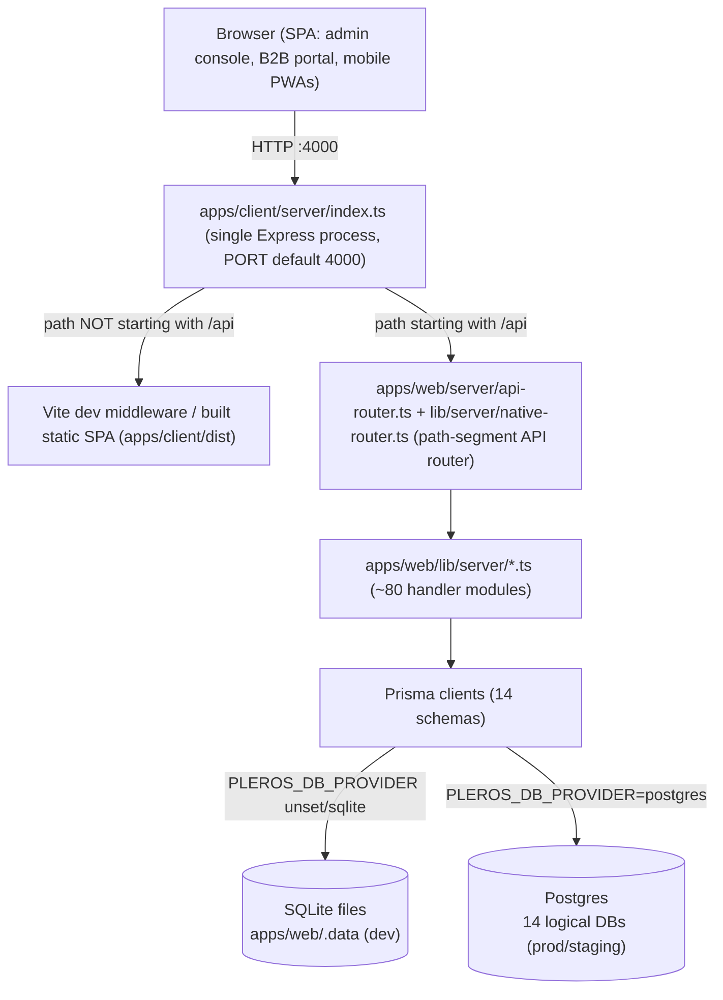
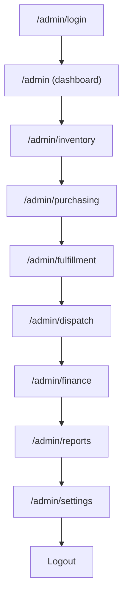
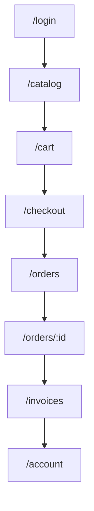
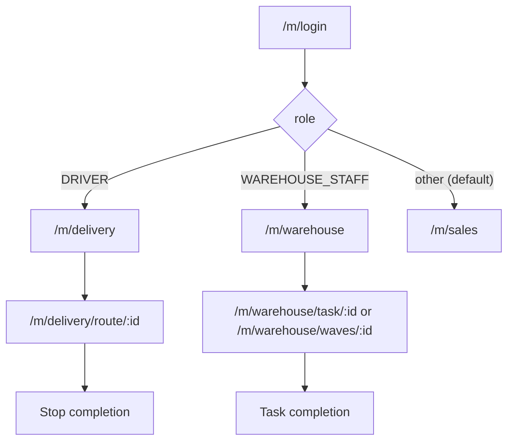

# Testing Flow Documentation

> Single source of truth for testing the Pleros / Cosmos ERP platform.

## 1. Overview

### 1.1 Purpose

This document is the master reference for testing the Pleros ERP / distribution platform (repo name `Cosmos`, package name `pleros`). It exists to give engineers and QA a single, verifiable procedure for standing up the application locally, understanding what "healthy" looks like, and exercising the platform's surfaces before a change ships. Every claim in this document is grounded in the actual scripts, environment files, and server code in this repository — see the fact-verification notes inline and in the linked source files.

### 1.2 Scope

This document covers the full monorepo as defined in the root `package.json` workspaces:

- `apps/web` (`@pleros/web`) — the API layer: Prisma schemas plus `lib/server/*.ts` business-logic modules, described in its own `package.json` as "Pleros API layer — Prisma + lib/server (served by @pleros/client Vite server)".
- `apps/client` (`@pleros/client`) — the single Express process (`apps/client/server/index.ts`) that serves the Vite/React SPA (admin console, B2B buyer portal, mobile field PWAs) and proxies `/api/*` requests into the `apps/web` API handler, all on one origin.
- `packages/*` — shared workspace packages: `@pleros/types`, `@pleros/ui`, `@pleros/web-gateway-client`, `@pleros/analytics-engine`.

Out of scope for this document: feature-by-feature acceptance criteria (see `PLATFORM_FEATURES.md`), the roadmap/gap analysis (`ERP_FEATURE_GAP.md`), production security hardening (`PRODUCTION_READINESS.md`), and the staging smoke-test script (`docs/QA_STAGING_CHECKLIST.md`) — this document is about the *mechanics* of testing (setup, startup, and, in later sections of this file, functional/API/DB test procedures), not a restatement of those other docs.

### 1.3 Application Architecture

Pleros runs as a **single-origin** application: one Express process serves both the browser SPA and the JSON API on the same host and port. There is no separate/standalone Express microservice for the API — `apps/web` contributes only a Prisma data layer and a tree of framework-agnostic handler modules under `lib/server/*.ts`; it has no server of its own (its own `dev` script literally says `"Use npm run dev from repo root (@pleros/client Vite server)"`).

Request flow, confirmed from source:

1. `apps/client/server/index.ts` starts one Express app on `PORT` (default `4000`).
2. Any request path starting with `/api` is buffered into a Fetch-API `Request` object and handed to `handleApiRequest()` in `apps/web/server/api-router.ts`.
3. `api-router.ts` answers a small number of routes directly (e.g. `GET /api/v1/health`, auth endpoints such as login/refresh/signup) and delegates everything else to `handleNativeApi()` in `apps/web/lib/server/native-router.ts` — a hand-written path-segment router (no Express/Next routing) that dispatches by `path[0]` (`tenants`, `users`, `skus`, `inventory`, `orders`, `invoices`, `wms`, `dispatch`, `bills`, `compliance`, `edi`, …) into the ~80 non-test modules in `apps/web/lib/server/`.
4. All non-`/api` requests fall through to the Vite dev middleware in development, or to the built static SPA (`apps/client/dist`) with an SPA fallback to `index.html` in production.
5. Handler modules read/write through Prisma clients against one of **14** independent Prisma schemas under `apps/web/prisma/*/schema.prisma` (`auth`, `tenant`, `inventory`, `order`, `crm`, `storefront`, `purchasing`, `payment`, `wms`, `dispatch`, `compliance`, `ledger`, `notification`, `analytics`) — each schema is a logical database, backed by embedded SQLite files in development or by separate Postgres databases (one per schema, same instance) in production/staging.



### 1.4 Testing Philosophy

The only automated test layer that exists in this repository today is **Node's built-in `--test` runner**, invoked via `tsx`. Confirmed per-workspace `test` scripts:

- `apps/web`: `node --import ./server/register-paths.mjs --import tsx --test lib/server/**/*.test.ts` — unit tests colocated next to the handler modules they cover (e.g. `barcode-labels.test.ts`, `compliance-recall.test.ts`, `fixed-assets.test.ts`, `dispatch-optimize.test.ts`).
- `apps/client`: `node --import tsx --test src/**/*.test.ts`
- `packages/analytics-engine` and `packages/web-gateway-client`: the same `node --import tsx --test src/**/*.test.ts` pattern.
- `packages/types` and `packages/ui`: no tests (`echo` stubs).

There is **no Jest, Vitest, or Playwright** anywhere in the repo (verified by grepping every `package.json` in the workspace tree) — meaning **there is no browser-driven end-to-end suite today**. Root `npm run test` (`node scripts/workspace-run.mjs test`) fans this out across workspaces, and `npm run prod:preflight` chains lint → test → build.

Because automated coverage stops at the unit-test layer, **manual and checklist-driven QA carries proportionally more weight** than it would in a codebase with an E2E suite. This document (and the later sections appended to it) is written with that gap in mind: it favors concrete, reproducible manual verification steps (exact URLs, exact curl/health checks, exact seeded accounts) over assuming a browser automation harness will catch regressions. If an E2E suite is introduced later, this section should be revisited — as of this writing, none exists.

---

## 2. Prerequisites

### 2.1 Required Software

| Requirement | Version / Notes | Source |
|---|---|---|
| Node.js | `>= 20` | `package.json` → `engines.node` |
| npm | `>= 10` | `package.json` → `engines.npm` (pinned `packageManager: npm@10.5.0`) |
| Git | any recent version, to clone the repo | — |
| Docker (optional) | only needed for `npm run infra:docker:up` (Postgres/Redis/MinIO/OTel-collector for scaled dev) or Postgres-mode testing | `docker-compose.yml` |

No global Postgres/Redis install is required for the default local workflow — local development uses embedded SQLite files under `apps/web/.data` with **no Postgres and no Docker** (per the comment at the top of `.env.example`).

### 2.2 Environment Setup

```bash
git clone <repo-url>
cd Cosmos
npm install
cp .env.example .env
# then set JWT_SECRET / JWT_REFRESH_SECRET to real random values (see 2.4)
```

`npm install` installs all workspaces (`apps/web`, `apps/client`, `packages/*`) in one pass because they are declared as npm workspaces in the root `package.json`.

### 2.3 Configuration Files

| File | Purpose |
|---|---|
| [`.env.example`](../.env.example) | Template for the root `.env` used by local development (SQLite by default). Copied to `.env` in step 2.2. |
| [`.env.production.example`](../.env.production.example) | Template for production/staging secrets (Postgres passwords, Redis password, live Stripe keys, `VITE_*` build-time values). Not used for local dev. |
| [`docker-compose.yml`](../docker-compose.yml) | Optional local infra: Postgres, Redis, MinIO, and an OpenTelemetry collector, for scaled-dev/Postgres-mode testing (`npm run infra:docker:up`). Plain local dev does not need this file. |
| [`docker-compose.production.yml`](../docker-compose.production.yml) | Production-style Compose stack: Postgres + Redis + the built `web` image, wired with per-schema `*_DATABASE_URL` variables. |
| [`render.yaml`](../render.yaml) | Render Blueprint for the `pleros-staging` and `pleros-production` web services plus a `pleros-staging-postgres` database; documents the exact env vars each hosted environment needs and the `/api/v1/health` health-check path. |
| [`package.json`](../package.json) | Root workspace scripts (`dev`, `build`, `test`, `db:*`, `seed`, `prod:preflight`, …). |
| [`tsconfig.base.json`](../tsconfig.base.json) | Shared strict TypeScript compiler options (`strict: true`, `target: ES2022`, `module: commonjs`) extended by workspace `tsconfig.json` files. |

### 2.4 Environment Variables Reference

The following table lists every variable present in `.env.example` (root). Purpose is inferred from the variable name and its inline comment — nothing here is invented.

| Variable | Purpose | Required? |
|---|---|---|
| `NODE_ENV` | Runtime mode (`development`/`production`); affects auth behavior (e.g. whether `verifyUrl` is returned to API responses). | Yes (defaults to `development` in the example) |
| `LOG_LEVEL` | Logging verbosity. | No (defaults to `info`) |
| `PLEROS_DATA_DIR` | Directory (relative to `apps/web`) holding embedded SQLite `.db` files when running without Postgres. | Yes for SQLite mode (defaults to `.data`) |
| `JWT_SECRET` | Signing secret for access tokens. | **Yes** — must be replaced with a real secret |
| `JWT_REFRESH_SECRET` | Signing secret for refresh tokens. | **Yes** — must be replaced with a real secret |
| `JWT_ACCESS_TTL` | Access-token lifetime (e.g. `15m`). | No (has a default) |
| `JWT_REFRESH_TTL` | Refresh-token lifetime (e.g. `7d`). | No (has a default) |
| `STRIPE_SECRET_KEY` | Stripe secret API key for server-side card checkout. | No locally (mock/dev-safe with placeholder); required for real Stripe flows |
| `STRIPE_PUBLISHABLE_KEY` | Stripe publishable key. | No locally |
| `STRIPE_WEBHOOK_SECRET` | Verifies incoming Stripe webhook signatures. | No locally |
| `STRIPE_RETURN_URL` | Redirect URL after Stripe Checkout. | No (defaults to `http://localhost:4000/checkout`) |
| `AWS_REGION` | Region for optional AWS S3 file storage (MSA/document archival). | No |
| `AWS_ACCESS_KEY_ID` | AWS credential. | No |
| `AWS_SECRET_ACCESS_KEY` | AWS credential. | No |
| `AWS_S3_BUCKET` | Target S3 bucket for document storage. | No |
| `NOTIFICATION_WEBHOOK_URL` | Optional outbound webhook for notification integration testing. | No |
| `PLEROS_OPS_EMAIL` | Ops/admin contact address used by notifications. | No |
| `SENDGRID_API_KEY` | Enables real email delivery for verification/invite/reset emails; without it, non-production signup/resend responses can return `verifyUrl` directly for QA convenience. | No locally; effectively required in production |
| `SENDGRID_FROM_EMAIL` | From-address for SendGrid-sent email. | No (defaults to `noreply@pleros.local`) |
| `APP_URL` | Public app origin used to build verification/reset/invite links. | Required in production; defaults to `http://localhost:4000` locally |
| `TWILIO_ACCOUNT_SID` | Twilio credential for SMS notifications. | No |
| `TWILIO_AUTH_TOKEN` | Twilio credential. | No |
| `TWILIO_FROM_NUMBER` | Twilio sending number. | No |
| `EXPO_PUSH_ACCESS_TOKEN` | Access token for Expo push notifications (mobile PWA). | No |
| `CELESTIAL_PROVIDER` | Selects the Celestial AI backend: `openrouter \| groq \| gemini \| ollama \| mock` (defaults to mock if no key is set). | No |
| `CELESTIAL_MODEL` | Model name for the selected Celestial provider. | No |
| `OPENROUTER_API_KEY` | Credential for the `openrouter` Celestial provider. | No |
| `GROQ_API_KEY` | Credential for the `groq` Celestial provider. | No |
| `GEMINI_API_KEY` | Credential for the `gemini` Celestial provider. | No |
| `CELESTIAL_OLLAMA_URL` | Local Ollama endpoint for the `ollama` Celestial provider. | No (defaults to `http://127.0.0.1:11434`) |
| `CELESTIAL_OLLAMA_MODEL` | Ollama model name. | No (defaults to `llama3.2`) |
| `PLEROS_OTEL_ENABLED` | Toggles OpenTelemetry export. | No (defaults to `false`) |
| `OPENTELEMETRY_ENDPOINT` | OTLP collector endpoint. | No (defaults to `http://localhost:4317`) |
| `PLEROS_DB_PROVIDER` | Set to `postgres` to switch the Prisma schemas from SQLite to Postgres (commented out by default — omitted means SQLite). | No (SQLite is the default) |
| `DATABASE_URL` | Base Postgres connection string, used only when `PLEROS_DB_PROVIDER=postgres`. | No locally; required when using Postgres |

> [!NOTE]
> `AWS_*` variables are present in `.env.example` but no `aws-sdk`/S3 client code was found under `apps/web/lib/server` at the time of writing — `apps/web/lib/server/msa-storage.ts` only performs a plain HTTPS `PUT` to an S3-compatible URL built from `MSA_S3_*` variables (a separate set, not the `AWS_*` ones above) when archiving MSA compliance reports. Treat `AWS_*` as reserved/optional rather than a hard prerequisite.

### 2.5 Database Setup

The provider switch is mechanical and controlled by `PLEROS_DB_PROVIDER`:

- **SQLite (default, no Postgres/Docker needed):**
  ```bash
  npm run db:setup          # scripts/setup-sqlite.mjs — creates apps/web/.data
  npm run db:generate-all   # scripts/generate-all-prisma.mjs — prisma generate for all 14 schemas
  npm run seed              # tsx scripts/seed-db.ts — demo tenant + accounts
  ```
- **Postgres:**
  ```bash
  PLEROS_DB_PROVIDER=postgres npm run db:setup:postgres   # scripts/setup-postgres.mjs
  npm run db:generate-all
  npm run db:migrate        # tsx scripts/migrate-all.ts — push all 14 Prisma schemas
  npm run seed
  ```
  Before generating/migrating against Postgres, `scripts/apply-prisma-provider.mjs` (invoked as `npm run db:provider`, and internally by the setup scripts) rewrites the `provider = "sqlite" | "postgresql"` line in every `apps/web/prisma/*/schema.prisma` file to match `PLEROS_DB_PROVIDER`.

`npm run db:migrate` and `npm run migrate:all` are the same script (`tsx scripts/migrate-all.ts`) under two names. `npm run infra:docker:up` (`docker compose -f docker-compose.yml up -d`) can supply a local Postgres/Redis/MinIO/OTel stack for Postgres-mode testing without installing them natively.

### 2.6 Authentication Requirements

Roles come from the `Role` enum in `apps/web/prisma/auth/schema.prisma`:

```
SUPER_ADMIN, TENANT_ADMIN, MANAGER, WAREHOUSE_STAFF, SALES_REP, DRIVER, ACCOUNTANT, VIEWER, STAFF
```

These are grouped into access-control sets in `apps/web/lib/server/session.ts`:

| Group | Roles | Used for |
|---|---|---|
| `ADMIN_ROLES` | `SUPER_ADMIN`, `TENANT_ADMIN`, `MANAGER`, `ACCOUNTANT` | Back-office/admin-gated routes (e.g. `GET /api/v1/health/db`) |
| `OPS_ROLES` | `ADMIN_ROLES` + `WAREHOUSE_STAFF` | Warehouse/fulfillment operations |
| `DRIVER_ROLES` | `ADMIN_ROLES` + `DRIVER` | Dispatch/delivery mobile PWA |
| `CRM_ROLES` (defined in `native-router.ts`) | `ADMIN_ROLES` + `SALES_REP` | CRM access |

`apps/web/lib/server/buyer-context.ts` additionally defines `PORTAL_BUYER_ROLES = ['STAFF', 'VIEWER']` — accounts with these roles are treated as B2B portal buyers (`isPortalBuyer()`) rather than back-office staff, and are resolved to a CRM customer record by matching email. There is no separate `BUYER` role value; buyer accounts use `STAFF` (the default role assigned by `apps/web/lib/server/auth.ts` on signup/invite when no role is given) or `VIEWER`.

For local testing, `npm run seed` creates the demo accounts documented in the root `README.md`:

| Role | Email | Password | Entry point |
|---|---|---|---|
| Admin | `admin@pleros.local` | `admin1234` | `/admin/login` |
| B2B buyer | `buyer@acme-retail.com` | `buyer1234` | `/login` |
| Warehouse | `warehouse@pleros.local` | `warehouse1234` | `/m/warehouse` |
| Driver | `driver@pleros.local` | `driver1234` | `/m/delivery` |
| Sales | `sales@pleros.local` | `sales1234` | `/m/sales` |

These seeded accounts exist only in the local database created by `npm run seed`; they are not present in production.

### 2.7 Third-Party Integrations

Confirmed by grepping `apps/web/lib/server` for each vendor's name/SDK:

| Integration | Confirmed usage | Hard prerequisite for local testing? |
|---|---|---|
| **Stripe** | `apps/web/lib/server/stripe.ts`, plus `billing.ts`, `invoices.ts`, `payments.ts`, `saved-payment-methods.ts`, `native-router.ts` | No — card checkout runs in a test/mock-safe mode with the placeholder `sk_test_replace_me` key from `.env.example`; real keys are only needed to exercise live Stripe flows. |
| **SendGrid** | `apps/web/lib/server/notification-provider.ts`, `notification-provider-status.ts`, `auth.ts` | No locally — without `SENDGRID_API_KEY`, emails log to the console and signup/resend can return `verifyUrl` directly for QA. Effectively required before go-live. |
| **Twilio** | `apps/web/lib/server/notification-provider.ts`, `notification-provider-status.ts` | No — SMS notifications are optional and only activate when Twilio credentials are set. |

No references to an AWS SDK, S3 client, or Expo push SDK were found under `apps/web/lib/server` at the time of writing, despite `AWS_*` and `EXPO_PUSH_ACCESS_TOKEN` appearing in `.env.example` — treat those as reserved/future rather than active integrations to test against.

---

## 3. Application Startup Flow

### 3.1 Starting the application

From the repo root, after completing Section 2:

```bash
npm run dev
```

This one command chains three steps (see the root `package.json` `dev` script):

1. `node scripts/prepare-dev-env.mjs` — reads the root `.env` (creating it from `.env.example` if missing) and writes `apps/web/.env.local` with the correct SQLite `file:` URLs (or Postgres URLs, if `PLEROS_DB_PROVIDER=postgres`) for each of the 14 schemas, plus a matching `apps/client/.env` for Vite build-time variables.
2. `node scripts/generate-all-prisma.mjs` — runs `prisma generate` for all 14 schemas so the Prisma clients match the current schema files.
3. `npm run dev -w @pleros/client` — runs `tsx server/index.ts`, which starts the single Express process described in Section 1.3: it mounts the `/api/*` proxy to the native API router, starts background jobs (`startBackgroundJobs()` from `apps/web/lib/server/background-jobs.ts`), and either wires in Vite's dev middleware (non-production) or serves the built static SPA (production, via `npm run start -w @pleros/client`).

The server listens on `PORT` (defaulting to `4000` — set in `apps/client/server/index.ts` as `Number(process.env.PORT ?? 4000)`), so the application is reachable at:

```
http://localhost:4000
```

### 3.2 What "healthy" looks like

Two real, code-confirmed health endpoints exist:

| Endpoint | Auth | Defined in | Behavior |
|---|---|---|---|
| `GET /api/v1/health` | None (public) | `apps/web/server/api-router.ts` | Returns `{ status: "ok", service: "pleros", api: "native", timestamp }` with HTTP 200. This is also the `healthCheckPath` Render uses for the hosted `pleros-staging` and `pleros-production` services in `render.yaml`. |
| `GET /api/v1/health/db` | Requires a session with an `ADMIN_ROLES` role | `apps/web/lib/server/native-router.ts` (dispatches to `checkDatabaseConnections()` in `apps/web/lib/server/db-health.ts`) | Returns `{ provider: "sqlite" \| "postgresql", checks: [...], allOk: boolean }` — one check per `*_DATABASE_URL` env key plus an `auth_connectivity` check that runs `SELECT 1` against the auth database. |

A quick unauthenticated check:

```bash
curl -s http://localhost:4000/api/v1/health
# {"status":"ok","service":"pleros","api":"native","timestamp":"..."}
```

Beyond the API, "healthy" also means the SPA shell loads — hit `http://localhost:4000/` (role-based landing page) or `http://localhost:4000/admin/login` and confirm the login form renders without a blank page or console errors.

### 3.3 Pre-test verification checklist

- [ ] `npm run dev` starts with no uncaught errors in the terminal, and logs `[pleros] Vite + API @ http://localhost:4000`.
- [ ] `curl -s http://localhost:4000/api/v1/health` returns HTTP 200 with `"status":"ok"`.
- [ ] `http://localhost:4000/admin/login` (or `/login` for the buyer portal) loads the login form in a browser with no blank page.
- [ ] The database exists and is reachable: for SQLite, `apps/web/.data/` contains the per-schema `.db` files after `npm run db:setup && npm run db:generate-all`; for Postgres, `GET /api/v1/health/db` (as an authenticated admin) reports `allOk: true`.
- [ ] `npm run seed` has been run at least once so the demo accounts in Section 2.6 exist, if functional/manual testing requires logging in.

> [!TIP]
> If `npm run dev` fails immediately, check that `.env` exists at the repo root (copy it from `.env.example` per Section 2.2) — `scripts/prepare-dev-env.mjs` will auto-create it from the example on first run, but will exit with an error if neither file is present.

---

## 4. End-to-End Testing Flow

Section 1.3 established that one Express process serves three distinct SPA surfaces from `apps/client/src/router.tsx`: the admin/back-office console under `/admin/*`, the B2B buyer portal under `/` (wrapped in `ShopLayout`), and the mobile field PWAs under `/m/*` (wrapped in `MobileLayout`). Each surface has its own realistic end-to-end path through the product, and the three paths write to (and read from) overlapping data — an order placed through the buyer portal shows up in the admin `/admin/orders` list and can generate a mobile warehouse task. The flows below are ordered the way they should be *tested*, not necessarily the way a real user would click through in one sitting.

### 4.1 Admin / Back-Office Flow



All eight route segments in the diagram are real children of the `/admin` route in `apps/client/src/router.tsx`. The router also defines several admin routes not shown on this main line — `crm`, `quotes`, `compliance`, `compliance/msa/:reportId`, `pos`, `celestial`, `warehouse`, `notifications`, `onboarding` — which branch off the dashboard and can be tested independently; they are omitted from the diagram only to keep the primary path readable.

The ordering is not arbitrary — it follows real code dependencies confirmed in Section 6:

- **Inventory before Purchasing/Fulfillment.** Receiving a PO (`po-receiving.ts`) and running WMS putaway/cycle-count (`wms-putaway.ts`, `wms-cycle-count.ts`) both import `inventory.ts` directly to mutate stock levels, and the order fulfillment pipeline (`order-orchestration.ts`) also imports `inventory.ts`. Testing Purchasing or Fulfillment against a SKU that was never created/stocked in Inventory will produce misleading failures that have nothing to do with the feature under test.
- **Fulfillment/Dispatch before Finance.** `order-orchestration.ts` imports `wms-fulfillment.ts` (pick/pack/ship) and drives the order into a shippable state; `dispatch.ts` imports `order-orchestration.ts` and `crm.ts` to resolve route stops back to orders. The invoice that Finance reconciles is generated from the order via `orders.ts` → `syncInvoiceFromOrder` → `invoices.ts` → `invoice-gl.ts`, so an order that never completed fulfillment/dispatch has no realistic invoice/ledger trail for Finance testing to exercise.
- **Reports last (before Settings).** `report-builder.ts` imports `orders.ts`, `invoices.ts`, `inventory.ts`, and `crm.ts` directly — it is the one module confirmed to read from every upstream feature area, so it is only meaningful to test once those areas already have data.
- **Settings tested last.** Role/permission constants such as `ADMIN_ROLES` (Section 2.6, defined in `apps/web/lib/server/session.ts:85`) and `CRM_ROLES` (defined in `apps/web/lib/server/native-router.ts:56`, built from `ADMIN_ROLES` plus `SALES_REP`) gate access to nearly every other admin route. Changing a role's permissions in Settings can change what the rest of this flow is even allowed to see, so re-running Settings changes earlier in the sequence would invalidate the tests that follow it.

### 4.2 Buyer Portal Flow



These routes are the `ShopLayout` children in `apps/client/src/router.tsx` (`/catalog`, `/cart`, `/checkout`, `/orders`, `/orders/:id`, `/invoices`, `/invoices/:id`, `/account`); the buyer signs in at `/login`, distinct from the admin's `/admin/login`. As Section 2.6 established, buyer-portal accounts have no dedicated `BUYER` role — they are `STAFF` or `VIEWER` accounts recognized as portal buyers by `isPortalBuyer()` in `apps/web/lib/server/buyer-context.ts`.

Checkout is where the flow's real dependencies surface: `checkout` submits through the same `orders.ts` module the admin console uses, which calls `assertOrderLinePrices` (`pricing.ts`), `computeSalesTax`/`getTenantSalesTaxRate` (`compliance-tax.ts`/`tenant-tax.ts`), and `assertCreditAvailable` (`credit-limit.ts`) before the order is accepted. A checkout tested against a SKU with no price row, a tenant with no configured tax rate, or a customer with no credit limit record will fail for reasons unrelated to the checkout UI itself. Once an order is created, `orders.ts` calls `syncInvoiceFromOrder` (`invoices.ts`), which is what populates `/invoices` for the buyer to view — so Invoices cannot be tested before at least one Checkout has completed. The router also exposes a parallel `/quotes` → `/quotes/new` → `/quotes/:id` path under the same `ShopLayout` for RFQ-style buying, which can be tested as a branch off Catalog rather than through Cart/Checkout.

### 4.3 Mobile PWA Flow



The role-to-home mapping is not a guess — it is the literal `defaultMobileHome()` function in `apps/client/src/pages/m/login/page.tsx`:

```ts
function defaultMobileHome(role: string | undefined): string {
  if (role === 'DRIVER') return '/m/delivery'
  if (role === 'WAREHOUSE_STAFF') return '/m/warehouse'
  return '/m/sales'
}
```

So `DRIVER` lands on `/m/delivery`, `WAREHOUSE_STAFF` lands on `/m/warehouse`, and every other role (including `SALES_REP`) falls through to `/m/sales`. `/m/warehouse` links into task/wave detail pages (`/m/warehouse/task/:id`, `/m/warehouse/waves/:id`, `/m/warehouse/receiving`), all real children of the `/m` route in `router.tsx`; `/m/delivery` links into `/m/delivery/route/:id`. `/m/sales` has no nested detail route in the router today, so its flow ends at the single page.

Because `order-orchestration.ts` imports `wms-fulfillment.ts` and `dispatch.ts` imports `order-orchestration.ts`, completing a task on `/m/warehouse/task/:id` or a stop on `/m/delivery/route/:id` writes back into the same order/inventory/dispatch records the admin console (`/admin/fulfillment`, `/admin/dispatch`) reads. The admin and mobile flows should be tested against the same seeded order for a completion action on mobile to be verifiable by checking the corresponding admin screen.

## 5. Module-by-Module Testing

> Route paths below are the literal children of the `/admin` route (`AdminLayout`) in `apps/client/src/router.tsx`. Backend routing for every module is dispatched from `apps/web/lib/server/native-router.ts`, a hand-written path-segment router: `handleNativeApi()` reads `path[0]` and calls a `route<X>()` function (e.g. `routeInventory`, `routePurchaseOrders`, `routeWms`) which then reads deeper segments/method to pick a handler in the matching `lib/server/*.ts` module. Role enforcement is via `requireRole(req, ROLES)` / `assertRole(session, ROLES)` from `session.ts`, against the real `Role` enum (`SUPER_ADMIN`, `TENANT_ADMIN`, `MANAGER`, `WAREHOUSE_STAFF`, `SALES_REP`, `DRIVER`, `ACCOUNTANT`, `VIEWER`, `STAFF` — `apps/web/prisma/auth/schema.prisma`) and two composed role lists defined in `session.ts`: `ADMIN_ROLES = [SUPER_ADMIN, TENANT_ADMIN, MANAGER, ACCOUNTANT]` and `OPS_ROLES = [...ADMIN_ROLES, WAREHOUSE_STAFF]`.

### 5.1 Inventory

**Purpose:** Maintain the SKU catalog and per-warehouse stock positions (on hand/reserved/available), and post every stock movement to an immutable ledger.
**Entry point:** `/admin/inventory` (list, `apps/client/src/pages/admin/inventory/page.tsx`) and `/admin/inventory/:skuId` (detail, `apps/client/src/pages/admin/inventory/[skuId]/page.tsx`)
**Backing API modules:** `apps/web/lib/server/inventory.ts` (SKUs, stock levels, ledger, adjust/receive/transfer/reserve/release, demand plan, low-stock alerts), `apps/web/lib/server/inventory-lots.ts` (lot tracking), `apps/web/lib/server/inventory-serials.ts` (serial tracking), routed via `routeSkus`/`routeInventory`/`routeWarehouses` in `apps/web/lib/server/native-router.ts`
**Prisma schemas touched:** `inventory` schema (`SKU`, `StockLevel`, `StockLedgerEntry`, `Warehouse`, `BinLocation`, `StockReservation`, `InventoryLot`, `SerialUnit` — `apps/web/prisma/inventory/schema.prisma`)
**Roles required:** `OPS_ROLES` (`SUPER_ADMIN`, `TENANT_ADMIN`, `MANAGER`, `ACCOUNTANT`, `WAREHOUSE_STAFF`) for all `/inventory/*` endpoints and any non-GET `/skus/*` call (`routeSkus` calls `assertRole(session, OPS_ROLES)` when `method !== 'GET'`); `/warehouses` writes are further restricted to `ADMIN_ROLES` only — `WAREHOUSE_STAFF` can view warehouses but not create one or set the default.

<details>
<summary>Test Checklist</summary>

- [ ] Functional: create a new SKU with code, name, category, cost, price, and a default warehouse/reorder point via the "New SKU" drawer, then receive stock against it from the SKU detail page ("Receive stock" → `POST /inventory/receive`)
- [ ] UI validation: on the New SKU drawer, "Create" stays disabled until both Code and Name are non-empty (`disabled={saving || !code.trim() || !name.trim()}`); toggling "Is tobacco" force-enables "Age restricted" and "Regulated product" and defaults minimum age to 21
- [ ] Form validation: "Adjust stock" requires a selected warehouse, a non-zero quantity delta, and a non-empty reason before "Apply" is enabled (`!adjWarehouse || adjDelta === 0 || !adjReason.trim()`)
- [ ] Navigation: click a SKU code in the inventory table to land on `/admin/inventory/:skuId`; use the "← Inventory" link on the detail page to return to the list
- [ ] Permissions: log in as a role outside `OPS_ROLES` (e.g. `SALES_REP` or `DRIVER`) and confirm any `/inventory/*` call (adjust, receive, transfer, levels) is rejected — `requireRole` throws before any handler in `routeInventory` runs
- [ ] Error handling: submit "Adjust stock" with a quantity delta large enough to drive `quantityOnHand` negative — `adjustStock` throws `ApiError(400, 'Adjustment would drive stock negative')` (`inventory.ts:582`)
- [ ] Edge cases: attempt "Transfer" with a quantity greater than `quantityAvailable` at the source warehouse — `transferStock` throws `ApiError(400, 'Insufficient available stock at source warehouse')` (`inventory.ts:278`)
- [ ] Empty state: with no SKUs matching the search/category/warehouse filters, the table renders the `EmptyState` "No SKUs match" panel with a "New SKU" action
- [ ] Loading state: while `skusQ` is loading, six skeleton rows (`div.skeleton`) render in place of the table
- [ ] Success scenario: "Adjust stock" applies the delta and appends a `StockLedgerEntry` with the given `eventType`/`quantityDelta`/`performedBy`, visible immediately in the "History" ledger modal
- [ ] Failure scenario: receiving stock into a nonexistent SKU/warehouse pair returns an error surfaced via `formatApiReachabilityError`, and no `StockLedgerEntry` row is created

</details>

**Expected results:** every stock-changing action (adjust/receive/transfer) writes exactly one `StockLedgerEntry` row whose `quantityAfter` matches the resulting `StockLevel.quantityOnHand`, and the demand-plan panel's "Suggest buy" quantities reflect `/inventory/demand-plan`. **Must never happen:** `StockLevel.quantityOnHand` or `quantityAvailable` must never go negative — every write path (`adjustStock`, `transferStock`, `reserveStock`) checks this before persisting.
**Screens:** `/admin/inventory` (list, filters, demand-plan panel, CSV import, New/Edit SKU drawer, ledger modal, adjust-stock modal) · `/admin/inventory/:skuId` (detail: tracking toggles, stock-by-warehouse table, batch tracking, ledger history, receive/transfer modals, label printing)

### 5.2 Purchasing

**Purpose:** Create and progress purchase orders against suppliers (draft → submit → receive → close/cancel), including landed-cost allocation onto received unit cost.
**Entry point:** `/admin/purchasing` (list + suppliers tab, `apps/client/src/pages/admin/purchasing/page.tsx`) and `/admin/purchasing/:poId` (detail, `apps/client/src/pages/admin/purchasing/[poId]/page.tsx`)
**Backing API modules:** `apps/web/lib/server/purchasing.ts` (PO/supplier CRUD, submit/cancel/receive/payments, landed-cost preview), `apps/web/lib/server/po-receiving.ts` (receipt validation, inventory posting, PO status refresh, bill/payment side effects via dynamic `await import('./ap-bills')`), `apps/web/lib/server/landed-cost.ts` (freight/duty/other allocation math, imported dynamically by both `purchasing.ts` and `po-receiving.ts`), routed via `routePurchaseOrders`/`routeSuppliers` in `native-router.ts`
**Prisma schemas touched:** `purchasing` schema (`Supplier`, `PurchaseOrder`, `PurchaseOrderLine`, `VendorBill`, `VendorBillLine` — `apps/web/prisma/purchasing/schema.prisma`); receiving also posts to the `inventory` schema (`StockLevel`, `StockLedgerEntry`) through `po-receiving.ts`'s static `import * as inv from './inventory'`
**Roles required:** reading POs/list (`GET /purchase-orders*`) requires `OPS_ROLES`, but every write — create, submit, cancel, receive, record payment, edit landed costs — requires `ADMIN_ROLES` only (`routePurchaseOrders`: `isRead ? requireRole(OPS_ROLES) : requireRole(ADMIN_ROLES)`), so `WAREHOUSE_STAFF` can view but not create/modify a PO. Suppliers: any non-buyer authenticated user can `GET`, but create/update requires `ADMIN_ROLES` (`routeSuppliers`).

<details>
<summary>Test Checklist</summary>

- [ ] Functional: create a purchase order for supplier X with one line (SKU code, description, qty ordered), submit it (`DRAFT` → `SUBMITTED`), then record a partial receipt of fewer units than ordered and confirm status becomes `PARTIALLY_RECEIVED`
- [ ] UI validation: the "New PO" drawer's "Create" button stays disabled until a supplier is selected (`disabled={props.loading || !supplierId}`); the "Record receipt" drawer clamps each line's input to `[0, open]` where `open = qtyOrdered - qtyReceived`
- [ ] Form validation: "New supplier" requires both Code and Name non-empty before "Create" enables
- [ ] Navigation: from `/admin/purchasing`, the "Purchase orders"/"Suppliers" tabs toggle in place (no route change); clicking a PO number's "View" link routes to `/admin/purchasing/:poId`; the inventory reorder-suggestion flow deep-links here via `?skuId=` query param, which prefills a PO line from `/skus/:id/reorder-suggestion`
- [ ] Permissions: log in as `WAREHOUSE_STAFF` and confirm PO list loads (`GET` allowed under `OPS_ROLES`) but "New PO", "Submit PO", "Cancel PO", and "Save landed costs" all fail with 403 since those require `ADMIN_ROLES`
- [ ] Error handling: submit a PO create with a line `qtyOrdered` of 0 or a missing supplier — the backend rejects it before a `PurchaseOrder` row is created
- [ ] Edge cases: attempt to receive more units on a line than are still open (`qtyOrdered - qtyReceived`) — the "Record receipt" input is capped at `open` client-side, and `po-receiving.ts`'s `validateAndApplyPoLineReceipts` rejects any receipt over the remaining quantity server-side
- [ ] Empty state: with zero purchase orders, the list renders `EmptyState` "No purchase orders" with a "New PO" action; zero suppliers renders "No suppliers" with a "New supplier" action
- [ ] Loading state: PO/supplier tables show "Loading…" text (not a skeleton) while `posQuery`/`suppliers` are in flight
- [ ] Success scenario: recording a receipt increments the matching `PurchaseOrderLine.qtyReceived`, posts a `StockLedgerEntry` via `postInventoryForPoReceipts` in `po-receiving.ts`, and (per `dispatch.ts` line 233's dynamic import) can create a `VendorBill` from the PO
- [ ] Failure scenario: if the inventory posting fails for a line during receipt, the UI surfaces the count of failed lines via `res.inventoryErrors` in a toast ("Receipt saved, but N inventory posting(s) failed") while the PO record itself is still updated

</details>

**Expected results:** a submitted PO's status transitions strictly `DRAFT` → `SUBMITTED` → (`PARTIALLY_RECEIVED` →) `CLOSED`, or to `CANCELLED` from `DRAFT`/`SUBMITTED`; landed costs (freight/duty/other) allocate across lines by value and feed `computeReceivedUnitCost`. **Must never happen:** a PO line's `qtyReceived` must never exceed its `qtyOrdered`, and a non-`ADMIN_ROLES` session must never be able to submit, cancel, or receive against a PO even if it can view the list.
**Screens:** `/admin/purchasing` (PO list with status filter chips, New PO drawer, Suppliers tab, New supplier drawer) · `/admin/purchasing/:poId` (status actions, landed-cost editor + preview, line items table, Record receipt drawer, "Start WMS session" shortcut into Warehouse receiving)

### 5.3 Fulfillment

**Purpose:** Track and progress warehouse pick tasks for released orders through pick → pack → dispatch, gating each transition on completion of the prior step and on product-recall status.
**Entry point:** `/admin/fulfillment` (task queue, `apps/client/src/pages/admin/fulfillment/page.tsx`) and `/admin/fulfillment/:taskId` (task detail, `apps/client/src/pages/admin/fulfillment/[taskId]/page.tsx`)
**Backing API modules:** `apps/web/lib/server/wms-fulfillment.ts` (task CRUD, pick-line confirmation, pack, dispatch status derivation; re-exports `derivePickLineStatus` from `pick-line-status.ts`), `apps/web/lib/server/pick-bin-resolver.ts` (enriches pick lines with resolved bin codes), routed via `routeFulfillment` (task create/cancel/pack/dispatch, under `/fulfillment/*`) and `routeWms` (task list/detail/assign/pick-lines/pick-all, under `/wms/tasks*`) in `native-router.ts`; dispatch itself is finished by `order-orchestration.ts`'s `dispatchFulfillmentTask`
**Prisma schemas touched:** `wms` schema (`FulfillmentTask`, `PickLine` — `apps/web/prisma/wms/schema.prisma`)
**Roles required:** `OPS_ROLES` (`SUPER_ADMIN`, `TENANT_ADMIN`, `MANAGER`, `ACCOUNTANT`, `WAREHOUSE_STAFF`) for every fulfillment/WMS-task endpoint — both `routeFulfillment` and `routeWms` call `requireRole(req, OPS_ROLES)` before dispatching on the sub-path.

<details>
<summary>Test Checklist</summary>

- [ ] Functional: open a `PENDING` task from the queue, use "Pick all" to mark every pick line `PICKED`, click "Pack" once all lines are `PICKED`/`SHORT`, then "Dispatch" once the task is `PACKED`
- [ ] UI validation: the "Pack" button is disabled while the task is already `PACKED`/`DISPATCHED`, and its tooltip reads "Every line must be PICKED or SHORT…" whenever `packingReady` is false; "Dispatch" is disabled unless `t.status !== 'PACKED'` is false (i.e. only enabled when status is exactly `PACKED`)
- [ ] Form validation: individual "Pick" buttons per line pass the full ordered `quantity` as `pickedQty`; a partial pick (less than ordered qty) without `markShort: true` is rejected by `confirmPickLine`'s "Partial pick requires markShort: true or pick full quantity" check
- [ ] Navigation: the task queue's status filter chips (`Active pickup`, `All open`, `Assigned`, `Pending`, `Picking`, `Ready to pack`, `Packed`, `Dispatched`) refetch `/wms/tasks` with `?status=`; clicking a task id routes to `/admin/fulfillment/:taskId`; the task detail links back to the originating order at `/admin/orders/:orderId`
- [ ] Permissions: as `SALES_REP` (outside `OPS_ROLES`), confirm `GET /wms/tasks` and every pack/dispatch/assign call is rejected before reaching `wms-fulfillment.ts`
- [ ] Error handling: try "Pick all" on a task whose status is `CANCELLED`, `PACKED`, or `DISPATCHED` — `assertTaskPickable` throws `ApiError(400, 'Cannot pick for task in status ...')`
- [ ] Edge cases: pick, pick-all, pack, and dispatch on a task that has a pick line whose `batchId` is under an active recall — each of the four call sites in `wms-fulfillment.ts` (`confirmPickLine`, `confirmAllPickLines`, `markFulfillmentPacked`, `markFulfillmentDispatched`) dynamically imports `checkBatchNotRecalled` from `compliance-recall.ts` and throws before the transition is applied
- [ ] Empty state: with no tasks matching the current filters, the queue renders `EmptyState` "No tasks in this view" ("adjust filters, or wait for orders to create WMS fulfillment tasks from the saga")
- [ ] Loading state: the task queue shows "Loading…" text while `tasks` query is in flight; it also polls every 45s (`refetchInterval: 45_000`)
- [ ] Success scenario: dispatching a `PACKED` task calls `orderOrchestration.dispatchFulfillmentTask`, which (per Section 6's dependency chain) commits inventory, fills backorder shorts, and updates the order/invoice — the task's status becomes `DISPATCHED` and the pick-progress bar shows 100%
- [ ] Failure scenario: packing a task with any pick line still `PENDING`/`PICKING` fails with "All lines must be PICKED or SHORT before packing" and the task status is unchanged

</details>

**Expected results:** a task's status only ever advances `PENDING`/`ASSIGNED` → `PICKING` → `PACKED` → `DISPATCHED` (or to `CANCELLED`), never skipping pack before dispatch. **Must never happen:** a task must never be packed while any `PickLine.status` is still `PENDING`, and a batch under an active recall must never be picked, packed, or dispatched.
**Screens:** `/admin/fulfillment` (task queue with status/warehouse/order filters) · `/admin/fulfillment/:taskId` (assignee picker, Pick all/Pack/Dispatch actions, per-line pick buttons)

### 5.4 Warehouse (WMS)

**Purpose:** Operate the physical warehouse floor — directed receiving against POs, putaway into bins, wave-batched picking, bin-location management, cycle counts with approval-gated inventory adjustment, and labor productivity metrics.
**Entry point:** `/admin/warehouse` (tabbed console — Pick tasks / Wave picking / Bin locations / Receiving / Putaway / Labor / Cycle counts — `apps/client/src/pages/admin/warehouse/page.tsx`)
**Backing API modules:** `apps/web/lib/server/wms-receiving.ts` (receiving sessions, barcode scan, complete → triggers putaway via dynamic `await import('./wms-putaway')`), `apps/web/lib/server/wms-putaway.ts` (bin suggestion, putaway task creation/confirmation, calls `recordLaborEvent` from `wms-labor.ts` statically), `apps/web/lib/server/wms-cycle-count.ts` (count CRUD, import, submit-for-approval, approve-and-post using `computeCycleCountDelta`/`cycleCountLineNeedsAdjustment` from `cycle-count-adjust.ts`), `apps/web/lib/server/wave-picking.ts` (wave create/start/complete, enriches lines with `pick-bin-resolver.ts`), `apps/web/lib/server/bin-locations.ts` (bin CRUD), `apps/web/lib/server/wms-labor.ts` (productivity metrics), routed via `routeWms` (`/wms/tasks`, `/wms/receiving/sessions`, `/wms/putaway/tasks`, `/wms/labor/metrics`, `/wms/cycle-counts`), `routePickWaves` (`/pick-waves`), and `routeBins` (`/bins`) in `native-router.ts`
**Prisma schemas touched:** `wms` schema (`ReceivingSession`, `ReceivingItem`, `PutawayTask`, `PutawayLine`, `CycleCount`, `CycleCountLine`, `PickWave`, `PickWaveTask`, `WmsLaborEvent` — `apps/web/prisma/wms/schema.prisma`); bin locations and cycle-count approval also write to the `inventory` schema's `BinLocation` and `StockLevel`/`StockLedgerEntry` tables
**Roles required:** `OPS_ROLES` for every `/wms/*`, `/pick-waves/*`, and `/bins/*` endpoint (`routeWms`, `routePickWaves`, `routeBins` all call `requireRole(req, OPS_ROLES)`), **except** cycle-count approval — `POST/PATCH /wms/cycle-counts/:id/approve` additionally calls `assertRole(session, ADMIN_ROLES)`, so `WAREHOUSE_STAFF` can create and submit a count but only `SUPER_ADMIN`/`TENANT_ADMIN`/`MANAGER`/`ACCOUNTANT` can approve it and post the resulting stock adjustments.

<details>
<summary>Test Checklist</summary>

- [ ] Functional: on the Receiving tab, start a session against a warehouse (optionally a PO id), import or scan received lines, then "Complete session" — confirm a `PutawayTask` with suggested bins appears on the Putaway tab; confirm the suggested bin, then check the Bin locations tab reflects the new stock
- [ ] UI validation: the "Add bin location" form requires a non-empty Code before "Add bin" enables; "Complete session" and the row-level "Complete" button on Receiving both block with a toast ("Scan at least one item before completing.") when `_count.items < 1`
- [ ] Form validation: the "New cycle count" drawer requires a warehouse selection before "Create" enables and defaults `type` to `FULL` (with `ABC`/`RANDOM` alternatives)
- [ ] Navigation: the seven tabs (Pick tasks, Wave picking, Bin locations, Receiving, Putaway, Labor, Cycle counts) switch state in place without a route change; the "Pick path" toggle on a wave row expands/collapses the bin-ordered pick path inline
- [ ] Permissions: as `WAREHOUSE_STAFF`, confirm cycle-count creation and "Submit for approval" succeed but the "Approve & post" button's underlying `POST /wms/cycle-counts/:id/approve` call is rejected with 403 (only `ADMIN_ROLES` may call it)
- [ ] Error handling: submit a cycle-count line's counted quantity, then attempt "Approve & post" while the count is still `IN_PROGRESS` (not yet `PENDING_APPROVAL`) — the approve action is only rendered/enabled when `status === 'PENDING_APPROVAL'`
- [ ] Edge cases: enter a cycle-count line's counted quantity equal to its system quantity (zero variance) — `cycleCountLineNeedsAdjustment` should report no adjustment needed, so approving posts zero stock adjustments even though the line was counted
- [ ] Empty state: a warehouse with no bin locations shows `EmptyState` "No bin locations"; a warehouse with no pick waves shows "No pick waves" with a "New pick wave" action gated on a warehouse being selected
- [ ] Loading state: every list on this page (pick tasks, waves, bins, receiving sessions, putaway tasks, labor metrics, cycle counts) renders skeleton rows (`div.skeleton`) while its query is loading
- [ ] Success scenario: approving a `PENDING_APPROVAL` cycle count calls `wmsCycleCount.approveCycleCount`, which posts one `StockLedgerEntry`/adjustment per line where `cycleCountLineNeedsAdjustment` is true, and the UI toasts "Cycle count posted — N stock adjustment(s) applied."
- [ ] Failure scenario: creating a pick wave with zero selected tasks is blocked client-side (`disabled={waveTaskSelection.size === 0}`); starting a wave that is not `OPEN`, or completing one that is not `IN_PROGRESS`, has no corresponding UI action exposed for that state

</details>

**Expected results:** the receiving → putaway → bin flow and the wave-picking flow both terminate in `StockLevel`/`StockLedgerEntry` rows consistent with what was physically scanned/counted; cycle-count adjustments are only ever posted after `ADMIN_ROLES` approval. **Must never happen:** a cycle count must never post inventory adjustments before an `ADMIN_ROLES` user has approved it (`WAREHOUSE_STAFF` submitting is not sufficient), and a pick wave must never be created with zero tasks selected.
**Screens:** `/admin/warehouse` tabs — Pick tasks (assign, detail modal), Wave picking (create wave drawer, pick-path view), Bin locations (add/remove per warehouse), Receiving (new session drawer, session detail with CSV import), Putaway (confirm-line actions), Labor (7-day productivity table), Cycle counts (new count drawer, count detail with line-level counted-qty editing and CSV import)

<!-- SECTION-5-INSERT-POINT -->

## 6. Feature Dependencies

Section 4's flow ordering is a consequence of real import relationships inside `apps/web/lib/server/*.ts`, not a stylistic choice. This section makes those relationships explicit so a tester (or a future task author) can tell which modules must be exercised — or at least seeded — before another module's tests are meaningful.

### 6.1 Dependency Table

> [!NOTE]
> A static `grep "^import"` alone understates several of these modules' real dependencies — a number of them reach other modules through runtime `await import('./module')` calls (often to defer a require until a specific branch, e.g. a cash-sale or a refund path) rather than a top-of-file `import`. The rows below were re-checked with `grep -n "await import(" <file>` in addition to the static-import grep, and call out dynamic dependencies explicitly where they exist.

| Feature (module) | Depends On | Why (evidence) |
|---|---|---|
| POS (`pos.ts`) | `orders.ts` (static) for order creation/pricing/tax/credit — **plus direct dynamic imports** of `order-orchestration.ts`, `wms-fulfillment.ts`, `inventory.ts`, and `inventory-serials.ts` | Static imports are only `orders`, `session`, `feature-flags`, `audit-log` (`pos.ts:1-7`), so a first pass (grepping only `^import`) suggests POS never touches inventory/WMS directly. That's wrong: `pos.ts` also contains four runtime `await import(...)` calls — `./order-orchestration` (`pos.ts:70,97`, for `cancelOrderWithCompensation`/`transitionOrderStatus`/`onFulfillmentDispatched`/`onDeliveryStopDelivered`), `./wms-fulfillment` (`pos.ts:84`, `cancelFulfillmentByOrder`), `./inventory` (`pos.ts:87`, `commitShipmentForOrder`), and `./inventory-serials` (`pos.ts:88`, `enforceAndShipSerialsForOrder`). On a CASH/CHECK sale, POS itself — not `orders.ts` — cancels the pick task, ships serials, and commits the inventory shipment directly. Pricing/tax/credit still only reach POS indirectly through `orders.ts` (`orders.ts:4-10`); the inventory/WMS/order-orchestration dependency is direct, just dynamic. |
| Orders (`orders.ts`) | `pricing.ts`, `compliance-tax.ts`, `tenant-tax.ts`, `credit-limit.ts`, `order-orchestration.ts`, `invoices.ts`, `compliance-age.ts`, `notification-triggers.ts` | Direct imports at `orders.ts:4-12`. |
| Order Orchestration (`order-orchestration.ts`) | `inventory.ts`, `wms-fulfillment.ts`, `order-payment-sync.ts`, `payments.ts`, `order-status.ts`, `backorders.ts`, `drop-ship.ts` | Direct imports at `order-orchestration.ts:10-17` (`import * as inv from './inventory'`, `import * as wmsFulfillment from './wms-fulfillment'`, etc.). |
| Dispatch (`dispatch.ts`) | `order-orchestration.ts`, `crm.ts` — and, transitively, `wms-fulfillment.ts`/`inventory.ts` | `dispatch.ts` imports `dispatch-order.ts`, `crm`, and `order-orchestration` directly (`dispatch.ts:3-6`) — there is no direct `order*`/`wms*` import as a naive grep for those substrings would suggest. The WMS/order dependency exists one hop further in, via `order-orchestration.ts`. |
| Purchasing (`purchasing.ts`) | `po-receiving.ts` | `purchasing.ts:4` — `import * as poReceiving from './po-receiving'`. |
| PO Receiving (`po-receiving.ts`) | `inventory.ts` | `po-receiving.ts:3` — `import * as inv from './inventory'`. |
| AP Bills (`ap-bills.ts`) | `operations-gl.ts` (which posts against the ledger schema) | `ap-bills.ts:3` — `import { postApPaymentJournal, postPoReceiptJournal } from './operations-gl'`. It does **not** import `purchasing.ts`, `po-receiving.ts`, or `ledger.ts` directly — the naive grep for those names returns nothing because the real link is through `operations-gl.ts`. |
| Fixed Assets (`fixed-assets.ts`) | `ledger.ts` | `fixed-assets.ts:3` — `import { createJournalDraft, postJournalEntry } from './ledger'`. Depreciation runs post journal entries straight into the ledger schema. |
| Invoices (`invoices.ts`) | `crm.ts`, `invoice-status.ts`, `invoice-gl.ts`, `notification-triggers.ts` (static) — **plus dynamic imports** of `orders.ts`, `invoice-document.ts`, `payments.ts`, `inventory.ts`, `credit-limit.ts`, `operations-gl.ts`, `db.ts` | Static imports at `invoices.ts:4-7`. Dynamic `await import(...)` calls add: `./orders` (`invoices.ts:412`, `recordOrderPayment`), `./invoice-document` (`invoices.ts:452,458`), `./payments` (`invoices.ts:474,666`), `./inventory` (`invoices.ts:573`, `adjustStock`), `./credit-limit` (`invoices.ts:631`, `releaseCreditUsed`), `./operations-gl` (`invoices.ts:645`, `computeOrderCogs`/`postCogsReversalJournal`), and `./db` (`invoices.ts:659`). |
| Invoice GL (`invoice-gl.ts`) | Ledger schema (`ledgerDb`) directly | `invoice-gl.ts:1-3` imports `ledgerDb` from `db.ts` and posts journal rows itself — it does **not** go through `ledger.ts`'s `createJournalDraft`/`postJournalEntry` helpers. |
| Reports (`report-builder.ts`) | `orders.ts`, `invoices.ts`, `inventory.ts`, `crm.ts` | Direct imports at `report-builder.ts:3-6` — confirmed as the one module that reads across every other listed feature area. |

> [!NOTE]
> There are three separate code paths that write to the ledger schema: `ledger.ts` (used by `fixed-assets.ts`), `invoice-gl.ts` (used by `invoices.ts`), and `operations-gl.ts` (used by `ap-bills.ts`). None of the three import each other — each posts journal entries against `ledgerDb` independently. When testing Finance/GL, verify the specific posting path for the feature under test rather than assuming a single shared "ledger service."

### 6.2 Required Setup Before Testing X

- [ ] **Before testing POS or Checkout (buyer portal):** seed at least one priced, in-stock SKU. `orders.ts` (which both POS and Checkout funnel through) calls `assertOrderLinePrices` (`pricing.ts`) and runs the order through `order-orchestration.ts`, which imports `inventory.ts` — an unpriced or out-of-stock SKU fails before checkout logic itself is ever exercised.
- [ ] **Before testing Checkout specifically:** confirm the tenant has a configured sales tax rate (`getTenantSalesTaxRate` in `tenant-tax.ts`) and the buyer's customer record has a credit limit set (`assertCreditAvailable` in `credit-limit.ts`) if the order is placed on account.
- [ ] **Before testing Purchasing → PO Receiving:** have at least one open purchase order, since `po-receiving.ts` operates on existing PO records and writes into `inventory.ts` on receipt.
- [ ] **Before testing Dispatch:** have at least one order that has already completed WMS fulfillment (picked/packed via `wms-fulfillment.ts`, reached through `order-orchestration.ts`) and a CRM customer/address record (`crm.ts`), since `dispatch.ts` resolves route stops back to orders via `dispatch-order.ts` and `crm.ts`.
- [ ] **Before testing AP Bills:** have at least one posted PO receipt, since matching a vendor bill exercises `BillMatchStatus` against a receipt and posts through `postPoReceiptJournal` in `operations-gl.ts`.
- [ ] **Before testing Fixed Assets depreciation posting:** confirm the ledger schema has valid GL accounts for `createJournalDraft`/`postJournalEntry` (`ledger.ts`) to post against.
- [ ] **Before testing Reports:** seed data across Orders, Invoices, Inventory, and CRM — `report-builder.ts` reads all four directly, so a report tested against an empty tenant will only prove the empty-state UI works.
- [ ] **Before testing the Mobile Warehouse flow (`/m/warehouse/*`):** have an order that has generated WMS fulfillment tasks/waves (via `order-orchestration.ts` → `wms-fulfillment.ts`), since `/m/warehouse/task/:id` and `/m/warehouse/waves/:id` read that state.
- [ ] **Before testing the Mobile Delivery flow (`/m/delivery/*`):** have a dispatch route with stops tied to a fulfilled order, since `/m/delivery/route/:id` reads from `dispatch.ts`'s route/stop records.

### 6.3 Shared Components / Shared APIs

These `apps/web/lib/server/*.ts` modules are genuinely imported by more than one feature area (confirmed by grepping every non-test file in `lib/server` for `from './<module>'`), so a regression here can surface as a failure in an apparently unrelated feature:

| Shared module | Used by (non-router modules) | Role |
|---|---|---|
| `db.ts` | Nearly every handler module | Exports the 14 Prisma client singletons (`authDb`, `tenantDb`, `inventoryDb`, `orderDb`, `crmDb`, `storefrontDb`, `wmsDb`, `dispatchDb`, `purchasingDb`, `paymentDb`, `complianceDb`, `notificationDb`, `ledgerDb`, `analyticsDb` — `db.ts:33-46`), one per Prisma schema described in Section 1.3. |
| `session.ts` | 50 of the ~80 modules under `lib/server` (grep count) | Shared `ApiError` class and session/auth helpers — the common error-handling contract almost every feature relies on. |
| `inventory.ts` | Static: `backorders.ts`, `demand-planning.ts`, `edi.ts`, `order-orchestration.ts`, `po-receiving.ts`, `report-builder.ts`, `wms-receiving.ts`, `quotes.ts`, `wms-cycle-count.ts`, `wms-putaway.ts`. Dynamic (`await import('./inventory')`): `pos.ts` (`pos.ts:87`), `invoices.ts` (`invoices.ts:573`), `orders.ts` (`orders.ts:255`), `drop-ship.ts` (`drop-ship.ts:32`), `background-jobs.ts` (`background-jobs.ts:15`) | Shared stock-level authority for purchasing, fulfillment, POS, invoicing, drop-ship, and background jobs alike — the dynamic-import consumers are easy to miss with a plain `grep "^import"`. |
| `pricing.ts` | `orders.ts` (plus `native-router.ts` directly) | Single place order-line pricing is validated — reached by both admin Orders and, transitively, POS. |
| `credit-limit.ts` | `orders.ts`, `order-orchestration.ts` | Shared credit-check logic gating both order creation and order orchestration. |
| `tenant-tax.ts` | `compliance-tax.ts`, `orders.ts` (plus `native-router.ts`) | Supplies the tenant's sales-tax rate to whichever module needs to compute tax. |
| `tenant.ts` | `invoice-document.ts` (plus `native-router.ts`) | Shared tenant lookup/patch logic. |
| `ledger.ts` | `fixed-assets.ts` (plus `native-router.ts`) | One of the three GL-posting entry points — see the note in 6.1. |
| `notification-triggers.ts` | `orders.ts`, `invoices.ts` | Shared hook point for firing customer notifications on order/invoice state changes. |
