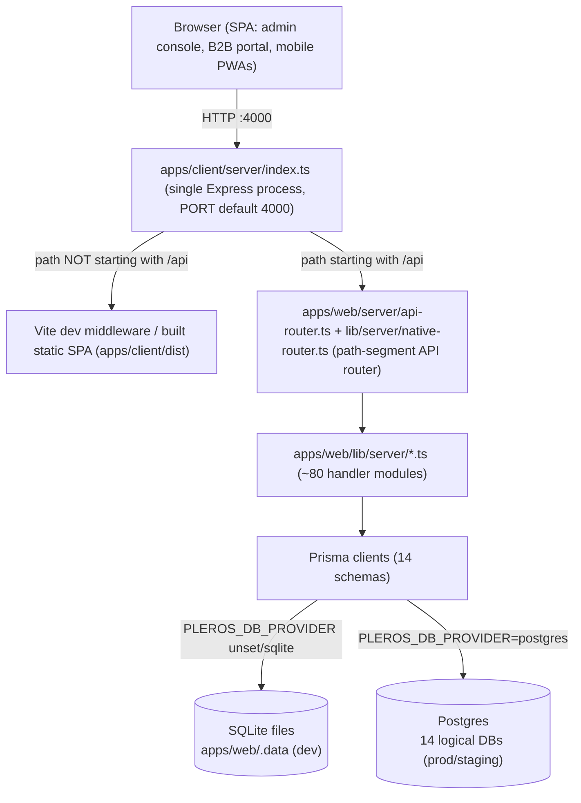

# Testing Flow Documentation

> Single source of truth for testing the Pleros / Cosmos ERP platform.

## 1. Overview

### 1.1 Purpose

This document is the master reference for testing the Pleros ERP / distribution platform (repo name `Cosmos`, package name `pleros`). It exists to give engineers and QA a single, verifiable procedure for standing up the application locally, understanding what "healthy" looks like, and exercising the platform's surfaces before a change ships. Every claim in this document is grounded in the actual scripts, environment files, and server code in this repository — see the fact-verification notes inline and in the linked source files.

### 1.2 Scope

This document covers the full monorepo as defined in the root `package.json` workspaces:

- `apps/web` (`@pleros/web`) — the API layer: Prisma schemas plus `lib/server/*.ts` business-logic modules, described in its own `package.json` as "Pleros API layer — Prisma + lib/server (served by @pleros/client Vite server)".
- `apps/client` (`@pleros/client`) — the single Express process (`apps/client/server/index.ts`) that serves the Vite/React SPA (admin console, B2B buyer portal, mobile field PWAs) and proxies `/api/*` requests into the `apps/web` API handler, all on one origin.
- `packages/*` — shared workspace packages: `@pleros/types`, `@pleros/ui`, `@pleros/web-gateway-client`, `@pleros/analytics-engine`.

Out of scope for this document: feature-by-feature acceptance criteria (see `PLATFORM_FEATURES.md`), the roadmap/gap analysis (`ERP_FEATURE_GAP.md`), production security hardening (`PRODUCTION_READINESS.md`), and the staging smoke-test script (`docs/QA_STAGING_CHECKLIST.md`) — this document is about the *mechanics* of testing (setup, startup, and, in later sections of this file, functional/API/DB test procedures), not a restatement of those other docs.

### 1.3 Application Architecture

Pleros runs as a **single-origin** application: one Express process serves both the browser SPA and the JSON API on the same host and port. There is no separate/standalone Express microservice for the API — `apps/web` contributes only a Prisma data layer and a tree of framework-agnostic handler modules under `lib/server/*.ts`; it has no server of its own (its own `dev` script literally says `"Use npm run dev from repo root (@pleros/client Vite server)"`).

Request flow, confirmed from source:

1. `apps/client/server/index.ts` starts one Express app on `PORT` (default `4000`).
2. Any request path starting with `/api` is buffered into a Fetch-API `Request` object and handed to `handleApiRequest()` in `apps/web/server/api-router.ts`.
3. `api-router.ts` answers a small number of routes directly (e.g. `GET /api/v1/health`, auth endpoints such as login/refresh/signup) and delegates everything else to `handleNativeApi()` in `apps/web/lib/server/native-router.ts` — a hand-written path-segment router (no Express/Next routing) that dispatches by `path[0]` (`tenants`, `users`, `skus`, `inventory`, `orders`, `invoices`, `wms`, `dispatch`, `bills`, `compliance`, `edi`, …) into the ~80 non-test modules in `apps/web/lib/server/`.
4. All non-`/api` requests fall through to the Vite dev middleware in development, or to the built static SPA (`apps/client/dist`) with an SPA fallback to `index.html` in production.
5. Handler modules read/write through Prisma clients against one of **14** independent Prisma schemas under `apps/web/prisma/*/schema.prisma` (`auth`, `tenant`, `inventory`, `order`, `crm`, `storefront`, `purchasing`, `payment`, `wms`, `dispatch`, `compliance`, `ledger`, `notification`, `analytics`) — each schema is a logical database, backed by embedded SQLite files in development or by separate Postgres databases (one per schema, same instance) in production/staging.



### 1.4 Testing Philosophy

The only automated test layer that exists in this repository today is **Node's built-in `--test` runner**, invoked via `tsx`. Confirmed per-workspace `test` scripts:

- `apps/web`: `node --import ./server/register-paths.mjs --import tsx --test lib/server/**/*.test.ts` — unit tests colocated next to the handler modules they cover (e.g. `barcode-labels.test.ts`, `compliance-recall.test.ts`, `fixed-assets.test.ts`, `dispatch-optimize.test.ts`).
- `apps/client`: `node --import tsx --test src/**/*.test.ts`
- `packages/analytics-engine` and `packages/web-gateway-client`: the same `node --import tsx --test src/**/*.test.ts` pattern.
- `packages/types` and `packages/ui`: no tests (`echo` stubs).

There is **no Jest, Vitest, or Playwright** anywhere in the repo (verified by grepping every `package.json` in the workspace tree) — meaning **there is no browser-driven end-to-end suite today**. Root `npm run test` (`node scripts/workspace-run.mjs test`) fans this out across workspaces, and `npm run prod:preflight` chains lint → test → build.

Because automated coverage stops at the unit-test layer, **manual and checklist-driven QA carries proportionally more weight** than it would in a codebase with an E2E suite. This document (and the later sections appended to it) is written with that gap in mind: it favors concrete, reproducible manual verification steps (exact URLs, exact curl/health checks, exact seeded accounts) over assuming a browser automation harness will catch regressions. If an E2E suite is introduced later, this section should be revisited — as of this writing, none exists.

---

## 2. Prerequisites

### 2.1 Required Software

| Requirement | Version / Notes | Source |
|---|---|---|
| Node.js | `>= 20` | `package.json` → `engines.node` |
| npm | `>= 10` | `package.json` → `engines.npm` (pinned `packageManager: npm@10.5.0`) |
| Git | any recent version, to clone the repo | — |
| Docker (optional) | only needed for `npm run infra:docker:up` (Postgres/Redis/MinIO/OTel-collector for scaled dev) or Postgres-mode testing | `docker-compose.yml` |

No global Postgres/Redis install is required for the default local workflow — local development uses embedded SQLite files under `apps/web/.data` with **no Postgres and no Docker** (per the comment at the top of `.env.example`).

### 2.2 Environment Setup

```bash
git clone <repo-url>
cd Cosmos
npm install
cp .env.example .env
# then set JWT_SECRET / JWT_REFRESH_SECRET to real random values (see 2.4)
```

`npm install` installs all workspaces (`apps/web`, `apps/client`, `packages/*`) in one pass because they are declared as npm workspaces in the root `package.json`.

### 2.3 Configuration Files

| File | Purpose |
|---|---|
| [`.env.example`](../.env.example) | Template for the root `.env` used by local development (SQLite by default). Copied to `.env` in step 2.2. |
| [`.env.production.example`](../.env.production.example) | Template for production/staging secrets (Postgres passwords, Redis password, live Stripe keys, `VITE_*` build-time values). Not used for local dev. |
| [`docker-compose.yml`](../docker-compose.yml) | Optional local infra: Postgres, Redis, MinIO, and an OpenTelemetry collector, for scaled-dev/Postgres-mode testing (`npm run infra:docker:up`). Plain local dev does not need this file. |
| [`docker-compose.production.yml`](../docker-compose.production.yml) | Production-style Compose stack: Postgres + Redis + the built `web` image, wired with per-schema `*_DATABASE_URL` variables. |
| [`render.yaml`](../render.yaml) | Render Blueprint for the `pleros-staging` and `pleros-production` web services plus a `pleros-staging-postgres` database; documents the exact env vars each hosted environment needs and the `/api/v1/health` health-check path. |
| [`package.json`](../package.json) | Root workspace scripts (`dev`, `build`, `test`, `db:*`, `seed`, `prod:preflight`, …). |
| [`tsconfig.base.json`](../tsconfig.base.json) | Shared strict TypeScript compiler options (`strict: true`, `target: ES2022`, `module: commonjs`) extended by workspace `tsconfig.json` files. |

### 2.4 Environment Variables Reference

The following table lists every variable present in `.env.example` (root). Purpose is inferred from the variable name and its inline comment — nothing here is invented.

| Variable | Purpose | Required? |
|---|---|---|
| `NODE_ENV` | Runtime mode (`development`/`production`); affects auth behavior (e.g. whether `verifyUrl` is returned to API responses). | Yes (defaults to `development` in the example) |
| `LOG_LEVEL` | Logging verbosity. | No (defaults to `info`) |
| `PLEROS_DATA_DIR` | Directory (relative to `apps/web`) holding embedded SQLite `.db` files when running without Postgres. | Yes for SQLite mode (defaults to `.data`) |
| `JWT_SECRET` | Signing secret for access tokens. | **Yes** — must be replaced with a real secret |
| `JWT_REFRESH_SECRET` | Signing secret for refresh tokens. | **Yes** — must be replaced with a real secret |
| `JWT_ACCESS_TTL` | Access-token lifetime (e.g. `15m`). | No (has a default) |
| `JWT_REFRESH_TTL` | Refresh-token lifetime (e.g. `7d`). | No (has a default) |
| `STRIPE_SECRET_KEY` | Stripe secret API key for server-side card checkout. | No locally (mock/dev-safe with placeholder); required for real Stripe flows |
| `STRIPE_PUBLISHABLE_KEY` | Stripe publishable key. | No locally |
| `STRIPE_WEBHOOK_SECRET` | Verifies incoming Stripe webhook signatures. | No locally |
| `STRIPE_RETURN_URL` | Redirect URL after Stripe Checkout. | No (defaults to `http://localhost:4000/checkout`) |
| `AWS_REGION` | Region for optional AWS S3 file storage (MSA/document archival). | No |
| `AWS_ACCESS_KEY_ID` | AWS credential. | No |
| `AWS_SECRET_ACCESS_KEY` | AWS credential. | No |
| `AWS_S3_BUCKET` | Target S3 bucket for document storage. | No |
| `NOTIFICATION_WEBHOOK_URL` | Optional outbound webhook for notification integration testing. | No |
| `PLEROS_OPS_EMAIL` | Ops/admin contact address used by notifications. | No |
| `SENDGRID_API_KEY` | Enables real email delivery for verification/invite/reset emails; without it, non-production signup/resend responses can return `verifyUrl` directly for QA convenience. | No locally; effectively required in production |
| `SENDGRID_FROM_EMAIL` | From-address for SendGrid-sent email. | No (defaults to `noreply@pleros.local`) |
| `APP_URL` | Public app origin used to build verification/reset/invite links. | Required in production; defaults to `http://localhost:4000` locally |
| `TWILIO_ACCOUNT_SID` | Twilio credential for SMS notifications. | No |
| `TWILIO_AUTH_TOKEN` | Twilio credential. | No |
| `TWILIO_FROM_NUMBER` | Twilio sending number. | No |
| `EXPO_PUSH_ACCESS_TOKEN` | Access token for Expo push notifications (mobile PWA). | No |
| `CELESTIAL_PROVIDER` | Selects the Celestial AI backend: `openrouter \| groq \| gemini \| ollama \| mock` (defaults to mock if no key is set). | No |
| `CELESTIAL_MODEL` | Model name for the selected Celestial provider. | No |
| `OPENROUTER_API_KEY` | Credential for the `openrouter` Celestial provider. | No |
| `GROQ_API_KEY` | Credential for the `groq` Celestial provider. | No |
| `GEMINI_API_KEY` | Credential for the `gemini` Celestial provider. | No |
| `CELESTIAL_OLLAMA_URL` | Local Ollama endpoint for the `ollama` Celestial provider. | No (defaults to `http://127.0.0.1:11434`) |
| `CELESTIAL_OLLAMA_MODEL` | Ollama model name. | No (defaults to `llama3.2`) |
| `PLEROS_OTEL_ENABLED` | Toggles OpenTelemetry export. | No (defaults to `false`) |
| `OPENTELEMETRY_ENDPOINT` | OTLP collector endpoint. | No (defaults to `http://localhost:4317`) |
| `PLEROS_DB_PROVIDER` | Set to `postgres` to switch the Prisma schemas from SQLite to Postgres (commented out by default — omitted means SQLite). | No (SQLite is the default) |
| `DATABASE_URL` | Base Postgres connection string, used only when `PLEROS_DB_PROVIDER=postgres`. | No locally; required when using Postgres |

> [!NOTE]
> `AWS_*` variables are present in `.env.example` but no `aws-sdk`/S3 client code was found under `apps/web/lib/server` at the time of writing — `apps/web/lib/server/msa-storage.ts` only performs a plain HTTPS `PUT` to an S3-compatible URL built from `MSA_S3_*` variables (a separate set, not the `AWS_*` ones above) when archiving MSA compliance reports. Treat `AWS_*` as reserved/optional rather than a hard prerequisite.

### 2.5 Database Setup

The provider switch is mechanical and controlled by `PLEROS_DB_PROVIDER`:

- **SQLite (default, no Postgres/Docker needed):**
  ```bash
  npm run db:setup          # scripts/setup-sqlite.mjs — creates apps/web/.data
  npm run db:generate-all   # scripts/generate-all-prisma.mjs — prisma generate for all 14 schemas
  npm run seed              # tsx scripts/seed-db.ts — demo tenant + accounts
  ```
- **Postgres:**
  ```bash
  PLEROS_DB_PROVIDER=postgres npm run db:setup:postgres   # scripts/setup-postgres.mjs
  npm run db:generate-all
  npm run db:migrate        # tsx scripts/migrate-all.ts — push all 14 Prisma schemas
  npm run seed
  ```
  Before generating/migrating against Postgres, `scripts/apply-prisma-provider.mjs` (invoked as `npm run db:provider`, and internally by the setup scripts) rewrites the `provider = "sqlite" | "postgresql"` line in every `apps/web/prisma/*/schema.prisma` file to match `PLEROS_DB_PROVIDER`.

`npm run db:migrate` and `npm run migrate:all` are the same script (`tsx scripts/migrate-all.ts`) under two names. `npm run infra:docker:up` (`docker compose -f docker-compose.yml up -d`) can supply a local Postgres/Redis/MinIO/OTel stack for Postgres-mode testing without installing them natively.

### 2.6 Authentication Requirements

Roles come from the `Role` enum in `apps/web/prisma/auth/schema.prisma`:

```
SUPER_ADMIN, TENANT_ADMIN, MANAGER, WAREHOUSE_STAFF, SALES_REP, DRIVER, ACCOUNTANT, VIEWER, STAFF
```

These are grouped into access-control sets in `apps/web/lib/server/session.ts`:

| Group | Roles | Used for |
|---|---|---|
| `ADMIN_ROLES` | `SUPER_ADMIN`, `TENANT_ADMIN`, `MANAGER`, `ACCOUNTANT` | Back-office/admin-gated routes (e.g. `GET /api/v1/health/db`) |
| `OPS_ROLES` | `ADMIN_ROLES` + `WAREHOUSE_STAFF` | Warehouse/fulfillment operations |
| `DRIVER_ROLES` | `ADMIN_ROLES` + `DRIVER` | Dispatch/delivery mobile PWA |
| `CRM_ROLES` (defined in `native-router.ts`) | `ADMIN_ROLES` + `SALES_REP` | CRM access |

`apps/web/lib/server/buyer-context.ts` additionally defines `PORTAL_BUYER_ROLES = ['STAFF', 'VIEWER']` — accounts with these roles are treated as B2B portal buyers (`isPortalBuyer()`) rather than back-office staff, and are resolved to a CRM customer record by matching email. There is no separate `BUYER` role value; buyer accounts use `STAFF` (the default role assigned by `apps/web/lib/server/auth.ts` on signup/invite when no role is given) or `VIEWER`.

For local testing, `npm run seed` creates the demo accounts documented in the root `README.md`:

| Role | Email | Password | Entry point |
|---|---|---|---|
| Admin | `admin@pleros.local` | `admin1234` | `/admin/login` |
| B2B buyer | `buyer@acme-retail.com` | `buyer1234` | `/login` |
| Warehouse | `warehouse@pleros.local` | `warehouse1234` | `/m/warehouse` |
| Driver | `driver@pleros.local` | `driver1234` | `/m/delivery` |
| Sales | `sales@pleros.local` | `sales1234` | `/m/sales` |

These seeded accounts exist only in the local database created by `npm run seed`; they are not present in production.

### 2.7 Third-Party Integrations

Confirmed by grepping `apps/web/lib/server` for each vendor's name/SDK:

| Integration | Confirmed usage | Hard prerequisite for local testing? |
|---|---|---|
| **Stripe** | `apps/web/lib/server/stripe.ts`, plus `billing.ts`, `invoices.ts`, `payments.ts`, `saved-payment-methods.ts`, `native-router.ts` | No — card checkout runs in a test/mock-safe mode with the placeholder `sk_test_replace_me` key from `.env.example`; real keys are only needed to exercise live Stripe flows. |
| **SendGrid** | `apps/web/lib/server/notification-provider.ts`, `notification-provider-status.ts`, `auth.ts` | No locally — without `SENDGRID_API_KEY`, emails log to the console and signup/resend can return `verifyUrl` directly for QA. Effectively required before go-live. |
| **Twilio** | `apps/web/lib/server/notification-provider.ts`, `notification-provider-status.ts` | No — SMS notifications are optional and only activate when Twilio credentials are set. |

No references to an AWS SDK, S3 client, or Expo push SDK were found under `apps/web/lib/server` at the time of writing, despite `AWS_*` and `EXPO_PUSH_ACCESS_TOKEN` appearing in `.env.example` — treat those as reserved/future rather than active integrations to test against.

---

## 3. Application Startup Flow

### 3.1 Starting the application

From the repo root, after completing Section 2:

```bash
npm run dev
```

This one command chains three steps (see the root `package.json` `dev` script):

1. `node scripts/prepare-dev-env.mjs` — reads the root `.env` (creating it from `.env.example` if missing) and writes `apps/web/.env.local` with the correct SQLite `file:` URLs (or Postgres URLs, if `PLEROS_DB_PROVIDER=postgres`) for each of the 14 schemas, plus a matching `apps/client/.env` for Vite build-time variables.
2. `node scripts/generate-all-prisma.mjs` — runs `prisma generate` for all 14 schemas so the Prisma clients match the current schema files.
3. `npm run dev -w @pleros/client` — runs `tsx server/index.ts`, which starts the single Express process described in Section 1.3: it mounts the `/api/*` proxy to the native API router, starts background jobs (`startBackgroundJobs()` from `apps/web/lib/server/background-jobs.ts`), and either wires in Vite's dev middleware (non-production) or serves the built static SPA (production, via `npm run start -w @pleros/client`).

The server listens on `PORT` (defaulting to `4000` — set in `apps/client/server/index.ts` as `Number(process.env.PORT ?? 4000)`), so the application is reachable at:

```
http://localhost:4000
```

### 3.2 What "healthy" looks like

Two real, code-confirmed health endpoints exist:

| Endpoint | Auth | Defined in | Behavior |
|---|---|---|---|
| `GET /api/v1/health` | None (public) | `apps/web/server/api-router.ts` | Returns `{ status: "ok", service: "pleros", api: "native", timestamp }` with HTTP 200. This is also the `healthCheckPath` Render uses for the hosted `pleros-staging` and `pleros-production` services in `render.yaml`. |
| `GET /api/v1/health/db` | Requires a session with an `ADMIN_ROLES` role | `apps/web/lib/server/native-router.ts` (dispatches to `checkDatabaseConnections()` in `apps/web/lib/server/db-health.ts`) | Returns `{ provider: "sqlite" \| "postgresql", checks: [...], allOk: boolean }` — one check per `*_DATABASE_URL` env key plus an `auth_connectivity` check that runs `SELECT 1` against the auth database. |

A quick unauthenticated check:

```bash
curl -s http://localhost:4000/api/v1/health
# {"status":"ok","service":"pleros","api":"native","timestamp":"..."}
```

Beyond the API, "healthy" also means the SPA shell loads — hit `http://localhost:4000/` (role-based landing page) or `http://localhost:4000/admin/login` and confirm the login form renders without a blank page or console errors.

### 3.3 Pre-test verification checklist

- [ ] `npm run dev` starts with no uncaught errors in the terminal, and logs `[pleros] Vite + API @ http://localhost:4000`.
- [ ] `curl -s http://localhost:4000/api/v1/health` returns HTTP 200 with `"status":"ok"`.
- [ ] `http://localhost:4000/admin/login` (or `/login` for the buyer portal) loads the login form in a browser with no blank page.
- [ ] The database exists and is reachable: for SQLite, `apps/web/.data/` contains the per-schema `.db` files after `npm run db:setup && npm run db:generate-all`; for Postgres, `GET /api/v1/health/db` (as an authenticated admin) reports `allOk: true`.
- [ ] `npm run seed` has been run at least once so the demo accounts in Section 2.6 exist, if functional/manual testing requires logging in.

> [!TIP]
> If `npm run dev` fails immediately, check that `.env` exists at the repo root (copy it from `.env.example` per Section 2.2) — `scripts/prepare-dev-env.mjs` will auto-create it from the example on first run, but will exit with an error if neither file is present.
