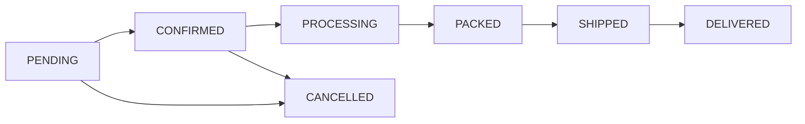

# Pleros Platform Overview (LLM Knowledge Base)

This document is indexed by **Celestial AI** and provides a comprehensive overview of Pleros — the modern wholesale distribution and ERP platform built for SMB distributors, manufacturers, and multi-warehouse operations.

**Keywords:** Pleros, ERP, distribution, wholesale, B2B, platform overview, what is Pleros, how Pleros works, modules, features, plain language, order to cash, procure to pay, WMS, logistics, accounting

---

## How Pleros works (plain language)

Pleros manages the entire lifecycle of a wholesale and distribution business across every department and role:

1. **Take Orders Across Any Channel**
   - **B2B Buyer Portal (`/catalog`)**: Customers log in to browse stock-aware catalogs, view custom contract pricing tiers, submit quotes, and check out with Net Terms or card payments.
   - **Point of Sale (`/admin/pos`)**: Fast counter sales register with instant barcode scanning, split cash/card tenders, age-verification attestations, and receipt printing.
   - **Field Sales (`/m/sales`)**: Reps log visits, create quotes, check customer balances, and capture orders on mobile.
   - **EDI / API (`/api/v1/*`)**: Automated 850 Purchase Order ingestion from enterprise trading partners.

2. **Multi-Warehouse Fulfillment & WMS**
   - Orders automatically validate against customer credit limits and allocate to the optimal warehouse.
   - Floor staff use the **Warehouse PWA (`/m/warehouse`)** to scan QR/Code128 barcodes, execute wave-picking paths sorted by bin location, receive PO docks, and complete blind cycle counts.
   - Support for lot/batch expiration tracking and directed putaway.

3. **Fleet Dispatch & Route Logistics**
   - Dispatchers assign orders to drivers with nearest-neighbor stop sequence calculation (`/admin/dispatch`).
   - Drivers navigate daily routes and capture digital photo proof-of-delivery (POD) on mobile (`/m/delivery`).

4. **Automated General Ledger & Accounts Receivable**
   - Invoices issue automatically when shipments dispatch.
   - Real-time double-entry GL journals post COGS, revenue, inventory asset valuation, and AR aging buckets (0–30, 31–60, 61–90, 90+ days).
   - 3-Way purchase matching reconciles PO, receiving dock slip, and vendor AP bill before payment.

5. **Built-in Celestial AI Intelligence**
   - Accessible from anywhere in the app (`/admin/celestial` or floating widget) to query live inventory, track shipments, analyze unpaid invoices, and explain platform features in plain language.

---

## User Roles and Surfaces

| Surface | URL Path | Intended Users | Primary Capabilities |
| :--- | :--- | :--- | :--- |
| **Admin ERP Hub** | `/admin/*` | Admins, Executives, Operations, Accountants | Dashboard KPIs, Inventory, Orders, Wave WMS, Purchasing, CRM, GL Finance, Dispatch, POS, Settings |
| **B2B Storefront** | `/catalog`, `/orders`, `/invoices`, `/quotes` | Wholesale Buyer Customers | Self-service catalog, cart, Net 30 checkout, order tracking, invoice payment, quote requests |
| **Mobile Warehouse** | `/m/warehouse` | Pickers, Receivers, Warehouse Floor | Barcode scanning, wave picking, bin mapping, dock receiving, cycle count adjustments |
| **Mobile Delivery** | `/m/delivery` | Fleet Drivers, Couriers | Daily route stops, turn directions, failed delivery notes, digital photo POD capture |
| **Mobile Sales** | `/m/sales` | Field Sales Representatives | Lead management, customer lookup, visit notes, quote creation |
| **Point of Sale** | `/admin/pos` | Cashiers, Store Associates | Counter checkout, barcode lookup, age verification, receipt generation, split tender |
| **Celestial AI** | `/admin/celestial` | All Authenticated Users | Live inventory lookups, order tracking, finance queries, platform how-to guidance |

---

## Role-Based Access Control (RBAC)

Pleros provides strict role-based permission scoping:
- `SUPER_ADMIN` / `TENANT_ADMIN`: Wildcard access (`*`) across all modules, settings, and team management.
- `WAREHOUSE_STAFF`: Read and write access to `inventory.*`, `wms.*`, and `purchasing.*`.
- `ACCOUNTANT`: Full access to `finance.*`, `reports.*`, and read access to `orders.*` and `purchasing.*`.
- `SALES_REP`: Full access to `crm.*`, `quotes.*`, and read access to `orders.*` and `inventory.*`.
- `BUYER`: Scoped strictly to their own customer account's orders, invoices, quotes, notifications, and contract pricing.
- `DRIVER`: Scoped to route manifests, stop updates, and POD photo uploads.

---

## Order Status Lifecycle

1. **PENDING**: Order placed from B2B Portal, POS, or Sales Rep. Credit limit checked.
2. **CONFIRMED**: Order approved. Stock reserved at source warehouse; WMS fulfillment tasks created.
3. **PROCESSING**: Floor staff actively picking lines via individual tasks or batch wave picking.
4. **PACKED**: All lines picked, verified against cartons, and staged at packing dock.
5. **SHIPPED**: Carrier tracking or fleet route assigned; invoice auto-generated; COGS posted to GL.
6. **DELIVERED**: Driver captures digital photo POD; customer notified.
