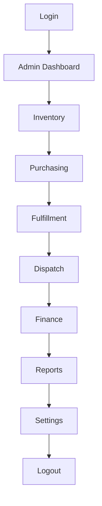
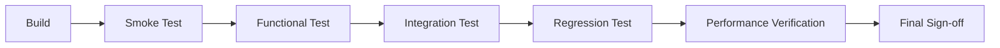

# Testing Flow Documentation Implementation Plan

> **For agentic workers:** REQUIRED SUB-SKILL: Use superpowers:subagent-driven-development (recommended) or superpowers:executing-plans to implement this plan task-by-task. Steps use checkbox (`- [ ]`) syntax for tracking.

**Goal:** Rewrite `docs/TESTING_FLOW.md` from scratch as a comprehensive, factually-verified, single-file Testing Flow Documentation for the Pleros/Cosmos ERP monorepo, per `docs/superpowers/specs/2026-08-06-testing-flow-doc-design.md`.

**Architecture:** The document is built section-by-section, in order, by appending to one growing Markdown file (`docs/TESTING_FLOW.md`). Each task owns one or more sections. Because this is a documentation deliverable (not code), each task's "test cycle" is a **fact-verification step** — grep/read the exact source files named in the task before writing, then a placeholder/consistency scan of the appended text — instead of a unit test. Tasks are ordered so later sections can reference structure established earlier (e.g. the module list from Section 5 is reused by Section 6's dependency map).

**Tech Stack:** Markdown, Mermaid diagrams (native GitHub/Markdown rendering), no build step — this is a docs-only change.

## Global Constraints

- Output is a **single file**: `docs/TESTING_FLOW.md` (repo root `docs/`). Do not create appendix files.
- Every concrete claim (env var name, script path, endpoint name, schema name, route, npm script) MUST be verified by reading the actual source in this repo before being written. Never carry over a claim from the old untracked draft without re-verifying it.
- Section 5 (Module-by-Module Testing) is organized **by user-facing module** (18 admin areas + Buyer Portal + 3 Mobile PWA roles + Settings), not by the ~90 backend files.
- Section 8 (API Testing) uses **tiered depth**: full request/response/error examples only for auth, orders, invoices/ledger, inventory, POS, dispatch, fixed-assets, purchasing. All other ~80 backend modules get a single reference-table row each (endpoint, method, auth requirement, purpose).
- Formatting: GitHub-flavored Markdown, tables for test cases/APIs/checklists, Mermaid fences for diagrams, `> [!NOTE]` / `> [!WARNING]` / `> [!TIP]` callouts, `- [ ]` checklists for release/regression/smoke sections, `<details>` collapsible blocks for lengthy per-module detail.
- Out of scope: `docs/QA_STAGING_CHECKLIST.md`, `ERP_FEATURE_GAP.md`, `PLATFORM_FEATURES.md`, `PRODUCTION_READINESS.md` are not touched. No new test code, tooling, or CI changes. Do not touch the pre-existing uncommitted changes to `README.md` or `apps/web/lib/server/finance-enhancements.test.ts`.
- Commit after every task, scoped only to `docs/TESTING_FLOW.md` (plus this plan file's checkbox updates, if the executor tracks those in git — otherwise just the doc).

---

### Task 1: Scaffold document — Sections 1–3 (Overview, Prerequisites, Startup Flow)

**Files:**
- Create: `docs/TESTING_FLOW.md`
- Read: `package.json`, `.env.example`, `.env.production.example`, `README.md`, `docker-compose.yml`, `docker-compose.production.yml`, `render.yaml`, `tsconfig.base.json`

**Interfaces:**
- Consumes: nothing (first task).
- Produces: `docs/TESTING_FLOW.md` containing a title, a short intro, and Sections `## 1. Overview` through `## 3. Application Startup Flow`. Later tasks append after this content and MUST NOT renumber these headings.

- [ ] **Step 1: Gather facts**

Run and read the output of:
```bash
cat package.json
cat .env.example
cat .env.production.example 2>/dev/null
cat docker-compose.yml
cat README.md
```
Note down: exact npm scripts (name → command), every env var name in `.env.example` with its purpose (infer from name/comment, don't invent), the dev port, and the SQLite/Postgres switch mechanism (`scripts/apply-prisma-provider.mjs`, `db:setup` vs `db:setup:postgres`).

- [ ] **Step 2: Write Section 1 (Overview)**

Write `docs/TESTING_FLOW.md` starting with:
```markdown
# Testing Flow Documentation

> Single source of truth for testing the Pleros / Cosmos ERP platform.

## 1. Overview

### 1.1 Purpose
### 1.2 Scope
### 1.3 Application Architecture
### 1.4 Testing Philosophy
```
Fill each subsection with prose grounded only in facts gathered in Step 1 plus the confirmed
architecture from the spec (`apps/client` buyer portal + admin console + mobile PWA;
`apps/web/lib/server/*.ts` ~90 modules via `native-router.ts`, single-origin server, no
standalone Express server; 14 Prisma schemas; SQLite dev / Postgres prod). Include one Mermaid
`flowchart` diagram of the architecture (Browser → single-origin server → client SPA + API
router → Prisma layer → SQLite/Postgres). For 1.4, state the actual testing philosophy implied
by the repo's tooling: Node's built-in `--test` runner is the only automated layer that exists
today (no Jest/Vitest/Playwright), so manual/checklist-driven QA carries proportionally more
weight until an E2E suite exists — say this explicitly, don't imply an E2E suite exists.

- [ ] **Step 3: Write Section 2 (Prerequisites)**

Subsections: 2.1 Required Software, 2.2 Environment Setup (clone → `npm install` → `cp
.env.example .env`), 2.3 Configuration Files (link the exact files read in Step 1), 2.4
Environment Variables Reference (a table: Variable | Purpose | Required?, one row per var
actually found in `.env.example` — do not invent vars not present), 2.5 Database Setup
(`npm run db:setup` for SQLite vs `npm run db:setup:postgres` for Postgres, `npm run
db:generate-all`, `npm run seed`), 2.6 Authentication Requirements (roles found in the survey:
ADMIN/BUYER/WAREHOUSE/DRIVER/SALES — verify these role names by grepping
`apps/web/lib/server/auth*.ts` and `apps/web/prisma/auth/schema.prisma` for a `Role` enum
before writing them down), 2.7 Third-Party Integrations (list only integrations you can confirm
via grep, e.g. `grep -ril stripe apps/web/lib/server`, `grep -ril sendgrid apps/web/lib/server`,
`grep -ril twilio apps/web/lib/server` — if a service isn't referenced in code, don't list it as
a hard prerequisite).

- [ ] **Step 4: Write Section 3 (Application Startup Flow)**

Document `npm run dev` (which chains `prepare-dev-env.mjs` → `generate-all-prisma.mjs` →
`dev -w @pleros/client`), the resulting URL (`http://localhost:4000` per the dev port env var
confirmed in Step 1), what "healthy" looks like (a specific page or `/api/v1/...` health
endpoint — grep `apps/web/lib/server` for a `health` handler and cite its real path; if none
exists, say so rather than inventing `/health`), and a short pre-test verification checklist
(`- [ ]` items: server boots without error, login page loads, DB file/connection exists).

- [ ] **Step 5: Verify — no placeholders, facts check**

Run:
```bash
grep -nE "TBD|TODO|FIXME|Lorem ipsum|XXX" docs/TESTING_FLOW.md
```
Expected: no output. Then re-open each env var, script name, and role name written in Steps
3–4 and confirm each still matches what Step 1 found (spot-check at least 3).

- [ ] **Step 6: Commit**

```bash
git add docs/TESTING_FLOW.md
git commit -m "docs: scaffold testing flow doc with overview, prerequisites, startup flow"
```

---

### Task 2: Section 4 (End-to-End Testing Flow) + Section 6 (Feature Dependencies)

**Files:**
- Modify: `docs/TESTING_FLOW.md` (append after Section 3)
- Read: `apps/client/src/pages` directory tree (for route order), `apps/web/lib/server` files for cross-module calls (e.g. does `pos.ts` import from `inventory*`? does `dispatch*.ts` import from `orders*`/`wms-*`?)

**Interfaces:**
- Consumes: Section 1.3 architecture description from Task 1 (for consistent terminology).
- Produces: `## 4. End-to-End Testing Flow` and `## 6. Feature Dependencies` headings. Section 5 (Task 3–6) is inserted between them by later tasks reading this file's current end and inserting in the right numeric position — see note in Task 3.

> **Note on ordering:** Because Section 5 is large and split across four tasks (3–6), write
> Section 4 now, then leave a marker comment `<!-- SECTION-5-INSERT-POINT -->` on its own line,
> then write Section 6 after the marker. Tasks 3–6 each replace the marker with their content
> followed by a fresh copy of the same marker, until Task 6 removes it for good. This keeps every
> task's diff a simple, reviewable insertion instead of requiring precise line-number surgery.

- [ ] **Step 1: Write Section 4**

```markdown
## 4. End-to-End Testing Flow


```
Below the diagram, explain the rationale: inventory must exist before purchasing/fulfillment
can be tested meaningfully, fulfillment/dispatch produce the shipment data finance reconciles
against, reports depend on data produced by every upstream module, settings is tested last
because role/permission changes there can affect every other module's access. Add a second,
shorter flow for the Buyer Portal (Catalog → Cart → Checkout → Orders → Invoices → Account) and
a third for Mobile PWA (Login → role-specific home → task list → task detail → completion).

- [ ] **Step 2: Insert the marker and write Section 6**

Append:
```markdown

<!-- SECTION-5-INSERT-POINT -->

## 6. Feature Dependencies
```
Populate Section 6 with a dependency table (Feature | Depends On | Why) built from actual
import relationships. Verify at least these by grepping imports, don't assume:
```bash
grep -n "^import" apps/web/lib/server/pos.ts | grep -iE "inventory|pricing|tax"
grep -n "^import" apps/web/lib/server/dispatch*.ts | grep -iE "order|wms"
grep -n "^import" apps/web/lib/server/fixed-assets.ts | grep -iE "ledger|operations-gl"
grep -n "^import" apps/web/lib/server/ap-bills.ts | grep -iE "purchasing|po-receiving|ledger"
```
Include a "Required setup before testing X" subsection (e.g. "Before testing POS, seed at
least one priced, in-stock SKU") and a "Shared components / shared APIs" subsection listing
genuinely shared backend files (e.g. `pricing.ts`, `credit-limit.ts`, `tenant.ts`) used by more
than one module.

- [ ] **Step 3: Verify**

```bash
grep -nE "TBD|TODO|FIXME|Lorem ipsum" docs/TESTING_FLOW.md
grep -c "SECTION-5-INSERT-POINT" docs/TESTING_FLOW.md
```
Expected: no TBD/TODO hits; exactly one marker occurrence (confirms Step 2 inserted it once).

- [ ] **Step 4: Commit**

```bash
git add docs/TESTING_FLOW.md
git commit -m "docs: add end-to-end flow and feature dependency sections"
```

---

### Task 3: Section 5 — Admin modules: Operations, Inventory, Purchasing, Fulfillment, Warehouse (WMS cluster)

**Files:**
- Modify: `docs/TESTING_FLOW.md` (replace the `<!-- SECTION-5-INSERT-POINT -->` marker)
- Read: `apps/client/src/pages/admin/inventory`, `apps/client/src/pages/admin/purchasing`, `apps/client/src/pages/admin/fulfillment`, `apps/client/src/pages/admin/warehouse` (list files, read key page components); `apps/web/lib/server/inventory*.ts`, `bin-locations.ts`, `cycle-count-adjust.ts`, `wms-*.ts`, `wave-picking.ts`, `pick-bin-resolver.ts`, `pick-line-status.ts`, `purchasing.ts`, `po-receiving.ts`, `landed-cost.ts`, `backorders.ts`, `drop-ship.ts`

**Interfaces:**
- Consumes: the `<!-- SECTION-5-INSERT-POINT -->` marker written in Task 2.
- Produces: `### 5.1 Inventory`, `### 5.2 Purchasing`, `### 5.3 Fulfillment`, `### 5.4 Warehouse (WMS)` subsections under a new `## 5. Module-by-Module Testing` heading (this task creates the `## 5.` heading since it's the first Section 5 task to run), followed by a fresh `<!-- SECTION-5-INSERT-POINT -->` marker for Task 4 to consume.

- [ ] **Step 1: Read the frontend and backend files listed above**

```bash
find apps/client/src/pages/admin/inventory apps/client/src/pages/admin/purchasing apps/client/src/pages/admin/fulfillment apps/client/src/pages/admin/warehouse -type f
```
Read each resulting file's top-level exports/route definitions (component name, any obvious
role guard). Read the backend files for their exported handler names and HTTP verbs (grep
`export (async )?function` and any `router.(get|post|put|patch|delete)` calls, or however
`native-router.ts` registers them — check `apps/web/lib/server/server/api-router.ts` or
`native-router.ts` for the registration pattern once and reuse it for every subsequent task).

- [ ] **Step 2: Write `## 5. Module-by-Module Testing` heading and the four subsections**

Replace the marker with:
```markdown
## 5. Module-by-Module Testing

### 5.1 Inventory
### 5.2 Purchasing
### 5.3 Fulfillment
### 5.4 Warehouse (WMS)

<!-- SECTION-5-INSERT-POINT -->
```
For each of the four subsections, use this fixed skeleton (fill every field from Step 1's
findings, never leave a bullet generic):

```markdown
### 5.N <Module Name>

**Purpose:** <one sentence>
**Entry point:** <exact client route/page path>
**Backing API modules:** <exact file names under apps/web/lib/server>
**Prisma schemas touched:** <exact schema names>
**Roles required:** <exact role(s)>

<details>
<summary>Test Checklist</summary>

- [ ] Functional: <specific action, e.g. "create a purchase order for SKU X with qty Y">
- [ ] UI validation: <specific field/constraint>
- [ ] Form validation: <specific required field / format rule>
- [ ] Navigation: <specific route transitions>
- [ ] Permissions: <specific role that should be blocked, and what blocking should look like>
- [ ] Error handling: <specific failure, e.g. "submit PO with qty 0">
- [ ] Edge cases: <specific boundary, e.g. "receive more units than ordered">
- [ ] Empty state: <what renders with zero records>
- [ ] Loading state: <what renders while the list/table fetches>
- [ ] Success scenario: <exact expected UI/DB outcome>
- [ ] Failure scenario: <exact expected UI/DB outcome>

</details>

**Expected results:** <what must happen> / **Must never happen:** <specific invariant, e.g.
"inventory quantity must never go negative">

**Screens:** <bullet list of every screen/route involved>
```
Every bracketed placeholder above must be replaced with a specific, real detail pulled from
Step 1 — e.g. for Warehouse (WMS), the checklist must reference actual flows found in
`wave-picking.ts` / `wms-cycle-count.ts` / `wms-receiving.ts` / `wms-putaway.ts` /
`wms-labor.ts`, not generic WMS boilerplate.

- [ ] **Step 3: Verify**

```bash
grep -nE "<one sentence>|<exact|<specific|TBD|TODO" docs/TESTING_FLOW.md
```
Expected: no output (confirms every template placeholder was actually filled in).

- [ ] **Step 4: Commit**

```bash
git add docs/TESTING_FLOW.md
git commit -m "docs: add module testing for inventory, purchasing, fulfillment, warehouse"
```

---

### Task 4: Section 5 — Admin modules: CRM, Quotes, Dispatch, POS, Compliance

**Files:**
- Modify: `docs/TESTING_FLOW.md` (replace the `<!-- SECTION-5-INSERT-POINT -->` marker left by Task 3)
- Read: `apps/client/src/pages/admin/crm`, `apps/client/src/pages/admin/quotes`, `apps/client/src/pages/admin/dispatch`, `apps/client/src/pages/admin/pos`, `apps/client/src/pages/admin/compliance`; `apps/web/lib/server/crm.ts`, `quotes.ts`, `pricing.ts`, `dispatch.ts`, `dispatch-order.ts`, `pos.ts`, `pos-receipt.ts`, `compliance-age.ts`, `compliance-msa.ts`, `compliance-recall.ts`, `compliance-tax.ts`, `msa-storage.ts`

**Interfaces:**
- Consumes: marker from Task 3.
- Produces: `### 5.5 CRM`, `### 5.6 Quotes`, `### 5.7 Dispatch`, `### 5.8 POS`, `### 5.9 Compliance`, plus a fresh marker for Task 5.

- [ ] **Step 1: Read the frontend and backend files listed above** (same method as Task 3 Step 1)

- [ ] **Step 2: Write the five subsections using the exact skeleton from Task 3 Step 2**, replacing the marker, ending with a fresh `<!-- SECTION-5-INSERT-POINT -->`. For Compliance, explicitly cover the batch recall flow (`compliance-recall.ts` — this is the most recently added feature per `git log`, so verify its current fields/handlers directly rather than guessing) and MSA/tax/age-verification checks separately since they are distinct compliance concerns.

- [ ] **Step 3: Verify** (same grep as Task 3 Step 3, run against the newly appended text)

- [ ] **Step 4: Commit**

```bash
git add docs/TESTING_FLOW.md
git commit -m "docs: add module testing for crm, quotes, dispatch, pos, compliance"
```

---

### Task 5: Section 5 — Admin modules: Finance, Reports, Notifications, Celestial AI, Settings, Onboarding, Customers

**Files:**
- Modify: `docs/TESTING_FLOW.md` (replace marker from Task 4)
- Read: `apps/client/src/pages/admin/finance`, `reports`, `notifications`, `celestial`, `settings`, `onboarding`, `customers`; `apps/web/lib/server/invoices.ts`, `invoice-status.ts`, `invoice-gl.ts`, `invoice-document.ts`, `bank-recon.ts`, `cashflow-history.ts`, `ledger.ts`, `operations-gl.ts`, `fixed-assets.ts`, `credit-limit.ts`, `ap-bills.ts`, `landed-cost.ts`, `report-builder.ts`, `analytics.ts`, `notifications.ts`, `notification-provider.ts`, `notification-triggers.ts`, `customer-notification-prefs.ts`, `apps/web/lib/server/celestial/*.ts`, `feature-flags.ts`, `audit-log.ts`

**Interfaces:**
- Consumes: marker from Task 4.
- Produces: `### 5.10 Finance`, `### 5.11 Reports`, `### 5.12 Notifications`, `### 5.13 Celestial AI`, `### 5.14 Settings`, `### 5.15 Onboarding`, `### 5.16 Customers`, plus a fresh marker for Task 6.

- [ ] **Step 1: Read the frontend and backend files listed above**

Given the most recent commits touched fixed assets, date-range filtering for financial
reports/bank reconciliation/vendor bills, and quarterly trial balance views, read
`fixed-assets.ts`, `bank-recon.ts`, `ap-bills.ts`, and `report-builder.ts` closely enough to
document the actual current fields/endpoints (e.g. depreciation calculation method, date-range
query params) rather than a generic finance description.

- [ ] **Step 2: Write the seven subsections** using the Task 3 skeleton. For Celestial AI, document the flow through `orchestrator → intent → retrieval → compose → conversations` (verify this pipeline order by reading `apps/web/lib/server/celestial/orchestrator.ts`'s imports/calls, don't assume the order from the name alone). End with a fresh marker.

- [ ] **Step 3: Verify** (same grep pattern as prior tasks)

- [ ] **Step 4: Commit**

```bash
git add docs/TESTING_FLOW.md
git commit -m "docs: add module testing for finance, reports, notifications, celestial ai, settings"
```

---

### Task 6: Section 5 — Buyer Portal + Mobile PWA (final Section 5 task, removes the marker)

**Files:**
- Modify: `docs/TESTING_FLOW.md` (replace marker from Task 5; this is the last Section-5 task, so no new marker is added afterward)
- Read: `apps/client/src/pages/catalog`, `cart`, `checkout`, `orders`, `invoices`, `quotes`, `account`; `apps/client/src/pages/m/{login,sales,delivery,warehouse}` including nested `warehouse/receiving`, `warehouse/task/[id]`, `warehouse/waves/[id]`, `delivery/route/[id]`; relevant backend: `orders.ts`, `order-status.ts`, `order-orchestration.ts`, `order-saga.ts`, `order-shipments.ts`, `pricing.ts`, `wms-labor.ts`, `dispatch-order.ts`

**Interfaces:**
- Consumes: marker from Task 5.
- Produces: `### 5.17 Buyer Portal`, `### 5.18 Mobile PWA — Sales`, `### 5.19 Mobile PWA — Delivery`, `### 5.20 Mobile PWA — Warehouse`. Marker is removed (no trailing marker). This is the final content of `## 5. Module-by-Module Testing`.

- [ ] **Step 1: Read the frontend and backend files listed above**

- [ ] **Step 2: Write the four subsections** using the Task 3 skeleton, with **Buyer Portal** treated as one combined module (its "Screens" list covers catalog → cart → checkout → orders → invoices → quotes → account) and each Mobile PWA role as its own module scoped to the role's actual pages (e.g. Warehouse role covers `m/warehouse`, `m/warehouse/receiving`, `m/warehouse/task/[id]`, `m/warehouse/waves/[id]`). Do not leave a trailing insert marker — this closes out Section 5.

- [ ] **Step 3: Verify**

```bash
grep -nE "<one sentence>|<exact|<specific|TBD|TODO|SECTION-5-INSERT-POINT" docs/TESTING_FLOW.md
```
Expected: no output (confirms the marker was fully consumed and no placeholders remain).

- [ ] **Step 4: Commit**

```bash
git add docs/TESTING_FLOW.md
git commit -m "docs: add module testing for buyer portal and mobile pwa roles"
```

---

### Task 7: Section 7 (Test Data)

**Files:**
- Modify: `docs/TESTING_FLOW.md` (append after Section 6 — Section 6 was written in Task 2, immediately before the Section-5 block; append Section 7 right after Section 5/6's combined content ends)
- Read: `scripts/seed-db.ts`, `scripts/migrate-all.ts`

**Interfaces:**
- Consumes: role names confirmed in Task 1 Step 3.
- Produces: `## 7. Test Data` heading with subsections for sample users, roles, seed data, and DB reset flow.

- [ ] **Step 1: Read `scripts/seed-db.ts` in full**

Note every user/record it actually creates: emails, passwords (if hardcoded for dev), roles,
sample SKUs/customers/orders. Do not invent sample data not present in the script.

- [ ] **Step 2: Write Section 7**

```markdown
## 7. Test Data

### 7.1 Sample Users
### 7.2 Roles
### 7.3 Seed Data / Fixtures
### 7.4 Resetting Test Data
```
7.1 is a table (Email | Password | Role | Purpose) built only from what Step 1 found. 7.3 lists
the actual records the seed script inserts. 7.4 documents the literal commands
(`npm run db:setup`, `npm run seed`, or whatever combination actually resets state — verify by
reading `scripts/setup-sqlite.mjs` briefly for what it deletes/recreates).

- [ ] **Step 3: Verify**

```bash
grep -nE "TBD|TODO|example@example.com" docs/TESTING_FLOW.md
```
Expected: no output (guards against placeholder emails/credentials that aren't real seed data).

- [ ] **Step 4: Commit**

```bash
git add docs/TESTING_FLOW.md
git commit -m "docs: add test data section"
```

---

### Task 8: Section 8 (API Testing) — Tier 1 full-depth modules

**Files:**
- Modify: `docs/TESTING_FLOW.md` (append after Section 7)
- Read: `apps/web/lib/server/auth*.ts`, `orders.ts`, `order-status.ts`, `invoices.ts`, `invoice-status.ts`, `ledger.ts`, `inventory.ts` (or the actual primary inventory file found in Task 3), `pos.ts`, `dispatch.ts`, `fixed-assets.ts`, `purchasing.ts`; the route-registration file identified in Task 3 Step 1 (`native-router.ts` or `server/api-router.ts`)

**Interfaces:**
- Consumes: the route-registration pattern discovered in Task 3.
- Produces: `## 8. API Testing` heading with a `### 8.1 Tier 1 — Critical Modules (Full Contract)` subsection covering the 8 named modules.

- [ ] **Step 1: For each of the 8 Tier-1 modules, extract its real routes**

For each file, find every route it registers (method + path) by cross-referencing the handler
export names against their registration in `native-router.ts`/`api-router.ts`. Do not guess
REST conventions — read the actual path strings.

- [ ] **Step 2: Write `## 8. API Testing` and `### 8.1`**

For each Tier-1 module, use this skeleton per endpoint (repeat for every real endpoint found,
not a representative sample — Tier-1 means complete coverage for these 8):

```markdown
#### `<METHOD> <exact/path>` — <handler name>

**Auth:** <role(s) required, or "none" if public — verify from middleware>

**Request:**
```json
{ "...": "actual shape inferred from the handler's input parsing/validation code" }
```

**Success Response (<status code>):**
```json
{ "...": "actual shape inferred from the handler's return statements" }
```

**Error Cases:**
| Condition | Status | Body |
| --- | --- | --- |
| <real validation failure found in code> | <code> | <shape> |
```
Base every JSON shape on what the handler actually parses/returns (zod schemas, destructured
fields, Prisma `select`/`create` calls) — not on invented "typical" fields.

- [ ] **Step 3: Verify**

```bash
grep -nE "actual shape inferred|TBD|TODO" docs/TESTING_FLOW.md
```
Expected: no output (confirms the template's own instructional text didn't leak into the final
doc, and no placeholders remain).

- [ ] **Step 4: Commit**

```bash
git add docs/TESTING_FLOW.md
git commit -m "docs: add tier-1 full-depth api testing section"
```

---

### Task 9: Section 8 (API Testing) — Tier 2 reference table (remaining ~80 modules)

**Files:**
- Modify: `docs/TESTING_FLOW.md` (append after 8.1)
- Read: every remaining file in `apps/web/lib/server/*.ts` not covered by Task 8, plus `apps/web/lib/server/celestial/*.ts`

**Interfaces:**
- Consumes: Section 8.1 from Task 8 (for consistent column format).
- Produces: `### 8.2 Tier 2 — Reference Table (All Other Modules)`.

- [ ] **Step 1: Enumerate every remaining backend module and its registered routes**

Use the same route-registration file as Task 8 to build a complete list. A useful starting
command:
```bash
ls apps/web/lib/server/*.ts | xargs -n1 basename
```
Cross this list against the Tier-1 set from Task 8 and the ones already covered contextually
(infra files like `db.ts`, `db-health.ts`, `env.ts`, `prisma.ts` can be noted as internal/
non-API and excluded with a one-line explanation rather than a table row).

- [ ] **Step 2: Write `### 8.2` as one table**

```markdown
| Endpoint | Method | Auth | Purpose |
| --- | --- | --- | --- |
| /api/v1/... | GET | ADMIN | ... |
```
One row per real route found in Step 1. Group the table with subheadings by domain area
(Billing/Payments, Backorders/Drop-ship, Search, EDI, Webhooks, Feature Flags, Audit Log, Event
Bus, Background Jobs, Barcode Labels, Demand Planning, Celestial AI tools, etc.) so it's
scannable rather than one undifferentiated 80-row block.

- [ ] **Step 3: Verify**

```bash
grep -c "^| /api" docs/TESTING_FLOW.md
```
Expected: a count roughly matching the number of remaining routes found in Step 1 (sanity check
that the table wasn't truncated or left mostly empty).

- [ ] **Step 4: Commit**

```bash
git add docs/TESTING_FLOW.md
git commit -m "docs: add tier-2 api reference table for remaining modules"
```

---

### Task 10: Section 9 (Integration Testing)

**Files:**
- Modify: `docs/TESTING_FLOW.md` (append after Section 8)
- Read: grep results for stripe/sendgrid/twilio usage, `apps/web/lib/server/celestial/*.ts`, `apps/web/lib/server/webhooks.ts`, `event-bus.ts`, `background-jobs.ts`

**Interfaces:**
- Consumes: the Tier-1/Tier-2 module list from Tasks 8–9 (for consistent naming).
- Produces: `## 9. Integration Testing`.

- [ ] **Step 1: Confirm real third-party integrations**

```bash
grep -ril "stripe" apps/web/lib/server
grep -ril "sendgrid" apps/web/lib/server
grep -ril "twilio" apps/web/lib/server
```
Only document integrations that actually appear. If one of Stripe/SendGrid/Twilio has zero
hits, do not include it as an integration to test — note in the doc that it's not present
rather than silently omitting (a future reader shouldn't wonder if you forgot it).

- [ ] **Step 2: Write Section 9**

Subsections: 9.1 Frontend ↔ Backend (how `apps/client` calls the API — check for a shared
fetch client/hook, e.g. `@pleros/web-gateway-client`), 9.2 Backend ↔ Database (multi-schema
Prisma client usage — how do handlers pick which of the 14 schemas to query?), 9.3 External
Services (only the confirmed ones from Step 1, with what to verify in a sandbox/test mode), 9.4
Event Bus / Background Jobs (`event-bus.ts`, `background-jobs.ts` — what triggers them and how
to verify they ran), 9.5 Celestial AI/RAG flow (orchestrator → intent → retrieval → compose,
confirmed in Task 5).

- [ ] **Step 3: Verify**

```bash
grep -nE "TBD|TODO" docs/TESTING_FLOW.md
```

- [ ] **Step 4: Commit**

```bash
git add docs/TESTING_FLOW.md
git commit -m "docs: add integration testing section"
```

---

### Task 11: Sections 10–11 (Regression Testing Checklist, Smoke Testing Checklist)

**Files:**
- Modify: `docs/TESTING_FLOW.md` (append after Section 9)
- Read: no new source reads required — synthesize from Sections 5–6 already written

**Interfaces:**
- Consumes: the module list and dependency map from Sections 5–6.
- Produces: `## 10. Regression Testing Checklist`, `## 11. Smoke Testing Checklist`.

- [ ] **Step 1: Write Section 10**

Build critical-journey checklists (`- [ ]` items) for: order-to-cash (catalog → cart →
checkout → order → invoice → payment → ledger), procure-to-pay (PO → receiving → AP bill →
payment → ledger), WMS pick/pack/ship (wave → pick → pack → dispatch → delivery), POS sale
(scan/select → price → tender → receipt → inventory decrement), fixed-asset lifecycle (create
asset → depreciation run → ledger posting). Each journey's checklist items must reference the
exact module/screen names already established in Section 5 — no new terminology.

- [ ] **Step 2: Write Section 11**

A short (10–15 item) `- [ ]` checklist for "is the app minimally functional after a deploy":
server boots, login succeeds, one page per major area (admin dashboard, catalog, one mobile PWA
screen) loads without error, one write operation succeeds end-to-end (e.g. create a quote),
DB connection healthy.

- [ ] **Step 3: Verify**

```bash
grep -c "^- \[ \]" docs/TESTING_FLOW.md
```
Expected: a nonzero, substantial count (sanity check checklists were actually written as
checkboxes, not prose).

- [ ] **Step 4: Commit**

```bash
git add docs/TESTING_FLOW.md
git commit -m "docs: add regression and smoke testing checklists"
```

---

### Task 12: Sections 12–13 (Common Failure Scenarios, Troubleshooting Guide)

**Files:**
- Modify: `docs/TESTING_FLOW.md` (append after Section 11)
- Read: `scripts/diagnose-prisma-engines.ps1`, `scripts/production-preflight.mjs`, `scripts/prepare-dev-env.mjs`, `apps/web/lib/server/db.ts`, `apps/web/lib/server/db-health.ts`, `apps/web/lib/server/env.ts`

**Interfaces:**
- Consumes: environment variable list from Task 1, DB setup flow from Task 1/7.
- Produces: `## 12. Common Failure Scenarios`, `## 13. Troubleshooting Guide`.

- [ ] **Step 1: Read the scripts listed above**

Note what each one actually checks or fixes (e.g. what does `production-preflight.mjs` verify
before allowing a deploy? what specific Prisma engine issues does the `.ps1` diagnose?).

- [ ] **Step 2: Write Section 12**

Document real failure patterns grounded in the multi-schema Prisma setup (e.g. "querying a
model from the wrong schema client throws `X`"), tenant-scoping mistakes (missing `tenantId`
filter), and any error-handling patterns visible in the handlers read across prior tasks.

- [ ] **Step 3: Write Section 13**

Subsections: 13.1 Startup Issues, 13.2 Build Failures, 13.3 API Failures, 13.4 Auth Problems,
13.5 Database Issues, 13.6 Environment Problems — each with symptom → likely cause → exact
fix command, citing the real scripts from Step 1 (e.g. "run `node
scripts/diagnose-prisma-engines.ps1`" only if that's a real, runnable diagnostic — note the
platform it targets since it's PowerShell).

- [ ] **Step 4: Verify**

```bash
grep -nE "TBD|TODO" docs/TESTING_FLOW.md
```

- [ ] **Step 5: Commit**

```bash
git add docs/TESTING_FLOW.md
git commit -m "docs: add common failure scenarios and troubleshooting guide"
```

---

### Task 13: Section 14 (Release Validation Flow) + Section 16 (Best Practices)

**Files:**
- Modify: `docs/TESTING_FLOW.md` (append after Section 13; Section 15 is inserted by Task 14 between 14 and 16 — leave a `<!-- SECTION-15-INSERT-POINT -->` marker after Section 14's content)
- Read: no new source reads required

**Interfaces:**
- Consumes: Sections 10–11 (regression/smoke) for the release flow to reference.
- Produces: `## 14. Release Validation Flow`, a `<!-- SECTION-15-INSERT-POINT -->` marker, `## 16. Best Practices`.

- [ ] **Step 1: Write Section 14**

```markdown
## 14. Release Validation Flow


```
Below the diagram, define what gate each stage actually checks and links to the relevant
section (Smoke → Section 11, Regression → Section 10, etc.), plus the real npm scripts to run
at the Build stage (`npm run build`, `npm run typecheck`, `npm run lint` — confirmed present in
Task 1's read of `package.json`).

- [ ] **Step 2: Insert marker**

```markdown

<!-- SECTION-15-INSERT-POINT -->
```

- [ ] **Step 3: Write Section 16**

Cover: recommended execution order (smoke before functional before regression, per Section 14),
efficient debugging tips grounded in this repo (multi-schema Prisma studio usage, reading
`node --test` output), writing reproducible bug reports (what to capture: role, tenant, exact
request payload, screen), avoiding flaky tests under `node --test` (no shared global state
across test files, use fresh SQLite file or transaction rollback per test — verify which
pattern the existing 34 test files actually use by sampling 2–3 of them), test maintenance
(update Section 5 checklists when a module's routes change).

- [ ] **Step 4: Verify**

```bash
grep -nE "TBD|TODO" docs/TESTING_FLOW.md
grep -c "SECTION-15-INSERT-POINT" docs/TESTING_FLOW.md
```
Expected: no TBD/TODO; exactly one marker occurrence.

- [ ] **Step 5: Commit**

```bash
git add docs/TESTING_FLOW.md
git commit -m "docs: add release validation flow and best practices sections"
```

---

### Task 14: Section 15 (Visual Flow Diagrams) — fills the marker from Task 13

**Files:**
- Modify: `docs/TESTING_FLOW.md` (replace `<!-- SECTION-15-INSERT-POINT -->`)
- Read: no new source reads required — synthesize diagrams from facts already documented in Sections 1, 4, 5, 6, 9

**Interfaces:**
- Consumes: marker from Task 13.
- Produces: `## 15. Visual Flow Diagrams` with diagrams not already drawn elsewhere in the doc (avoid duplicating the Section 1 architecture diagram or Section 4/14 flow diagrams verbatim).

- [ ] **Step 1: Write Section 15**

Include, each as its own Mermaid fence with a one-line caption:
- Auth flow (`sequenceDiagram`: client → login endpoint → JWT issuance → subsequent
  authenticated requests), based on the real auth handler flow read in Task 8.
- Order lifecycle state diagram (`stateDiagram-v2`) based on the actual states found in
  `order-status.ts` in Task 8 — use the real state names, not invented ones.
- Data flow diagram (`flowchart`) showing how a WMS pick updates inventory and dispatch,
  grounded in Task 3's findings.
- Module dependency graph (`flowchart`) built directly from the Feature Dependencies table in
  Section 6 — every edge in the diagram must correspond to a row already written there.
- Testing workflow diagram summarizing Sections 4/10/11/14 as one funnel.

- [ ] **Step 2: Verify**

```bash
grep -nE "TBD|TODO|SECTION-15-INSERT-POINT" docs/TESTING_FLOW.md
grep -c '```mermaid' docs/TESTING_FLOW.md
```
Expected: no TBD/TODO/marker; a mermaid fence count consistent with diagrams added across the
whole document so far (sanity check none of the fences were left unclosed — also confirm equal
counts of opening ` ```mermaid ` and closing ` ``` ` fences).

- [ ] **Step 3: Commit**

```bash
git add docs/TESTING_FLOW.md
git commit -m "docs: add visual flow diagrams section"
```

---

### Task 15: Section 17 (Appendix)

**Files:**
- Modify: `docs/TESTING_FLOW.md` (append after Section 16)
- Read: `package.json` (already read in Task 1 — reuse), `.env.example` (reuse), any `*.http` or Postman/Insomnia collection files if present (`find . -iname "*.postman*" -o -iname "*.http" -not -path "*/node_modules/*"`)

**Interfaces:**
- Consumes: npm scripts and env vars gathered in Task 1.
- Produces: `## 17. Appendix` — the final numbered section of the document.

- [ ] **Step 1: Check for API collections**

```bash
find . -iname "*.postman*" -o -iname "*.http" -not -path "*/node_modules/*" -not -path "*/.git/*"
```
If none exist, state that explicitly in the Appendix rather than inventing a collection link.

- [ ] **Step 2: Write Section 17**

Subsections: 17.1 Useful Commands (full npm script table from Task 1, verbatim from
`package.json`), 17.2 URLs (dev server URL, any staging/prod URLs found in `render.yaml` —
only if present), 17.3 Environment Variables (link back to Section 2.4, don't duplicate the
full table), 17.4 Scripts (one-line purpose for each file under `scripts/`), 17.5 Database
Queries (2–3 example Prisma Studio / raw SQL snippets useful for QA, e.g. checking a tenant's
order count), 17.6 API Collections (result of Step 1), 17.7 Reference Links (internal links to
`README.md`, `docs/QA_STAGING_CHECKLIST.md` — cross-reference, don't restate their content).

- [ ] **Step 3: Verify**

```bash
grep -nE "TBD|TODO" docs/TESTING_FLOW.md
```

- [ ] **Step 4: Commit**

```bash
git add docs/TESTING_FLOW.md
git commit -m "docs: add appendix section"
```

---

### Task 16: Final assembly QA pass

**Files:**
- Modify: `docs/TESTING_FLOW.md` (whole-document pass, no new sections)

**Interfaces:**
- Consumes: the complete document from Tasks 1–15.
- Produces: a finished, internally consistent `docs/TESTING_FLOW.md` with a table of contents.

- [ ] **Step 1: Add a Table of Contents**

Insert a `## Table of Contents` right after the title/intro (before `## 1. Overview`), linking
to all 17 numbered sections using GitHub anchor-link format.

- [ ] **Step 2: Full-document consistency scan**

```bash
grep -nE "TBD|TODO|FIXME|Lorem ipsum|XXX|<one sentence>|<exact|<specific" docs/TESTING_FLOW.md
grep -c "SECTION-5-INSERT-POINT\|SECTION-15-INSERT-POINT" docs/TESTING_FLOW.md
grep -c '```mermaid' docs/TESTING_FLOW.md
grep -c '```$' docs/TESTING_FLOW.md
```
Expected: no placeholder hits; zero marker occurrences; the mermaid-open count and the plain
closing-fence count should reconcile (every opened fence — mermaid, json, bash, markdown —
has a matching close). Manually skim the heading list (`grep -n "^## " docs/TESTING_FLOW.md`)
to confirm all 17 sections are present, in order, numbered correctly, with no duplicate numbers
from the multi-task Section 5/8 splits.

- [ ] **Step 3: Fix anything Step 2 surfaces**

Directly edit the file to resolve any leftover marker, unclosed fence, placeholder text, or
heading numbering gap.

- [ ] **Step 4: Commit**

```bash
git add docs/TESTING_FLOW.md
git commit -m "docs: add table of contents and final consistency pass for testing flow doc"
```
